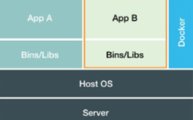

# 云分类

**ON PREMISES**：由用户管理一切：网络、存储、虚拟化等等

**IAAS**：厂商提供基础设施服务（虚拟化层以上，包含操作系统，由用户管理）

**PAAS**：厂商提供平台服务（包含了运行时、中间件，用户“只需要提交代码”，厂商负责程序的运维）

**SAAS**(Software)：厂商直接提供使用的软件

# 背景

技术栈不同的多个程序互不影响的运行（沙盒）

需要多种基础设施上配置相同的运行环境（“中间层”（Docker），镜像（分层文件系统））

<div align="center">  </div><br>
## 与虚拟机比较

虚拟机模拟硬件（硬件虚拟化功能），并在硬件上安装操作系统。

<div align="center">  </div><br>
<div align="center">  </div><br>
- 启动速度

  启动虚拟机需要启动虚拟机的操作系统，再启动应用，这个过程非常慢；

  而启动 Docker 相当于启动宿主操作系统上的一个进程。

- 占用资源

  虚拟机是一个完整的操作系统，需要占用大量的磁盘、内存和 CPU，一台机器只能开启几十个的虚拟机。

  而 Docker 只是一个进程，只需要将应用以及相关的组件打包，在运行时占用很少的资源，一台机器可以开启成千上万个 Docker。

# 实现

- 沙盒

  程序=“代码+数据”，运行起来后就变成了寄存器中的值，堆栈中的指令和变量，打开的文件和各种设备的状态信息的集合，即进程。进程是程序的动态表现。

  容器技术约束和修改程序的动态表现，从而创造出边界。Cgroups用来制造约束，Namespace 用来修改进程视图。

  PID Namespace，让容器中进程号独立发展，还有 Mount、UTS、IPC、Network、User等。容器中看到当前 Namespace 所限的资源、文件、设备、状态等。

  

  我们应该把 Docker 画在跟应用同级别并且靠边的位置。这意味着，用户运行在容器里的应用进程，跟宿主机上的其他进程一样，都由**宿主机操作系统**统一管理，只不过这些被隔离的进程拥有额外设置过的 Namespace 参数。而 Docker 项目在这里扮演的角色，更多的是旁路da式的辅助和管理工作。

  现在的“容器”虽然因为 Namespace，有了不同的视图。但是各个容器中的进程对系统的资源仍然是在相互竞争，一边多了，另一边就少了。

  容器的各种 Namespace 会以文件的形式存在（在 /proc/[pid]/ns文件夹下)，那怎么进入一个容器的 Namespace 呢？可以借助 setns 调用，打开相应的 Namespace 文件，然后传给 setns。

  Cgroups 能够限制进程组使用的资源上限，包括 CPU、内存、磁盘、网络带宽等等，还能够设置进程优先级，审计、挂起和恢复进程。虽然 Cgroups 设置了限制，但容器不知道这些限制，当读取资源使用情况时（如 top），仍然从 OS 的 /proc 读取。这时可借助 lxcfs 来解决，不过现在的内核本身以及解决了这个问题。

  容器本质上就是一个进程，除非找一个公共进程来充当不同应用的父进程（如 Systemd、Supervisord），但是这会导致容器和目标应用**生命周期不同**，容器还在运行，但是应用已经挂了，容器编排系统处理起来就很麻烦。

- 文件系统

  容器中看到的文件系统是怎么样的呢？如果不 ReMount，挂载点和主机是一样的。为了一次性让容器看到全新的文件系统，可重新挂载整个根目录（优先使用系统调用 pivot_root，然后才是 chroot）。这个用于隔离环境的根文件系统（rootfs）即为容器镜像。

  对整个 rootfs 操作，共享时会比较麻烦。Docker 引入了分层，每次修改是在以前的基础上增量变化，共享只需要变化部分。

  Docker 借助联合文件系统实现，如用 AuFS。拉取的镜像由多层组成，它们都是ro+wh(whiteout，允许被“遮掩”)。容器的 rootfs，由三种类型的层组成：可读写(rw)、Init 层(ro+wh)、只读层。用户的修改都在可读写层，删除文件时则在可读写层创建对应的 whiteout 文件。因为可读写层要共享，而有些修改只希望在当前容器有，如 /etc/hosts、/etc/resolv.conf，对它的修改应放在另外一层（Init层）。rootfs 对应多层合并后的“文件夹”，在这个文件夹中的修改（Write）会复制到可读写层（Copy-on-Write），用于提交。
  
  如何在主机和容器间共享文件？
  
  将主机文件夹“链接到”容器中，docker 叫 volume 机制。容器创建时启用 Mount Namespace，将各层联合挂载为 rootfs，但是还没 chroot，可在这时把主机文件夹 mount 到“联合目录”（由于 NS 的存在，这个挂载不会影响主机），这样就实现了需求。

# 使用

## 常用命令

- docker run

  “指定的命令”运行完毕后，容器退出。

  -i 打开标注输入、-t 分配伪终端、-d 守护态运行

  ```shell
  $ docker run alpine echo '123'
  # 没有 -it，那么此命令只是单纯为了 echo
  ```
  --link abc[:alias]，别名是被链接的 abc 在容器内的主机名

- docker stop

  stop 发出 SIGTERM，10s 后发出 SIGKILL，kill 直接 SIGKILL

  rm -f 发出 SIGKILL

- 重新进入

  attach 回到上次退出容器的位置

  exec 重新打开一个伪终端，不影响后台程序的运行

- 暴露端口

  -P 在主机随机选取一个 port 映射到镜像 EXPOSE 声明的 port

## Dockerfile

- 每调用一次 RUN，就是在旧镜像加一层

- RUN/CMD ["executable","param1","param2"] executable 是用 exec（新程序替换掉旧的） 执行的

  RUN/CMD \<command>  command 是用 `sh -c`执行的

  command 要换 shell 执行

  ```shell
  RUN/CMD ["/bin/bash","-c","echo hello"]
  ```
  - exec 是 shell 的 built-in command，映射内核的 exec 操作

- VOLUME

  创建 VOLUME 并挂载到容器中的指定位置；Dockerfile 没办法指定 Volume 在 host 的位置，固定在 host 的 /var/lib/docker/volumes 下的一个。

  docker rm 时要加`-v`，才会删除容器绑定的 Volume。如果 Volume 没有删除，下次启动相同镜像的容器，不会复用上次的 Volume

- ENTRYPOINT

  --entrypoint

  ```shell
  $ docker run -it --link xx:db --entrypoint mongo mongo --host db
  # 默认 entrypoint 为 'sh -c'，这里取代为 mongo
  # 注意：entrypoint 只指定可执行文件是哪个，而不是指定命令（包含参数）
  ```

- docker build 

  build 过程由 daemon 执行，build 过程可能需要 client 周围的文件，client 于是把周围的文件打包成 build context 发出去。可以定义 .dockerignore 文件，避免多余文件被打包。

- “子镜像”

  镜像会继承父镜像开放的端口（EXPOSE），但如果镜像有自己的 CMD，则不会继承启动命令（CMD）。

- 优化

  1. apt update 后，`apt clean`，`rm -rf /var/lib/apt/lists/*`
  2. CMD 之前 EXPOSE、WORKDIR
  3. 脚本添加进镜像后，chmod +x

## 特殊使用

1. 使容器和主机时间同步

   ```shell
   $ docker run -v /etc/timezone:/etc/timezone -v /etc/localtime:/etc/localtime -ti centos bash
   ```

2. 使容器绑定到主机的localhost

   ```shell
   $ docker run -d -p 127.0.0.1:8080:8080 #local_ip:local_port:container_port
   ```

# 原理

- 为什么要用特权才能操作?

  docker daemon 绑定在 unix socket 上，该 socket 属于 root:docker，只有 root 和 docket 组才能读取
