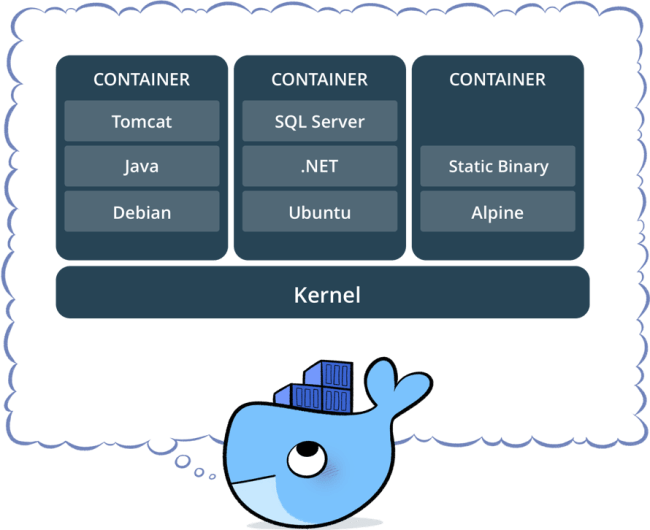
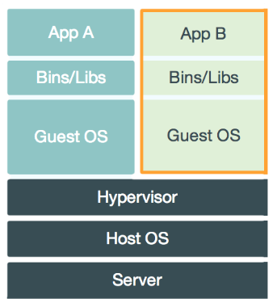
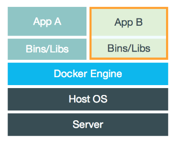

# 云分类

ON PREMISES：由用户管理一切：网络、存储、虚拟化等等

**IAAS**：厂商提供基础设施服务（虚拟化层以上，包含操作系统，由用户管理）

**PAAS**：厂商提供平台服务（包含了运行时、中间件，用户“只需要提交代码”，厂商负责程序的运维）

**SAAS**(Software)：厂商直接提供使用的软件

# 背景

程序需要的“运行时”会因为操作系统不同（内核区别、版本区别）而进行不同的配置，Docker 提供了这个中间层，一次配置在所有地方运行。为了提升运行效率，Docker 对资源分组隔离，而不是运行在虚拟机上。为了方便用户使用，Docker 提供了一系列的管理工具；并启用分层文件系统，用户可以很方便的在别人的镜像上构建自己的镜像。

<div align="center">  </div><br>
## 与虚拟机比较

虚拟机模拟硬件，并在硬件上安装操作系统。

<div align="center">  </div><br>
<div align="center">  </div><br>
- **启动速度**

  启动虚拟机需要启动虚拟机的操作系统，再启动应用，这个过程非常慢；

  而启动 Docker 相当于启动宿主操作系统上的一个进程。

- **占用资源**

  虚拟机是一个完整的操作系统，需要占用大量的磁盘、内存和 CPU，一台机器只能开启几十个的虚拟机。

  而 Docker 只是一个进程，只需要将应用以及相关的组件打包，在运行时占用很少的资源，一台机器可以开启成千上万个 Docker。

## 与传统运维比较

一次配置，到处运行

# 使用

## 常用命令

- docker run

  “指定的命令”运行完毕后，容器退出。

  -i 打开标注输入、-t 分配伪终端、-d 守护态运行

  ```shell
  $ docker run alpine echo '123'
  # 没有 -it，那么此命令只是单纯为了 echo
  ```
  --link abc[:alias]，别名是被链接的 abc 在容器内的主机名

- docker stop

  stop 发出 SIGTERM，10s 后发出 SIGKILL，kill 直接 SIGKILL

  rm -f 发出 SIGKILL

- 重新进入

  attach 回到上次退出容器的位置

  exec 重新打开一个伪终端，不影响后台程序的运行

- 暴露端口

  -P 在主机随机选取一个 port 映射到镜像 EXPOSE 声明的 port

## Dockerfile

- 每调用一次 RUN，就是在旧镜像加一层

- RUN/CMD ["executable","param1","param2"] executable 是用 exec（新程序替换掉旧的） 执行的

  RUN/CMD \<command>  command 是用 `sh -c`执行的

  command 要换 shell 执行

  ```shell
  RUN/CMD ["/bin/bash","-c","echo hello"]
  ```
  - exec 是 shell 的 built-in command，映射内核的 exec 操作

- VOLUME

  创建 VOLUME 并挂载到容器中的指定位置；Dockerfile 没办法指定 Volume 在 host 的位置，固定在 host 的 /var/lib/docker/volumes 下的一个。

  docker rm 时要加`-v`，才会删除容器绑定的 Volume。如果 Volume 没有删除，下次启动相同镜像的容器，不会复用上次的 Volume

- ENTRYPOINT

  --entrypoint

  ```shell
  $ docker run -it --link xx:db --entrypoint mongo mongo --host db
  # 默认 entrypoint 为 'sh -c'，这里取代为 mongo
  # 注意：entrypoint 只指定可执行文件是哪个，而不是指定命令（包含参数）
  ```

- docker build 

  build 过程由 daemon 执行，build 过程可能需要 client 周围的文件，client 于是把周围的文件打包成 build context 发出去。可以定义 .dockerignore 文件，避免多余文件被打包。

- “子镜像”

  镜像会继承父镜像开放的端口（EXPOSE），但如果镜像有自己的 CMD，则不会继承启动命令（CMD）。

- 优化

  1. apt update 后，`apt clean`，`rm -rf /var/lib/apt/lists/*`
  2. CMD 之前 EXPOSE、WORKDIR
  3. 脚本添加进镜像后，chmod +x

## 特殊使用

1. 使容器和主机时间同步

   ```shell
   $ docker run -v /etc/timezone:/etc/timezone -v /etc/localtime:/etc/localtime -ti centos bash
   ```

2. 使容器绑定到主机的localhost

   ```shell
   $ docker run -d -p 127.0.0.1:8080:8080 #local_ip:local_port:container_port
   ```

# 原理

- 为什么要用特权才能操作?

  docker daemon 绑定在 unix socket 上，该 socket 属于 root:docker，只有 root 和 docket 组才能读取
