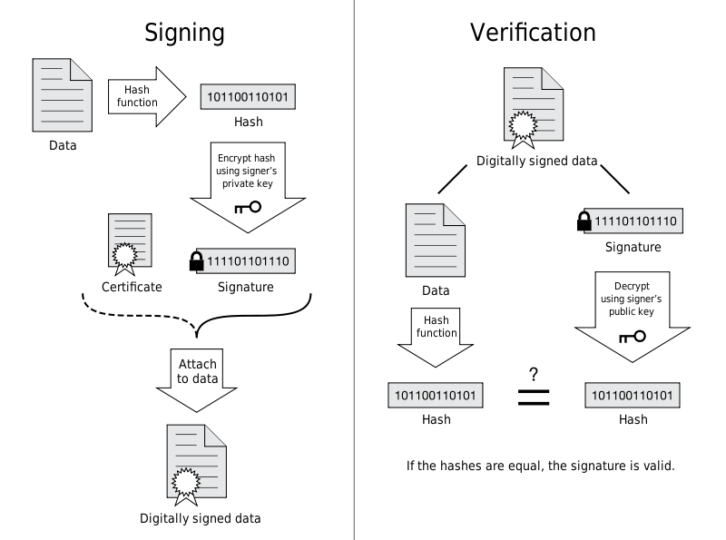

# 基础概念

World Wide Web（WWW），其资源通过 URL 标识，URL 之间通过**超文本**连接，并且可以用互联网对 URL 访问。

HTTP，应用层协议，实现超文本传输。

## URI

用于描述资源在在网络上的位置

<div align="center">  </div><br>
## 请求和响应报文

- **请求报文**

<div align="center">  </div><br>
- **响应报文**

<div align="center">  </div><br>
# 方法

## GET

> 获取资源

## HEAD

> 获取报文首部

确认 URL 的有效性、资源更新时间。

## POST

> 传输数据

## OPTIONS

> 查询支持的方法

查询指定 URL 能够支持的 HTTP 方法。

# GET 和 POST 比较

## 作用

GET 用于获取资源，而 POST 用于传输数据。

## 参数

GET 的参数作 Query Param 在URL，而POST则在报文主体。

非 ASCII 要转码。例如 `中文` 会转换为 `%E4%B8%AD%E6%96%87`，而空格会转换为 `%20`。

POST 传输的数据量大，可以达到 2M；GET 只能 1024 字节

# HTTP 状态码

**响应报文**状态行中包含了状态码及原因短语，用来告知客户端请求的结果。

| 状态码 | 类别 | 含义 |
| :---: | :---: | :---: |
| 1XX | Informational（信息性状态码） | 接收的请求正在处理 |
| 2XX | Success（成功状态码） | 请求正常处理完毕 |
| 3XX | Redirection（重定向状态码） | 需要附加操作以完成请求 |
| 4XX | Client Error（客户端错误状态码） | 服务器无法处理请求 |
| 5XX | Server Error（服务器错误状态码） | 服务器处理请求出错 |


# 连接管理

<div align="center">  </div><br>
## 短连接与长连接

长连接一个 TCP 连接进行多次 HTTP 通信。

注意根据 HTTP 版本设置不同 Connection 首部

## 流水线

不必等待响应，连续发出多个请求

# Cookie

在浏览器端少量“单调”保存数据

### 用途

- 维持会话状态（如用户登录状态、购物车等）

- 个性化设置（如用户自定义设置、主题等）

- 跟踪用户上网行为

`参考`

- Cookie 在跟踪用户上网行为的过程中扮演着什么角色?

### 创建过程

```html
HTTP/1.0 200 OK
Content-type: text/html
Set-Cookie: yummy_cookie=choco
Set-Cookie: tasty_cookie=strawberry
```

```html
GET /sample_page.html HTTP/1.1
Host: www.example.org
Cookie: yummy_cookie=choco; tasty_cookie=strawberry
```

### 分类

- 会话期 Cookie：会话，浏览器访问过程
- 持久性 Cookie：到指定时间过期

```html
Set-Cookie: id=a3fWa; Expires=Wed, 21 Oct 2015 07:28:00 GMT;
```

### 作用域

Set-Cookie时，可以设定这个Cookie在哪些范围有效。

Domain 标识指定了哪些域名*（主机）*会被提交此Cookie。如果不指定，默认为当前文档的主机*(不包含子域名)*。如果指定了 Domain，则一般包含子域名；例如，如果设置 Domain=mozilla.org，包含子域名*(如 developer.mozilla.org)*。

Path 标识指定了此 Cookie可作用于该域哪些路径有效。例如，设置 Path=/docs，则以下地址都会匹配：

- /docs
- /docs/Web/
- /docs/Web/HTTP

### JavaScript

通过 `document.cookie` 属性可创建新的 Cookie。

```html
document.cookie = "yummy_cookie=choco";
document.cookie = "tasty_cookie=strawberry";
console.log(document.cookie);
```

### HttpOnly

document.cookie 获取

```html
Set-Cookie: id=a3fWa; Expires=Wed, 21 Oct 2015 07:28:00 GMT; Secure; HttpOnly
```

# Session

服务器保存用户信息的对象，有一个随机 ID。

Session ID：

- 不能产生一个容易被猜到的 Session ID ；

- 要经常更新 Session ID；

- 在危险操作（例如转账）时，需要对用户重新验证，比如重新输入密码，或者使用短信验证码等方式。

`参考`

- Session ID 和 token 有什么区别?

  token难伪造，且可以保存一些信息*(Session ID一般随机，没有保存信息)*。

# 缓存

## 缓存要求
- 用能够缓存的 HTTP 方法请求，如：GET
- 响应的是能够缓存的状态码，如：200
- 响应报文设置了Cache-Control

## 强缓存

通过缓存过期时间来验证缓存是否生效(Cache-Control:max-age，Expire：)

注意：浏览器会默认缓存静态资源（图片、CSS等）

要避免强制缓存，当请求一个资源时加上一个随机参数

## 协商缓存

强缓存失效后，通过询问服务器协商判断资源是否失效(Last-Modified、Etag)。失效返回新资源，没失效返回 304，并根据响应头更新客户端存储的信息。

# 内容协商

通过 vary，设置额外参与协商的头部

# 内容编码

Encoding，区别字符编码

有：gzip、compress、deflate、identity。

# 范围请求

网络连接中断

## Range

指定请求的范围。

```html
GET /z4d4kWk.jpg HTTP/1.1
Host: i.imgur.com
Range: bytes=0-1023
```

```html
#部分内容
HTTP/1.1 206 Partial Content
Content-Range: bytes 0-1023/146515
Content-Length: 1024
...
(binary content)
```

## Accept-Ranges

响应首部字段 Accept-Ranges 用于告知客户端是否能处理范围请求，可以处理使用 bytes，否则使用 none。

```html
Accept-Ranges: bytes
```

# 分块传输编码

# HTTPS

HTTP：

- 使用明文通信
- 不验证通信方的身份
- 报文可能不完整

HTTP 借助 SSL 连接来通信

<div align="center">  </div><br>
## 加密

### 对称密钥加密

加密和解密使用同一密钥。

- 优点：速度快；
- 缺点：无法安全传输密钥。

<div align="center">  </div><br>
### 非对称密钥加密

一对密钥，一般公钥用于加密

- 优点：密钥不暴露
- 缺点：速度慢。

<div align="center">  </div><br>
### HTTPS 采用的加密方式

下图中的 Session Key 是用来加密通信内容的对称密钥

<div align="center">  </div><br>
## 认证

数字证书认证机构*(CA，Certificate Authority)*是客户端与服务器双方都信赖的第三方机构。

CA验证申请者身份后，颁发证书。

<div align="center">  </div><br>
## 完整性保护

SSL Hash

## HTTPS 的缺点

- 加密解密，速度慢；
- 需要证书授权费。

# HTTP/1.1 新特性
- 同时多个 TCP 连接
- 默认长连接
- 支持流水线
- 虚拟主机
- 状态码 100
- 分块传输编码
- 缓存指令 max-age

# 跨域

为了安全，浏览器原则上不允许访问不同域的内容。

解决：1. 利用可允许的特例（CORS）。 2. 将跨域访问变为”同域“，通过 xx/api 反向代理提供服务。