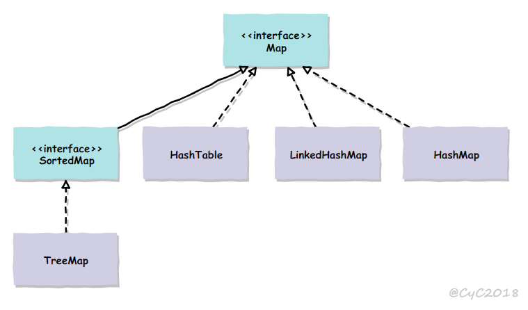

# 概览

## Collection

<div align="center">  </div><br>
## Map

<div align="center">  </div><br>
# ArrayList

ArrayList 同时要 RandomAccess，和 List

```java
public class ArrayList<E> extends AbstractList<E>
        implements List<E>, RandomAccess, Cloneable, java.io.Serializable
```
```java
private static final int DEFAULT_CAPACITY = 10;
```

<div align="center">  </div><br>
## 添加

要求：ArrayList 的 capacity 不够时，要自己扩大。

条件：put() 时容量才不够

所以：put() 前检查容量并扩容 1.5 倍

## 删除

计算出要移动的量，然后 copy 一圈

```java
public E remove(int index) {
    rangeCheck(index);
    modCount++;
    E oldValue = elementData(index);
    int numMoved = size - index - 1;
    if (numMoved > 0)
        System.arraycopy(elementData, index+1, elementData, index, numMoved);
    elementData[--size] = null; // clear to let GC do its work
    return oldValue;
}
```

## Fail-Fast

要能够简单的检查并发修改。版本号 CAS -> 这个版本号应该和修改次数有关 

```java
private void writeObject(java.io.ObjectOutputStream s)
    throws java.io.IOException{
    // Write out element count, and any hidden stuff
    int expectedModCount = modCount;
    s.defaultWriteObject();

    // Write out size as capacity for behavioural compatibility with clone()
    s.writeInt(size);

    // Write out all elements in the proper order.
    for (int i=0; i<size; i++) {
        s.writeObject(elementData[i]);
    }

    if (modCount != expectedModCount) {
        throw new ConcurrentModificationException();
    }
}
```


# Vector

ArrayList 同时修改出错，那么就不允许同时修改了，都排队

```java
public synchronized boolean add(E e) {
    modCount++;
    ensureCapacityHelper(elementCount + 1);
    elementData[elementCount++] = e;
    return true;
}

public synchronized E get(int index) {
    if (index >= elementCount)
        throw new ArrayIndexOutOfBoundsException(index);

    return elementData(index);
}
```

## 与 ArrayList 比较

- Vector 每次扩容请求其大小的 2 倍空间，而 ArrayList 是 1.5 倍。

# CopyOnWriteArrayList

避免读写争用锁。读完全不会阻塞

```java
public boolean add(E e) {
    final ReentrantLock lock = this.lock;
    lock.lock();
    try {
        Object[] elements = getArray();
        int len = elements.length;
        Object[] newElements = Arrays.copyOf(elements, len + 1);
        newElements[len] = e;
        setArray(newElements);
        return true;
    } finally {
        lock.unlock();
    }
}

final void setArray(Object[] a) {
    array = a;
}
```

```java
@SuppressWarnings("unchecked")
private E get(Object[] a, int index) {
    return (E) a[index];
}
```

## 缺点

- 写速度慢
- 占内存
- 中间状态不一致

# LinkedList

```java
private static class Node<E> {
    E item;
    Node<E> next;
    Node<E> prev;
}
```

```java
transient Node<E> first;
transient Node<E> last;
```

<div align="center">  </div><br>
## add() 

保存 last 的值，新生成节点，指针指向调好，last 后移。如果保存的 last 为 null，first 为 last。如果不，调整指针。

## get()

前半部分，前半部分查。

# HashMap

```java
transient Entry[] table;
```

<div align="center">  </div><br>
## put

table 可能为空；key 可能为空；哈希变位置，遍历找重复，最后再填实体。

## 确定桶下标

```java
int hash = hash(key);
int i = indexFor(hash, table.length);
```

**计算 hash 值** 

```java
final int hash(Object k) {
    int h = hashSeed;
    if (0 != h && k instanceof String) {
        return sun.misc.Hashing.stringHash32((String) k);
    }

    h ^= k.hashCode();

    // This function ensures that hashCodes that differ only by
    // constant multiples at each bit position have a bounded
    // number of collisions (approximately 8 at default load factor).
    h ^= (h >>> 20) ^ (h >>> 12);
    return h ^ (h >>> 7) ^ (h >>> 4);
}
```

```java
public final int hashCode() {
    return Objects.hashCode(key) ^ Objects.hashCode(value);
}
```

**取模** 

capacity 为 2^n^，可以用位运算取模。

```java
static int indexFor(int h, int length) {
    return h & (length-1);
}
```

## 重新计算桶下标

扩容后为原来的一倍。

capacity 为 2^n^，1 的位置为1，新的位置在原来位置加原来的 capacity。

## 计算数组容量

传入容量掩码再加 1

```java
static final int tableSizeFor(int cap) {
    //why minize 1, not is the same mask.
    int n = cap - 1;
    n |= n >>> 1;
    n |= n >>> 2;
    n |= n >>> 4;
    n |= n >>> 8;
    n |= n >>> 16;
    return (n < 0) ? 1 : (n >= MAXIMUM_CAPACITY) ? MAXIMUM_CAPACITY : n + 1;
}
```

## 链表转红黑树

从 JDK 1.8 开始，一个桶存储的链表长度大于 8 时会将链表转换为红黑树。

# ConcurrentHashMap

1.7 

问题：1.全范围数据锁 2.多个读也排队 3.读不到最新值

分成段（Segment，每个 Segment 里面包含 Entry，Segment 还是 ReentrantLock中的读写锁，这样多读不锁），只锁个别段。

但是，读操作好像没有申请读锁，直接用 valatile 特性读取最新值。

1.8

问题：1.遍历每个链表的速度太慢 2.每个放都锁不好 3.锁一段还是太多了，只锁一个桶

把链表变成红黑树

