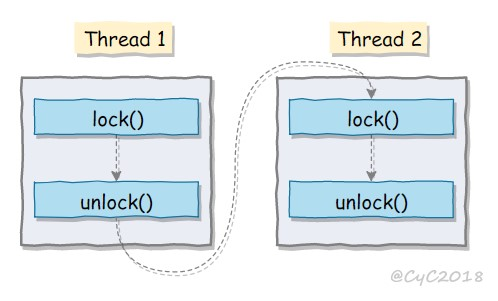
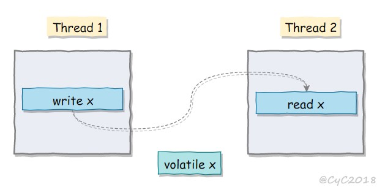

# 线程状态转换

<div align="center"></div>
`参考`

Thread state for a runnable thread. A thread in the runnable state is executing in the Java virtual machine but it may be waiting for other resources from the operating system such as processor.

- Dead 是 Terminated
- Waitting 要放锁。假设另一个要获取它占有的资源，才 notify() 它，这样就死锁啦
- Object.wait()、Thread.join()、Thread.sleep()
- sleep() 不能进 Waitting
- Blocked 状态不能发现 interrupt()，其他状态能。但是使用 ReentrantLock Block，能够发现 interrupt()
- yield() 不释放锁

# 使用线程

构造线程一定要自定义名字

给 Thread 传一个任务，或者直接改 Thread run()

## 实现 Runnable 接口

```java
public class MyRunnable implements Runnable {
    public void run() {
        // ...
    }
}
```

```java
public static void main(String[] args) {
    MyRunnable instance = new MyRunnable();
    Thread thread = new Thread(instance);
    thread.start();
}
```

## 实现 Callable 接口

```java
public class MyCallable implements Callable<Integer> {
    //call方法
    public Integer call() {
        return 123;
    }
}
```

```java
public static void main(String[] args) throws ExecutionException, InterruptedException {
    MyCallable mc = new MyCallable();
    //返回值为 Integer
    FutureTask<Integer> ft = new FutureTask<>(mc);
    Thread thread = new Thread(ft);
    thread.start();
    // get() 会阻塞
    System.out.println(ft.get());
}
```

## 继承 Thread 类

当调用 start() 方法启动一个线程时，虚拟机会将该线程放入就绪队列中等待被调度，当一个线程被调度时会执行该线程的 run() 方法。

```java
public class MyThread extends Thread {
    public void run() {
        // ...
    }
}
```

```java
public static void main(String[] args) {
    MyThread mt = new MyThread();
    mt.start();
}
```

## 线程数量

一般为 2×CPU_NUM。

线程切换过程：

线程 1 执行被打断（或主动结束），执行上下文切换，线程 2 执行。

可以看出，如果 CPU 利用率已经很高，并且有很多线程执行，那么很多 CPU 时间浪费在上下文切换上。

# 线程通信

## 等待、通知

```java
public class WaitNotify {
    private  int count = 0;
    //关键是它控制打印顺序
    private  boolean even = false;

    public static void main(String[] args) {
        WaitNotify waitNotify = new WaitNotify();
        Thread even = new Thread(new Even(waitNotify));
        even.setName("even");
        Thread odd = new Thread(new Odd(waitNotify),"odd");
        even.start();
        odd.start();
    }


    static class Even implements Runnable{
        private WaitNotify waitNotify;
        Even(WaitNotify waitNotify){
            this.waitNotify = waitNotify;
        }

        @Override
        public void run() {
            while (waitNotify.count<100){
                synchronized (WaitNotify.class){
                    if (waitNotify.even){
                        waitNotify.count++;
                        System.out.println(Thread.currentThread().getName()+":"+waitNotify.count);
                        waitNotify.even = false;
                        WaitNotify.class.notify();
                        try {
                            WaitNotify.class.wait();
                        } catch (InterruptedException e) {
                            e.printStackTrace();
                        }
                    }
                }
            }
        }
    }

    static class Odd implements Runnable{
        private WaitNotify waitNotify;

        Odd(WaitNotify waitNotify){
            this.waitNotify = waitNotify;
        }

        @Override
        public void run() {
            while (waitNotify.count<100){
                synchronized (WaitNotify.class){
                    if (!waitNotify.even){
                        waitNotify.count++;
                        System.out.println(Thread.currentThread().getName()+":"+waitNotify.count);

                        waitNotify.even = true;
                        WaitNotify.class.notify();
                        try {
                            WaitNotify.class.wait();
                        } catch (InterruptedException e) {
                            e.printStackTrace();
                        }
                    }
                }
            }
        }
    }
}
```

join()方法就用该机制实现，线程完成后会 JVM 调用 notifyAll() 方法。

## Volatile 变量

## CountDownLatch、CyclicBarrier、Pipe

# 池

## Executor

无限多>固定>1个

- CachedThreadPool：每个任务创建一个线程；
- FixedThreadPool：所有任务只能使用固定大小的线程；
- SingleThreadExecutor：相当于大小为 1 的 FixedThreadPool。
- newScheduledThreadPool ：可以周期和定时执行任务

```java
public static void main(String[] args) {
    ExecutorService executorService = Executors.newCachedThreadPool();
    for (int i = 0; i < 5; i++) {
        executorService.execute(new MyRunnable());
    }
    executorService.shutdown();
    
    //延迟两秒，三秒一次
    scheduledThreadPool.scheduleAtFixedRate(r2, 2, 3, TimeUnit.SECONDS);
}
```

## 参数

本质调用 ThreadPoolExcutor()。一个线程池该有：

1. 有多少线程
2. 当大于 corePoolSize 时，线程维持多久
3. 放任务的工作队列
4. 线程池满，且工作队列满，怎么办

## 实现

1. excute() ，当池的 workerCount 没到 corePoolSize 时，要 addWorker()，传入 first task。

   addWorker()，首先检验状态：现在是不是处于可加状态，现在的 workerCount 到限制没有，通过， workerCount+1。然后新建一个 worker，排队加入 workers 里面，加入后启动 worker 对应的线程。

   worker（是 Runnable） 需要什么？first task、线程。

   worker 的 run() 做什么？要不断从 Queue 中取 task（第一次取 first task），然后执行。

2. 到 corePoolSize 了，或者新加 worker 失败，就尝试加入 workQueue，workerQueue 加入失败，再次尝试添加 worker，失败执行 reject()

# 中断

## InterruptedException

 interrupt() 设置 interrupted status/flag，消费后标志就取消了。

 Some methods that block such as `Object.wait()` may consume the interrupted status immediately and throw an appropriate exception (usually `InterruptedException`)。 I/O 阻塞和 synchronized 锁阻塞当然不会去检查这个标志啦

```java
public class InterruptExample {

    private static class MyThread1 extends Thread {
        @Override
        public void run() {
            try {
                Thread.sleep(2000);
                System.out.println("Thread run");
            } catch (InterruptedException e) {
                e.printStackTrace();
            }
        }
    }
}
```

```java
public static void main(String[] args) throws InterruptedException {
    Thread thread1 = new MyThread1();
    thread1.start();
    thread1.interrupt();
    System.out.println("Main run");
}
```

```html
Main run
java.lang.InterruptedException: sleep interrupted
    at java.lang.Thread.sleep(Native Method)
    at InterruptExample.lambda$main$0(InterruptExample.java:5)
    at InterruptExample$$Lambda$1/713338599.run(Unknown Source)
    at java.lang.Thread.run(Thread.java:745)
```

## interrupted()

用户程序主动检测标记

```java
public class InterruptExample {
    private static class MyThread2 extends Thread {
        @Override
        public void run() {
            //用interrupted()
            while (!interrupted()) {
                // ..
            }
            System.out.println("Thread end");
        }
    }
}
```

```java
public static void main(String[] args) throws InterruptedException {
    Thread thread2 = new MyThread2();
    thread2.start();
    thread2.interrupt();
}
```

```html
Thread end
```

## Executor 的中断操作

shutdown() 等待线程都执行完毕之后再关闭。shutdownNow() 调用每个线程的 interrupt() 方法。

```java
public static void main(String[] args) {
    ExecutorService executorService = Executors.newCachedThreadPool();
    //匿名内部线程
    executorService.execute(() -> {
        try {
            Thread.sleep(2000);
            System.out.println("Thread run");
        } catch (InterruptedException e) {
            e.printStackTrace();
        }
    });
    executorService.shutdown();
    //没有结束就一直等，每秒打印一次
    while (!executorService.awaitTermination(1, TimeUnit.SECONDS)) {
        LOGGER.info("线程还在执行。。。");
    }
    System.out.println("Main run");
}
```

只想中断 Executor 中的一个线程， submit() 提交，调用返回对象的 cancel(true) 。

```java
Future<?> future = executorService.submit(() -> {
    // ..
});
future.cancel(true);
```

# Java 内存模型（JMM）

每个线程有自己的工作内存，操作变量副本。


# 并发编程三要求

可见性、原子性、有序性

- 原子性

  ```java
  a++;//两步：获取旧值，加1
  ```

- 有序性

  ```java
  //一个线程
  int a = 1;
  int b = 2;
  finished = true;
  
  //另一个线程，不一定会执行上面的内容
  if(finished){
      System.out.Println("hello");
  }
  ```

- 可见性
  之前进行的修改操作，之后一定可见。靠 JVM 实现的 Happes-Before

`参考`

- volatile

  用于双重锁检验是为了什么？用于标志时，是干了什么？

# 先行发生原则

如果一个操作**先行发生**于另一个操作，其**影响**是能被后者“观测”到的，因为工作内存的存在，导致看不到。下面的操作是 JVM 确保可以看到的。

### 单一线程原则

> Single Thread rule

在一个线程内，在程序前面的操作先行发生于后面的操作。

<div align="center">  </div><br>
###  管程锁定规则

> Monitor Lock Rule

一个 unlock 操作先行发生于后面对同一个锁的 lock 操作。

<div align="center">  </div><br>
### volatile 变量规则

> Volatile Variable Rule

对一个 volatile 变量的写操作先行发生于后面对这个变量的读操作。

<div align="center">  </div><br>
### 线程启动规则

> Thread Start Rule

Thread 对象的 start() 方法调用先行发生于此线程的每一个动作。

<div align="center">  </div><br>
### 线程加入规则

> Thread Join Rule

Thread 对象的结束先行发生于 join() 方法返回。

<div align="center">  </div><br>
### 线程中断规则

> Thread Interruption Rule

对线程 interrupt() 方法的调用先行发生于通过 interrupted() 方法检测到是否有中断发生。

### 对象终结规则

> Finalizer Rule

一个对象的初始化完成（构造函数执行结束）先行发生于它的 finalize() 方法的开始。

### 传递性

> Transitivity

如果操作 A 先行发生于操作 B，操作 B 先行发生于操作 C，那么操作 A 先行发生于操作 C。

# 线程不安全示例

以下代码演示了 1000 个线程同时对 cnt 执行自增操作，操作结束之后它的值有可能小于 1000。

```java
public class ThreadUnsafeExample {

    private int cnt = 0;

    public void add() {
        cnt++;
    }

    public int get() {
        return cnt;
    }
}
```

```java
public static void main(String[] args) throws InterruptedException {
    final int threadSize = 1000;
    ThreadUnsafeExample example = new ThreadUnsafeExample();
    final CountDownLatch countDownLatch = new CountDownLatch(threadSize);
    ExecutorService executorService = Executors.newCachedThreadPool();
    for (int i = 0; i < threadSize; i++) {
        executorService.execute(() -> {
            //传入的对象得是final的，不然两边改后，就不一致了
            example.add();
            countDownLatch.countDown();
        });
    }
    countDownLatch.await();
    executorService.shutdown();
    System.out.println(example.get());
}
```

```html
997
```

# 互斥同步

一个线程如果获得了某个锁，那么在同一个线程里面不需要再次去获得该锁。

```java
class ...{
synchronized void a(){}
synchronized void b(){}
}

class Main{
new Thread{
	run{
		a()
		b()
	}.start()
}
}
```

## ReentrantLock

ReentrantLock 是 java.util.concurrent（J.U.C）包中的锁。

```html
0 1 2 3 4 5 6 7 8 9 0 1 2 3 4 5 6 7 8 9
```

### 取锁过程

**公平锁**

判断 AQS 中的 state 是否为 0（锁是否被获取）

是 0，然后判断是否等待队列是否为空，为空则尝试 CAS 设置 state 为 1，并设置当前线程独占。

不等于0，则判断是否是当前线程独占该锁，是则 state + 1。

如果取锁失败，通过 addWaiter，通过 CAS 将当前线程加入等待队列（链表实现），接下来就是挂起线程了：如果前面是头节点啦，再试一次加锁。不是或加锁失败，则用 LockSupport 的 park 挂起当前线程，等待唤醒。

**非公平锁**

取锁不会去检查等待队列。失败和上面过程一样。

注：非公平锁效率更高，因为公平锁大多时候获锁的线程是从等待队列唤醒的，上下文切换，速度慢。

### 放锁

判断是否当前线程占用锁。是，将 state 减到 1，当放锁到 state 为 0，唤醒挂起线程。

## 比较

**锁的实现** 

synchronized 是 JVM 实现的，而 ReentrantLock 是 JDK 实现的。

**性能** 

新版本 Java 对 synchronized 进行了很多优化，例如自旋锁等，synchronized 与 ReentrantLock 大致相同。

**加锁粒度自由**

**申锁可中断** 

**给锁，公平锁** 

**锁绑定多个条件** 

Condition 用于 await() 和 signal()，signal() 可唤醒指定线程。

## 使用选择

优先 synchronized。ReentrantLock 特定 JDK 支持，要手动加解锁

## 锁的种类

**同一进程**

重入锁

读写锁：维护一对锁：读锁和写锁

**不同进程**

分布式锁

Mysql、Redis

# ”尝试修改“

阻塞悲观，一来就锁上。可能没并发了，可以先试一下。

## CAS

和没其他人改动的期望一样就修改

## AtomicInteger

```java
public class AtomicTest {

    public static AtomicInteger race = new AtomicInteger(0);

    public static void increase() {
        race.incrementAndGet();
    }

    private static final int THREADS_COUNT = 20;

    public static void main(String[] args) throws Exception {
        Thread[] threads = new Thread[THREADS_COUNT];
        for (int i = 0; i < THREADS_COUNT; i++) {
            threads[i] = new Thread(new Runnable() {
                @Override
                public void run() {
                    for (int i = 0; i < 10000; i++) {
                        increase();
                    }
                }
            });
            threads[i].start();
        }

        while (Thread.activeCount() > 1)
            Thread.yield();

        System.out.println(race);
    }
}

    /**
     * Atomically increment by one the current value.
     * @return the updated value
     */
    public final int incrementAndGet() {
        for (;;) {
            int current = get();
            int next = current + 1;
            if (compareAndSet(current, next))
                return next;
        }
    }
```

## ABA

改过来又该回去

# 不共享

不共享数据；局部变量，ThreadLocal

# J.U.C - AQS

AQS （AbstractQueuedSynchronizer）是 J.U.C 的核心基础组件。

## CountDownLatch

await() 直到 countDown() 到 0

## ...


# 锁优化

## 自旋锁

取不到锁，线程不马上 Blocked，而是多试几次。

在 JDK 1.6 中引入了自适应的自旋锁。如果以前获锁经常成功，有希望，可以多试几次。没希望，就不要无谓尝试。

## 锁粗化

连续多次对同一个对象加锁解锁，没有必要；直接所有之前加，所有之后解。

## 重量级锁

申请内核的 Mutex，上下文切换。申请不到，线程阻塞。

## 轻量级锁

在用户层操作，用 CAS 的方式改对象头的锁标志；将 Mark Word 中轻量级锁指针指向某个线程的 Lock Record。设置失败，膨胀为重量级。注意：CAS 的期望是初始状态，失败也可能是指向自己

解锁就是恢复该指针。

## 偏向锁

尝试用 CAS 改 Mark Word 中偏向的线程 ID，改成功后，以后取锁只需要看偏向的是不是自己就行了。偏向锁的CAS 期望是 null，也就是说偏向锁只能用一次。

## 加锁过程

所以，加锁过程会：先检查偏向、然后轻量、最后重量。