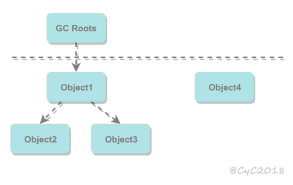

# 运行时内存和垃圾回收

## 字节码文件结构

魔数 版本号 常量池 访问标志 当前类索引 父类索引 

接口索引 字段表 方法表 附加属性

## 数据区域


<div align="center">  </div><br>
**程序计数器**

正在执行的字节码的地址

**虚拟机栈**

实现方法调用。每个方法对应栈中的一个栈帧

<div align="center">  </div><br>
```java
java -Xss512M HackTheJava
```

该区域可能抛出以下异常：

- 栈深度太大，会抛出 StackOverflowError 异常；
- 创建太多线程，会抛出 OutOfMemoryError 异常。

**本地方法栈**

实现本地方法调用

本地方法一般是用其它语言（C、C++ 或汇编语言等）编写的，并且被编译为基于本机硬件和操作系统的程序，对待这些方法需要特别处理。

<div align="center">  </div><br>
**堆**

所有对象都在这里分配内存，GC 堆。

根据回收算法的特点，把要回收的对象分为两类。复制算法需要移动，适合少量活对象，且移动的目的地是个小空间，需要能够有地方进行分配担保。标记整理没有碎片。

- 新生代（Young Generation），小、新对象
- 老年代（Old Generation），老、大对象

放不下，且没法扩展空间就会抛出 OutOfMemoryError。

```java
java -Xms1M -Xmx2M HackTheJava
```

**方法区**

用于存放已被加载的类信息、常量、即时编译器编译后的代码等数据。

OutOfMemoryError。

方法区的回收

方法区回收条件苛刻，回收效果不好；但是，又必须得回收，不然在大量加载类（动态代理和反射）的时候溢出。JDK8 直接移出虚拟机内存，到了本地内存（元空间），或许是因为不会 OutOfMemory 了？。

满足下面条件的类可能被卸载：

- 加载该类的 ClassLoader 被回收。
- 该类对应的 Class 对象没有被使用。
- 该类所有的实例被回收

**运行时常量池**

运行时常量池是方法区的一部分，存放字面量和符号引用。

除了在编译期生成的常量，还允许动态生成，例如 String 类的 intern()。

**直接内存**

NIO 类，它使用 Native 函数库直接分配堆外内存，然后通过 Java 堆里的 DirectByteBuffer 对象作为这块内存的引用。

## 判断可否回收

### 引用计数算法

对象被引用就是活的

循环引用就废了

```java
public class Test {

    public Object instance = null;

    public static void main(String[] args) {
        Test a = new Test();
        Test b = new Test();
        a.instance = b;
        b.instance = a;
    }
}
```

### 可达性分析算法

确定被使用的对象和他们引用的对象是活的

GC Roots 是被确定引用的：

- 局部变量表中引用的对象
- 本地方法栈中 JNI 
- 类静态属性引用
- 方法区中的常量引用


<div align="center">  </div><br>
### finalize()

重写了且没被调用过 finalize()，在回收前会被调用

被回收对象可以尝试此时把自己变成 GC Roots 对象(类静态属性引用)

## 内存泄漏

对象没有被使用仍然没有被回收。

原因：引用对象的变量的作用域太大。

解决：较小作用域或使用完就赋 null

场景：（需要手动 close() 的）数据库连接、网络连接 单例模式

## 引用类型

怎样判断是否算引用?

### 强引用

被强引用关联的对象不会被回收。

```java
Object obj = new Object();
```

### 软引用

被软引用关联的对象只有在内存不够的情况下才会被回收。

```java
Object obj = new Object();
SoftReference<Object> sf = new SoftReference<Object>(obj);
obj = null;  // 使对象只被软引用关联
```

### 弱引用

被弱引用关联的对象一定会被回收，也就是说它只能存活到垃圾回收发生之前。

内存不够的时候，不算引用

```java
Object obj = new Object();
WeakReference<Object> wf = new WeakReference<Object>(obj);
obj = null;
```

### 虚引用

虚引用不是引用

为一个对象设置虚引用的唯一目的是能在这个对象被回收时收到一个系统通知。

```java
Object obj = new Object();
PhantomReference<Object> pf = new PhantomReference<Object>(obj);
obj = null;
```

## 垃圾收集算法

### 标记 - 清除

<div align="center">  </div><br>
标记要回收的对象，然后清除。

标记，清除效率不高。内存碎片。

### 标记 - 整理


<div align="center">  </div><br>
让所有存活的对象都向一端移动，然后直接清理掉端边界以外的内存。

### 复制

<div align="center">  </div><br>
大部分小、新对象存活不长，复制少量就完成回收，划算。

把 Eden 和一个 Survivor 存活的复制到剩下来的 Survivor 区。如果放不下怎么办，分配担保放老年代。

### 分代收集

- 新生代使用：复制算法
- 老年代使用：标记 - 清除 或者 标记 - 整理 算法

## 垃圾收集器

<div align="center">  </div><br>
### Serial 收集器

<div align="center">  </div><br>
使用一个线程进行垃圾收集。

回收速度还行

### ParNew 收集器

<div align="center">  </div><br>
多线程收集

速度快了（CPU 资源要够），可以和 CMS 配合

### Parallel Scavenge 收集器

多线程收集，吞吐量优先，即垃圾回收时间占用的比例小。

可以让其自行调节参数，以使吞吐量最大，参数包括新生代的大小（-Xmn）、Eden 和 Survivor 区的比例、晋升老年代对象年龄等细节参数了。

### Serial Old 收集器

<div align="center">  </div><br>
单线程

作 CMS 失败后的备用方案

### Parallel Old 收集器

<div align="center">  </div><br>
吞吐量优先

### CMS 收集器

<div align="center">  </div><br>
CMS（Concurrent Mark Sweep）

分为以下四个流程：

- 初始标记：标记 GC Roots，需停顿，但速度很快，因为 OopMap 的存在
- 并发标记：标记 GC Roots 的引用，并行不停顿，耗时最长
- 重新标记：修正因用户线程运行造成的引用改动，需停顿。
- 并发清除：不需要停顿。

并发标记、并发清除耗时最长，但和用户线程并行运行。

缺点：

- 吞吐量低：许多清理时间浪费在”无关环节“上（如重新标记）
- 产生浮动垃圾，过多导致 Concurrent Mode Failure，然后启用 Serial Old。
- 空间碎片，导致触发 Full GC。

### G1 收集器

 G1 直接对新生代和老年代一起回收。

<div align="center">  </div><br>
G1 对内存分区（Region），在标记过程中统计各区的回收价值和回收时间的经验值形成“优先队列”，然后，根据用户设定的停顿时间，选择价值最高的几个区回收。

<div align="center">  </div><br>
<div align="center">  </div><br>
如果不计算维护 Remembered Set 的操作，G1 收集器的运作大致可划分为以下几个步骤：

- 初始标记
- 并发标记
- 最终标记：修正
- 筛选回收：首先对各个 Region 中的回收价值和成本进行排序；根据用户所期望的 GC 停顿时间来回收一部分 Region。

具备如下特点：

- 可预测停顿
- 空间整合：没有碎片，局部是复制算法，全局是标记-整理

## 内存分配与回收策略

### Minor GC 和 Full GC

- Minor GC：回收新生代上。因为新生代存活时间很短，会频繁执行，但执行的速度比较快。

- Full GC：回收老年代和新生代

### 对象分配策略

小对象优先分配在 Eden，如果内存不够且没法扩展大小，且老年代连续空间大于新生代存活对象大小或历次晋升大小（看空间分配担保是否能成功），就先 Minor GC，再分配。实在放不了 Eden，也可以放老年代。

大对象，如：很长的字符串以及数组，在老年代分配。-XX:PretenureSizeThreshold，大于此值的对象直接在老年代分配

统计 Eden 对象存活时间（经过一次 Minor GC，年龄 +1），当达到阈值进入老年代

-XX:MaxTenuringThreshold 用来定义年龄的阈值。

当大部分存活对象的年龄一样时，无需等待阈值，直接进入老年代。（动态对象年龄判定）

### Full GC 的触发条件

**空间分配担保失败**

**老年代空间不足**

**JDK 1.8 前永久代空间不足且没有用 CMS**

**CMS 浮动垃圾放不下**

**调用 System.gc()**

​	建议虚拟机执行 Full GC。

# 类加载机制

类是在运行期间第一次使用时动态加载，而不是一次性加载，浪费空间。

## 类的生命周期

<div align="center">  </div><br>
包括以下 7 个阶段：

-  **加载（Loading）** 
-  **验证（Verification）** 
-  **准备（Preparation）** 
-  **解析（Resolution）** 
-  **初始化（Initialization）** 
- 使用（Using）
- 卸载（Unloading）

## 类加载过程

### 加载

根据类全限定名获取二进制字节流

### 验证

验证字节流的信息是否安全

### 准备

为类在方法区分配空间，并为类变量（static）设置初始值

常量（final）初始值就是定义的值

```java
public static final int value = 123;
```

### 解析

将符号引用（符号表示的引用）替换为直接引用（到具体内存地址）的过程。

解析可以在初始化再进行，为了动态绑定。

### 初始化

按用户要求为类变量赋值；调用 &lt;clinit>() 方法。

&lt;clinit>() 由编译器自动收集类变量赋值动作和静态语句块合并产生，编译器按照语句出项顺序收集。

注意：

```java
public class Test {
    static {
        i = 0;                // 给变量赋值可以正常编译通过
        System.out.print(i);  // 这句编译器会提示“非法向前引用”
    }
    static int i = 1;
}
```

父类的 &lt;clinit>() 方法先执行。例如以下代码：

```java
static class Parent {
    public static int A = 1;
    static {
        A = 2;
    }
}

static class Sub extends Parent {
    public static int B = A;
}

public static void main(String[] args) {
     System.out.println(Sub.B);  // 2
}
```

即使多线程， &lt;clinit>只会被调用一次

## 类初始化时机

### 主动引用

加载多久发生没规定，但规定了多久初始化：
1. JVM 启动包含 main 方法的启动类时。 
1. 为一个类型创建一个新的对象实例时（比如 new 、反射、序列化）
1. 初始化一个类的派生类时（ Java 虚拟机规范明确要求初始化一个类时，它的超类必须提前完成初始化操作，接口例外）
1. 调用类或接口的静态字段，或对静态字段执行赋值操作时（getstatic 或者 putstatic 指令），不过用final修饰的静态字段除外，准备阶段就处理好了
1. 调用静态方法（invokestatic 指令）
1. 使用反射时（获取类的信息，调用类的方法等）


### 被动引用

除上面外，所有引用类的方式都不会触发初始化，称为被动引用。

- 通过子类引用父类的静态字段，不会导致子类初始化。

```java
System.out.println(SubClass.value);  // value 字段在 SuperClass 中定义
```

- 通过数组定义来引用类，不会触发此类的初始化。该过程会对数组类进行初始化，数组类是一个由虚拟机自动生成的、直接继承自 Object 的子类，其中包含了数组的属性和方法。

```java
SuperClass[] sca = new SuperClass[10];
```

- 常量在编译阶段会存入调用类的常量池中，本质上并没有直接引用到定义常量的类，因此不会触发定义常量的类的初始化。

```java
System.out.println(ConstClass.HELLOWORLD);
```

## 类与类加载器

两个类相等，需要类本身相等，并且使用同一个类加载器进行加载。

这里的相等，包括类的 Class 对象的 equals() 方法、isAssignableFrom() 方法、isInstance() 方法的返回结果为 true，也包括使用 instanceof 关键字做对象所属关系判定结果为 true。

## 类加载器分类

从 Java 虚拟机的角度来讲，只存在以下两种不同的类加载器：

- 启动类加载器（Bootstrap ClassLoader），使用 C++ 实现，是虚拟机自身的一部分；

- 所有其它类的加载器，使用 Java 实现，独立于虚拟机，继承自抽象类 java.lang.ClassLoader。

从 Java 开发人员的角度看，类加载器可以划分得更细致一些：

- 启动类加载器（Bootstrap ClassLoader）此类加载器负责将存放在 &lt;JRE_HOME>\lib 目录中的，或者被 -Xbootclasspath 参数所指定的路径中的。启动类加载器无法被 Java 程序直接引用，用户在编写自定义类加载器时，直接使用 null 作为委派对象。

- 扩展类加载器（Extension ClassLoader）这个类加载器是由 ExtClassLoader（sun.misc.Launcher$ExtClassLoader）实现的。它负责将 &lt;JAVA_HOME>/lib/ext 或者被 java.ext.dir 系统变量所指定路径，开发者可以直接使用扩展类加载器。

- 应用程序类加载器（Application ClassLoader）这个类加载器是由 AppClassLoader（sun.misc.Launcher$AppClassLoader）实现的。getSystemClassLoader() 的返回值，因此称系统类加载器。它负责加载用户类路径（ClassPath）上所指定的类库，开发者可以直接使用，没有自定义类加载器，一般就是这个。

<div data="modify <--"></div>
## 双亲委派模型

下图展示了类加载器之间的层次关系，类加载器之间的父子关系通过组合关系（Composition）来实现，而不是继承关系（Inheritance）。

<div align="center">  </div><br>
### 工作过程

加载请求委托给父加载器，当其无法完成自己才加载。

### 好处

系统类只会由系统加载器加载，保证系统类一致

## 自定义类加载器实现

自定义类加载器继承 ClassLoader 重写 findClass() 方法，保证双亲委派。

```java
public class FileSystemClassLoader extends ClassLoader {

    private String rootDir;

    public FileSystemClassLoader(String rootDir) {
        this.rootDir = rootDir;
    }

    protected Class<?> findClass(String name) throws ClassNotFoundException {
        byte[] classData = getClassData(name);
        if (classData == null) {
            throw new ClassNotFoundException();
        } else {
            return defineClass(name, classData, 0, classData.length);
        }
    }

    private byte[] getClassData(String className) {
        String path = classNameToPath(className);
        try {
            InputStream ins = new FileInputStream(path);
            ByteArrayOutputStream baos = new ByteArrayOutputStream();
            int bufferSize = 4096;
            byte[] buffer = new byte[bufferSize];
            int bytesNumRead;
            while ((bytesNumRead = ins.read(buffer)) != -1) {
                baos.write(buffer, 0, bytesNumRead);
            }
            return baos.toByteArray();
        } catch (IOException e) {
            e.printStackTrace();
        }
        return null;
    }

    private String classNameToPath(String className) {
        return rootDir + File.separatorChar
                + className.replace('.', File.separatorChar) + ".class";
    }
}
```


# 字节码指令

## 方法调用

**invokevirtual 指令**

静态多分派，动态单分派

静态多分派，静态可以理解为编译时，所以意思是，编译时根据多个宗量来确定具体是哪个方法。动态则自然理解为运行时。

`参考`

- 在编译时进行类型检查的是静态类型语言
- 宗量：方法参数或方法接收者

# 运行

## JIT

Just In Time，虚拟机可指定启动模式 client 或 server，后者启动速度更慢，但运行速度更快；client 会启用 c1 JIT 编译器，server 启用 c2，c2 编译后的机器码的执行效率更高。

JIT 的高效编译需要一些运行时信息，所以先解释运行几次。比如：判断是不是热点代码、另外，多态的时候，每次解释运行需要查找调用对象到底是谁，JIT 编译可以固定到某个调用对象。