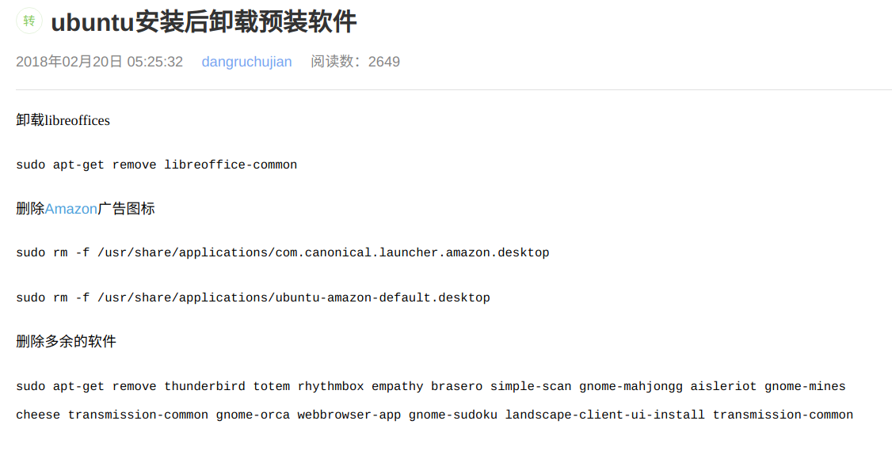
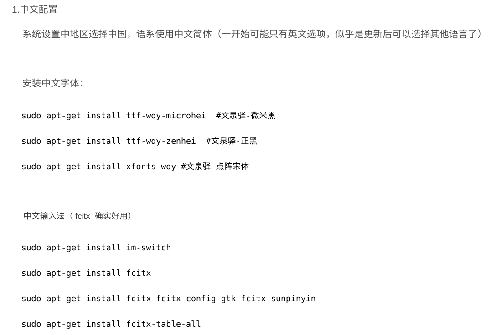
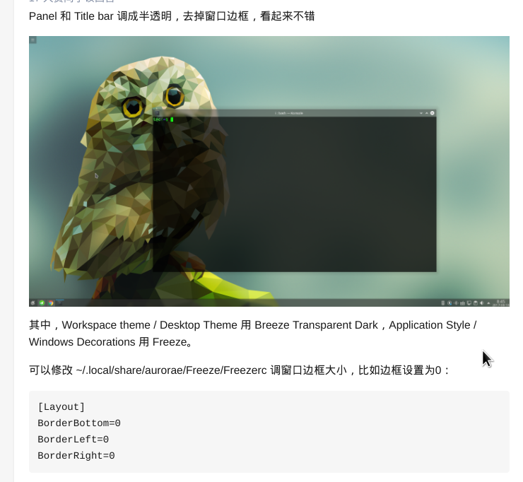
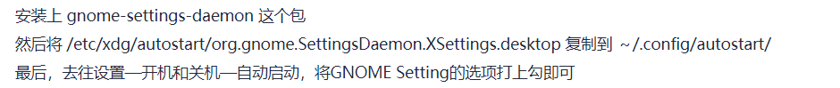

# Arch

## 安装

- 判断是uefi还是bios

  ```shell
  # 如果目录不存在，则是bios。
  ls /sys/firmware/efi/efivars。
  ```
  
- 分区

  ```shell
  # 查看磁盘情况 
  fdisk -l
  # 分四个区，依次为 EFI、root、home、swap
  cfdisk /dev/**
  ```

- 格式化分区

  ```shell
  # 查看分区情况 
  fdisk -l
  mkfs.fat -F32 /dev/**
  # 设置分区的标签为 root，不然要用 UUID 引用分区
  mkfs.ext4 -L root /dev/**
  # 设置交换分区
  mkswap /dev/**
  swapon /dev/**
  ```

- 挂载分区
  root 挂载到 /mnt；在 mnt 创建相应文件夹，然后将 efi 挂载到 /mnt/boot/EFI，home 挂载到 /mnt/home
  
- 连接网络

  ```shell
  # 连接有限网络
  dhcpd
  # 获取 ip 地址
  # 连接热点
  NetworkManager 用于管理 wifi 连接，和 iw 同类
  nmcli dev wifi list
  nmcli dev wifi connect <SSID> password <password> [hidden yes]
  nmcli connection delete CONNECTION_NAME # 上面连接失败后，以后的连接仍然用错误凭证，所以先删除
  # 测试网络，直到连通
  ping baidu.com
  ```
  
- 更新时间

  在联网时，及安装时验证证书有效

  ```shell
  timedatectl set-ntp true
  ```

- 配置 pacman 镜像源
  
  将：https://mirrors.huaweicloud.com/archlinux/
  
  和 tuna
  
  放到 /etc/pacman.d/mirrorlist 的前面
  
- 安装基础包

  ```shell
  pacstrap /mnt base linux linux-firmware networkmanager sudo ntfs-3g dnsmasq
  # ntfs-3g os-prober 和 dolphin 需要
  # dnsmasq 在创建热点时用于作 dns 服务器
  ```

- 生成分区表

  ```shell
  genfstab -U /mnt>>/mnt/etc/fstab
  # 然后查看fstab，看是否有四个分区
  ```

- 切入 /mnt 中

  相比`chroot`，`arch-chroot`可以自行挂载 /run

  ```shell
  arch-chroot /mnt
  ```
  
- 设置主机名
  ```shell
  echo ** > /etc/hostname
  ```
  
- 设置root的密码
  ```shell
  passwd
  ```
  
- 设置时区

  ```shell
  ln -sf /usr/share/zoneinfo/Asia/Shanghai /etc/localtime
  # 设置硬件时间
  hwclock --systohc
  ```

- 本地化设置

  ```shell
  # 1. 
  将/etc/locale.gen中的
  en_US.UTF-8
  zh_CN.UTF-8
  zh_HK.UTF-8
  注释去掉
  # 2.生成 locale
  locale-gen
  # 3.设置默认 locale，UI、命令行尽量用英文
  echo 'LANG=en_US.UTF-8' >/etc/locale.conf
  ```

- 设置hosts文件
	
	```
	127.0.0.1	localhost
	::1		localhost
	127.0.1.1	myhostname.localdomain	myhostname
	```

- 安装引导程序

  ```shell
  pacman -S grub efibootmgr os-prober
  grub-install --target=x86_64-efi --efi-directory=<EFI 分区挂载点> --bootloader-id=<启动项在 BIOS 中的名字>
  grub-mkconfig -o /boot/grub/grub.cfg
  ```

- 退出安装

  ```shell
  # 1.
  exit
  # 2.
  umount -R /mnt
  # 3.
  reboot
  # 4.移除安装介质
  ```

- 添加新用户

  ```shell
  useradd -m -G wheel -s /bin/bash fwinac
  # -m 创建相应 home 目录
  passwd fwinac
  ```

- 设置新用户可 sudo  
  在 /etc/sudoers 中 fwinac 后添加和 root 后一样的内容

  或：
  
  将 /etc/sudoers 中 %wheel 前的注释去掉
  
- 屏蔽 nouveau，安装 bbswitch
  在 /etc/modprobe.d/nouveau_blacklist.conf 添加 blacklist nouveau

- 安装dde

  1. 安装 deepin
  1. 在 /etc/lightdm/lightdm.conf设置
     [Seat:*]
     greeter-session=lightdm-deepin-greeter

- 设置 DE 程序开机启动

  1. systemctl enable lightdm/sddm
  1. systemclt enable NetworkManager
  1. systemctl enable bluetooth

- 安装字体
  
  noto，no tofu
  
  noto-fonts noto-fonts-cjk noto-fonts-emoji

- 添加 archlinuxcn 源

  1. 在 `/etc/pacman.conf` 文件末尾添加：

     ```
     [archlinuxcn]
     Server = https://mirrors.tuna.tsinghua.edu.cn/archlinuxcn/$arch
     ```
     
  2. 安装密钥

     ```shell
     $ sudo pacman -S archlinuxcn-keyring
     ```

- 安装输入法
	1. 安装 fcitx-im fcitx-configtool/kcm-fcitx
	
	2. vim ~/.xprofile(xprofile 适用 xorg，也可添加到 ~/.pam_environment，不用加 export) 
	
	   ```shell
	   export GTK_IM_MODULE=fcitx
	   export QT_IM_MODULE=fcitx
	   export XMODIFIERS="@im=fcitx"
	   ```

`参考`
- [中文动图安装参考](https://bbs.archlinuxcn.org/viewtopic.php?id=1037)

- 将主目录里面的文件夹汉字转英文

  ```shell
  $ sudo pacman -S xdg-user-dirs-gtk
  $ export LANG=en_US
  $ xdg-user-dirs-gtk-update
  # 然后会有个窗口提示语言更改，更新名称即可
  $ export LANG=zh_CN.UTF-8
  # 然后重启电脑，如果提示语言更改，保留旧的名称即可
  ```

# Ubuntu

## 显卡驱动

1. 启动时在 quiet splash 后加 nouveau.modeset=0

2. 启动后

   ```shell
   $ ubuntu-drivers devices
   $ ubuntu-drivers autoinstall
   ```


## 删除多余自带
<div aligh="center"></div>
# i3wm

- 设置缩放
  修改主目录下的 .Xresources 文件，把 Xft.dpi 改为 125
  
- 设置主题
  修改 lxapperance 和 qt5ct 中的 style，选择亮色主题。
- 安装 shadowsocks-qt5 alacritty polybar vim-plug nitrogen 

- 复制 github 相关配置文件到系统中

- 重启

- 添加代理
  安装 proxychains 和 privoxy，设置 http porxy。
  
- 用 proxychains 启动 chrome(脚本)，然后同步

- 安装 zsh

- 配置 conky 字体

`参考`

  - 脚本在 refs 目录下的 pchrome.sh

# KDE

## 输入法

- **Neon**

<div aligh="center"></div>
- **Kubuntu**

  搜狗官网

## 美化

- **方案一**

  1. <div aligh="center"></div>
  1. Latte Dock
  1. 使右键菜单半透明  
     setting->Application Style->Widget Style->config(Widget style右边)->Transparency(右边空三格)
  1. 改变Window decorations的颜色
     setting->Colors，选择Breeze Light

- **方案二**

  安装kvantum(github搜索，按照INSTALL安装)。找到kvantum主题fluent dark；将icon换成flat-remix；setting的显示方式换成tree view

## 全局菜单chrome无

安装libdbusmenu-glib

## 很短时间就锁屏

Desktop Behavior（或在设置中搜索 lock）

## Chrome不能默认

Application->File Associations，搜索html

applicaition中的xhtml+xml和text中的html，它们中把chrome浏览器的位置提高。

## docx等被当压缩文件

> removed the 3 xml files wps-office-et.xml wps-office-wpp.xml wps-office-wps.xml from /usr/share/mime/packages/ then "sudo update-mime-database /usr/share/mime" then I assigned the .xlsx format to et, the .docx format to wps and it is OK now!

## 网易云音乐没缩放

```bash
netease-cloud-music --force-device-scale-factor=1.25
#应该在命令行这样启动
```

## KDE不能用Deepin-Wine
<div aligh="center"></div>
# 安装 CLI 词典
- 安装

  ```shell
  $ sudo apt install dictd dict
  ```

- 启动 dictd 服务

  ```shell
  $ sudo systemctl start dictd
  ```

- 下载词典数据库放到 /usr/share/dictd

- 配置词典数据库

  在 /var/lib/dictd/db.list 添加

  ```
  database langdao-ec 
   {
    data  /usr/share/dictd/langdao-ec.dict.dz
    index /usr/share/dictd/langdao-ec.index
  }
  ```

- 重启 dictd 服务

  ```shell
  $ sudo sytemctl restart dictd
  ```

  

`参考`

  - [在命令行查词典](https://www.jianshu.com/p/661c8e5bed86)

# 发行版及桌面对比

## 站在“洁癖”角度看Windows

- 系统结构冗余

  - 支持的软件时间跨度大。
  - 系统自身集成的功能越来越多：hyper-v、既有系统设置又有控制面板。

- 软件体系冗余

  既做 Windows 本身的软件（图形软件+命令行软件），又想集成 Linux 软件（通过 VM 的方式），这两种软件又没有很好的融合到一起：Windows 的第三方软件无法直接调用 Linux 软件，比如 jetbrains idea 就不能调用 WSL 中的 Git，导致为了兼容性不得不同时安装 Windows 的 Git 和 Linux 的 Git。

- 文件结构乱

  - 使用盘符的方式。
  - 用 \ 分割文件路径，和转义符冲突，导致在一些情况下路径乱且长。
  - 第三方软件可以自由在任何位置添加目录，一点都不整洁。不像 Linux，哪些文件夹放软件，哪些放配置，清清楚楚。

- 命令行冗余

  - 一些第三方软件“捆绑”命令行程序；如 Git、Mysql，导致 Windows 出现了多个命令行程序可用的奇怪现象。
  - 以前的 Powersehll 难用，现在的 Windwos Terminal 还一口气包含了 CMD、Powershell、WSL 多个难用的，再次体现了冗余的特点。

## Fyde OS

“中国版” Chrome OS

- 缩放不好

  缩放有两种方式：

  1. 设置主界面改变缩放比例，这个设置了只是字体会变大；像底栏、通知栏还是很小，而且由于字太小，在分辨率不高的屏幕上，字体锯齿感严重。
  2. 在设备选项里设置显示的缩放，这个设置字体和底栏会变大，但是只有 120%、130%，根本不能选合适的比例；而且这样缩放后， Android App 就会模糊。

- 硬件支持不好

  可能是由于对 Nvidia 显卡的支持不好，屏幕偶尔花屏，风扇狂转

- 不能使用 Virtual Box

- 不带 Google 账号同步

- 更新周期不确定

- Chrome OS 自身带的基础软件功能就不够丰富，何况 Fyde OS 还阉割了自带软件，没有 Google Assitant，没有办公三件套等等。

## Fedora 和 Arch 

- 对 Nvidia 显卡支持不好。安装麻烦，使用起来不稳定：Fedora 不停报错，Arch 安装驱动后，启动直接黑屏。
- DDE 主要是在 deepin 上开发的，所以，除 deepin 外都会遇到小问题。
- Arch 安装输入法比较麻烦，而且搜狗输入法用不了，莫名报错。

## 国外发行版

- 软件体验不好。
  - 软件商店界面难看，功能少。
  - flatpak、Snap 在中国下载速度很慢，Snap 速度慢可以借助 proxychains 解决
  - 常用应用的 Wine 安装麻烦，使用难受：字体比 deepin 模糊许多、Wine 程序比 deepin 的 Wine 程序集成度更低，甚至不能打开自带的文件管理器。
## Gnome
- 显示效果不好。
  - 缩放不行，缩放后文字和界面的比例明显不对称，并且顶栏过大。
  - 界面看起来有种“尖锐”感。
- 界面比 deepin 难看，但是 gnome 应用的样式比较统一。不过尽管样式在视频里看起来还可以，但是实际上看起来，就觉得模糊，不够好看。

## KDE

- 除了任务栏和“开始菜单”看起来现代，其他界面就很落后，比如像 Windows 那样的大片灰色。
