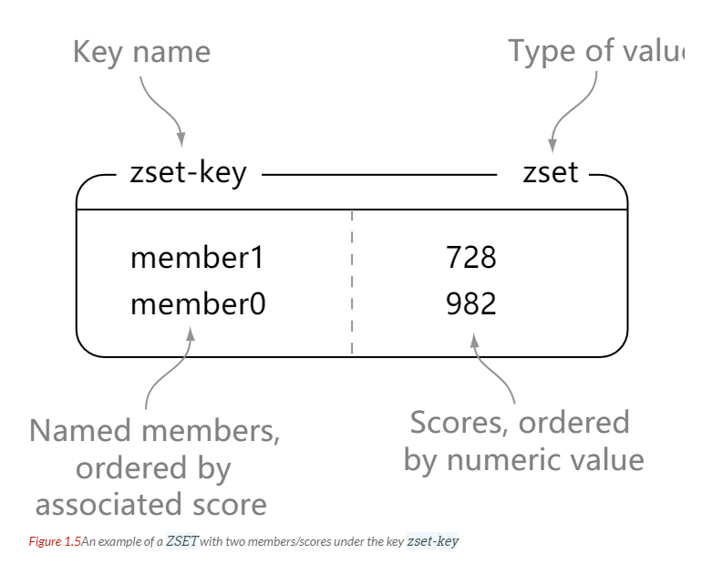
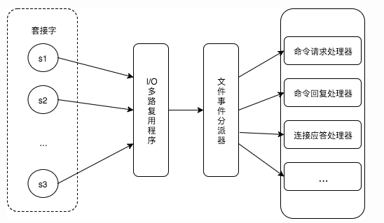
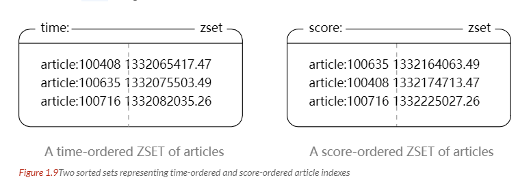

# 概述

Redis 是非关系型（NoSQL）内存键值数据库

非常快

# 数据类型

| 数据类型 | 可以存储的值 |
| :--: | :--: |
| STRING | 字符串、整数或者浮点数 |
| LIST | 列表(栈、队列) |
| SET | 无序集合 |
| HASH | 包含键值对的无序散列表 |
| ZSET | 有序集合 |

## STRING

<div align="center">  </div><br>
```html
> set hello world
OK
> get hello
"world"
> del hello
(integer) 1
> get hello
(nil)
```

## LIST

<div align="center">  </div><br>
```html
> rpush list-key item
(integer) 1
> rpush list-key item2
(integer) 2
> rpush list-key item
(integer) 3

> lrange list-key 0 -1
1) "item"
2) "item2"
3) "item"

> lindex list-key 1
"item2"

> lpop list-key
"item"

> lrange list-key 0 -1
1) "item2"
2) "item"
```

## SET

<div align="center">  </div><br>
```html
> sadd set-key item
(integer) 1
> sadd set-key item2
(integer) 1
> sadd set-key item3
(integer) 1
> sadd set-key item
(integer) 0

> smembers set-key
1) "item"
2) "item2"
3) "item3"

> sismember set-key item4
(integer) 0
> sismember set-key item
(integer) 1

> srem set-key item2
(integer) 1
> srem set-key item2
(integer) 0

> smembers set-key
1) "item"
2) "item3"
```

## HASH

<div align="center">  </div><br>
```html
> hset hash-key sub-key1 value1
(integer) 1
> hset hash-key sub-key2 value2
(integer) 1
> hset hash-key sub-key1 value1
(integer) 0

> hgetall hash-key
1) "sub-key1"
2) "value1"
3) "sub-key2"
4) "value2"

> hdel hash-key sub-key2
(integer) 1
> hdel hash-key sub-key2
(integer) 0

> hget hash-key sub-key1
"value1"

> hgetall hash-key
1) "sub-key1"
2) "value1"
```

## ZSET

<div align="center">  </div><br>
```html
> zadd zset-key 728 member1
(integer) 1
> zadd zset-key 982 member0
(integer) 1
> zadd zset-key 982 member0
(integer) 0

> zrange zset-key 0 -1 withscores
1) "member1"
2) "728"
3) "member0"
4) "982"

> zrangebyscore zset-key 0 800 withscores
1) "member1"
2) "728"

> zrem zset-key member1
(integer) 1
> zrem zset-key member1
(integer) 0

> zrange zset-key 0 -1 withscores
1) "member0"
2) "982"
```


# 使用场景

## 计数器

可以对 String 进行自增自减运算，从而实现计数器功能。

Redis 这种内存型，很适合存储频繁读写的计数量。

## 缓存

将热点数据放到内存中，设置内存的最大使用量以及淘汰策略来保证缓存的**命中率**。

## 查找表

例如 DNS 记录就很适合使用 Redis 进行存储。

查找表和缓存类似，但查找表内容不能失效。

## 会话缓存

可以使用 Redis 来统一存储多台应用服务器的会话信息。

当应用服务器不再存储用户的会话信息，也就不再具有状态，一个用户可以请求任意一个应用服务器，从而更容易实现高可用性以及可伸缩性。

## 消息队列

List 是一个双向链表，可以通过 lpop 和 lpush 写入和读取消息。

不过最好使用 Kafka、RabbitMQ 等消息中间件。

## 分布式锁实现

多个节点需要一个节点来存储锁信息。

使用自带的 SET 命令实现分布式锁，除此之外，还可以使用官方提供的 RedLock 分布式锁实现。

```
#设锁
SET resource_name my_random_value NX PX 30000
#解锁
if redis.call("get",KEYS[1]) == ARGV[1] then
    return redis.call("del",KEYS[1])
else
    return 0
end
```


## 其它

Set 可以实现交集、并集等操作，从而实现共同好友等功能。

ZSet 可以实现有序性操作，从而实现排行榜等功能。

# Redis 与 Memcached

两者都是非关系型内存键值数据库，主要有以下不同：

## 数据类型

Memcached 仅支持字符串类型，而 Redis 支持五种不同的数据类型，可以更灵活地解决问题。

## 内存管理机制

- Memcached 的数据会一直在内存中。
- Memcached 内存利用率不高。分块，只解决了块外碎片；而且某种大小的数据只能存储在和其规格相似的块中，导致明明有空间，但分配不了内存。

## 数据持久化

Redis 支持两种持久化策略：RDB 快照和 AOF 日志，而 Memcached 不支持持久化。

## 分布式

Memcached 不支持分布式，只能通过在客户端使用一致性哈希（？，节点失效）来实现分布式存储，这种方式在存储和查询时都需要先在客户端计算一次数据所在的节点。

Redis Cluster 实现了分布式的支持。

# 键的过期时间

Redis 可以为每个键设置过期时间，当键过期时，会自动删除该键。

对于散列表这种容器，只能为整个键设置过期时间（整个散列表）。

# 数据淘汰策略

Reids，三类：不淘汰、设置了过期的数据和所有数据

| 策略 | 描述 |
| :--: | :--: |
| volatile-lru | 从已设置过期时间的数据集中挑选最近最少使用的数据淘汰 |
| volatile-ttl | 从已设置过期时间的数据集中挑选将要过期的数据淘汰 |
|volatile-random | 从已设置过期时间的数据集中任意选择数据淘汰 |
| allkeys-lru | 从所有数据集中挑选最近最少使用的数据淘汰 |
| allkeys-random | 从所有数据集中任意选择数据进行淘汰 |
| noeviction | 禁止驱逐数据 |

作为内存数据库，出于对性能和内存消耗的考虑，Redis 的淘汰算法实际实现上并非针对所有 key，而是抽样一小部分并且从中选出被淘汰的 key。

使用 Redis 缓存数据时，为了提高缓存命中率(使用到的缓存/总缓存大小)，需要保证缓存数据都是热点数据。可以将内存最大使用量设置为热点数据占用的内存量，然后启用 allkeys-lru 淘汰策略，将最近最少使用的数据淘汰。

Redis 4.0 引入了 volatile-lfu 和 allkeys-lfu 淘汰策略，LFU 策略通过统计访问频率，将访问频率最少的键值对淘汰。

# 持久化

Redis 是内存型数据库，为了保证数据在断电后不会丢失，需要将内存中的数据持久化到硬盘上。

## RDB 持久化

将某个时间点的所有数据都存放到硬盘上。

生成快照时间、崩溃恢复?

## AOF 持久化

将写命令添加到 AOF 文件（Append Only File）的末尾。

使用 AOF 持久化需要设置同步选项。这是因为对文件进行写入并不会马上将内容同步到磁盘上，而是由操作系统决定什么时候同步到磁盘。有以下同步选项：

| 选项 | 同步频率 |
| :--: | :--: |
| always | 每个写命令都同步 |
| everysec | 每秒同步一次 |
| no | 让操作系统来决定何时同步 |

- always 选项会严重减低服务器的性能；
- everysec 选项比较合适，对性能影响不大，而且崩溃后损失较小。
- no 性能提升不大，崩溃后完蛋

随着服务器写请求的增多，AOF 文件会越来越大。Redis 提供了一种将 **AOF 重写**的特性，能够去除 AOF 文件中的冗余写命令。

# 事务

一个事务包含多个命令，被一次性发往服务器（流水线）。客户端执行事务时，不会执行其他客户端的请求。

Redis 最简单的事务实现方式是使用 MULTI 和 EXEC 命令将事务操作包围起来。

# 数据结构


## 跳跃表

是有序集合的底层实现之一。

跳跃表是基于多指针有序链表实现的，可以看成多个有序链表。

<div align="center">  </div><br>
在查找时，从上层指针开始查找，找到对应的区间之后再到下一层去查找。下图演示了查找 22 的过程。

<div align="center">  </div><br>
与红黑树等平衡树相比，跳跃表具有以下优点：

- 插入速度非常快速，因为不需要进行旋转等操作来维护平衡性；
- 更容易实现；

# 事件

Redis 服务器是一个事件驱动程序。

## 文件事件

Redis 基于 Reactor 模式开发了自己的网络事件处理器，使用 I/O 多路复用程序来同时监听多个套接字，并将到达的事件传送给文件事件分派器，分派器会根据套接字产生的事件类型调用相应的事件处理器。

<div align="center">  </div><br>
## 时间事件

服务器有一些操作需要在给定的时间点执行，时间事件是对这类定时操作的抽象。

时间事件又分为：

- 定时事件：是让一段程序在指定的时间之内执行一次；
- 周期性事件：是让一段程序每隔指定时间就执行一次。

Redis 将所有时间事件都放在一个无序链表中，通过遍历整个链表查找出已到达的时间事件，并调用相应的事件处理器。

## 事件的调度与执行

服务器需要不断监听文件事件的套接字才能得到待处理的文件事件，但是不能一直监听，否则时间事件无法在规定的时间内执行，因此监听时间应该根据距离现在最近的时间事件来决定。

事件调度与执行由 aeProcessEvents 函数负责，伪代码如下：

```python
def aeProcessEvents():
    # 获取到达时间离当前时间最接近的时间事件
    time_event = aeSearchNearestTimer()
    # 计算最接近的时间事件距离到达还有多少毫秒
    remaind_ms = time_event.when - unix_ts_now()
    # 如果事件已到达，那么 remaind_ms 的值可能为负数，将它设为 0
    if remaind_ms < 0:
        remaind_ms = 0
    # 根据 remaind_ms 的值，创建 timeval
    timeval = create_timeval_with_ms(remaind_ms)
    # 阻塞并等待文件事件产生，最大阻塞时间由传入的 timeval 决定
    aeApiPoll(timeval)
    # 处理所有已产生的文件事件
    procesFileEvents()
    # 处理所有已到达的时间事件
    processTimeEvents()
```

将 aeProcessEvents 函数置于一个循环里面，加上初始化和清理函数，就构成了 Redis 服务器的主函数，伪代码如下：

```python
def main():
    # 初始化服务器
    init_server()
    # 一直处理事件，直到服务器关闭为止
    while server_is_not_shutdown():
        aeProcessEvents()
    # 服务器关闭，执行清理操作
    clean_server()
```

从事件处理的角度来看，服务器运行流程如下：

<div align="center">  </div><br>
# 复制

通过使用 slaveof host port 命令来让一个服务器成为另一个服务器的从服务器。

一个从服务器只能有一个主服务器，并且不支持主主复制。

复制不同于分片

## 过程

1. 主服务器创建快照文件，发送给从服务器，并在发送期间使用缓冲区记录执行的写命令。快照文件发送完毕之后，开始向从服务器发送存储在缓冲区中的写命令；

2. 从服务器丢弃所有旧数据，载入主服务器发来的快照文件，之后从服务器开始接受主服务器发来的写命令；

3. 主服务器每执行一次写命令，就向从服务器发送相同的写命令。

## 主从链

主服务器之间不能复制，一个从服务器只能有一个主服务器。从服务器太多，就形成了树状结构。

<div align="center">  </div><br>
# Sentinel

Sentinel（哨兵）可以监听集群中的服务器，并在主服务器进入下线状态时，自动从从服务器中选举出新的主服务器。

# 分片位置

根据执行分片的位置，可以分为三种分片方式：

- 客户端分片：客户端使用一致性哈希等算法决定键应当分布到哪个节点。
- 代理分片：将客户端请求发送到代理上，由代理转发请求到正确的节点上。
- 服务器分片：Redis Cluster。

# 一个简单的论坛系统分析

该论坛系统功能如下：

- 可以发布文章；
- 可以对文章进行点赞；
- 在首页可以按文章的发布时间或者文章的点赞数进行排序显示。

## 文章信息

文章包括标题、作者、赞数等信息，在关系型数据库中很容易构建一张表来存储这些信息，在 Redis 中可以使用 HASH 来存储每种信息以及其对应的值的映射。

Redis 没有关系型数据库中的表这一概念来将同种类型的数据存放在一起，而是使用命名空间的方式来实现这一功能。键名的前面部分存储命名空间，后面部分的内容存储 ID，通常使用 : 来进行分隔。例如下面的 HASH 的键名为 article:92617，其中 article 为命名空间，ID 为 92617。

<div align="center">  </div><br>
## 点赞功能

当有用户为一篇文章点赞时，除了要对该文章的 votes 字段进行加 1 操作，还必须记录该用户已经对该文章进行了点赞，防止用户点赞次数超过 1。可以建立文章的已投票用户集合来进行记录。

为了节约内存，规定一篇文章发布满一周之后，就不能再对它进行投票，而文章的已投票集合也会被删除，可以为文章的已投票集合设置一个一周的过期时间就能实现这个规定。

<div align="center">  </div><br>
## 对文章进行排序

为了按发布时间和点赞数进行排序，可以建立一个文章发布时间的有序集合和一个文章点赞数的有序集合。（下图中的 score 就是这里所说的点赞数；下面所示的有序集合分值并不直接是时间和点赞数，而是根据时间和点赞数间接计算出来的）

<div align="center">  </div><br>
