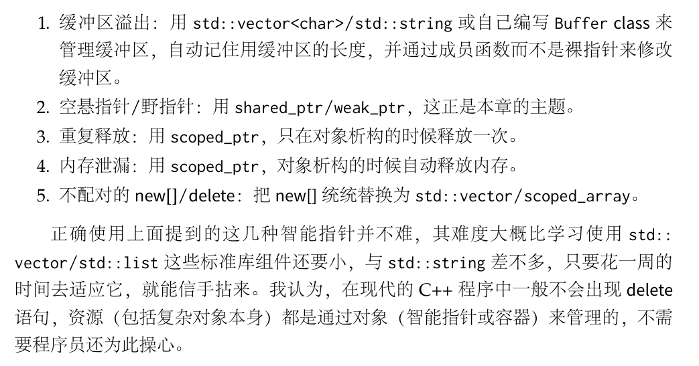

# 概述

C++ 是静态类型语言

## 编译
### 预处理命令

使用 #ifdef 设置条件编译，使用 #defeine 设置宏，注意定义宏要加括号。

预处理分为哪几种？分别干了什么？使用起来需要注意什么？

### 现代编译器

源代码通过编译器前端转换到中间表示代码，再通过编译器后端转换到机器码。
`参考`

- [Compare gcc and llvm](https://stackoverflow.com/a/24836566)

# 语法

## 指针
- 常量指针  
  
  ```c++
  int const* p;  const int* p;
  ```
  
-  指针常量
  
  ```c++
  int* const p;
  ```
  
- ”多指针“

  ```c++
  int main()
  {
      //二维数组n，每维10个元素
      int(*n)[10] = (int(*)[10]) new int[10];//在堆分配一个数组，把返回的地址作第一维的首地址,而n的地址也为这个地址
      for (int i = 0; i < 10; i++)
      {
          //注意n和*n的值是一样的。
          printf("%d:%d\n",n,*((*n)+i));
          (*n)[i] = i;
          printf("%d-%d\n",(*n)[i],n+i);
      }
      return 0;
  }
  ```

`参考`

- 二维数组逻辑结构


## 引用

- 使用引用有什么优势？

- 右值引用、引用折叠

  ```c++
  template<typename T>
  void f(T&& param);
  
  f(10); // 10是右值，函数参数就是右值引用
  int x = 10;
  f(x);  // x是左值，发生引用折叠
  ```

  折叠规则：
  1.所有右值引用折叠到右值引用上仍然是一个右值引用。（A&& && 变成 A&&）
  2.所有的其他引用类型之间的折叠都将变成左值引用。 （A& & 变成 A&;  A& && 变成 A&;  A&& & 变成 A&）
  也就是说左值没有“引用的引用”。

## 初始化

- **变量“一定义”就会自动初始化**

- 初始化分为三种

  ```c++
  //范例一
  string a("hello");//直接初始化
  string i1 = "hello"; //复制初始化，理论上分两步：先隐式调用构造函数生成临时对象("hello"变为string对象)，然后调用拷贝构造函数。
  string i2 {"hello"}; //列表初始化，只一步：调用构造函数

  //范例二：比较列表初始化和复制初始化
  class Foo
  {
  public:
  	Foo(int) {}
  private:
  	Foo(const Foo &);
  };
  int _tmain(int argc, _TCHAR* argv[])
  {
  	Foo a1(123); //调用Foo(int)构造函数初始化
  	Foo a2 = 123; //error Foo的拷贝构造函数声明为私有的
   
  	Foo a3 = { 123 }; //复制列表初始化，成功。隐式调用构造函数。
  	Foo a4 { 123 }; //直接列表初始化，成功。显式调用构造函数。
   
  	int a5 = { 3 };
  	int a6 { 3 };
  	return 0;
  }
  
  ```
  
  

## 类型

自动变量

```c++
auto b = true;       // a bool
auto ch = 'x';       // a char
```

## enum 枚举类型

### 限定作用域的枚举类型

```cpp
enum class Color { black, white, red};            // black, white, red 作用域为 Color
auto white = false;                               // fine, 在这个作用域内没有其他的 "white"
Color c = white;                                  // 错误！在这个定义域中没有叫"white"的枚举元素
Color c = Color::white;                           // fine
```

### 不限定作用域的枚举类型

```cpp
enum color { red, yellow, green };
enum { floatPrec = 6, doublePrec = 10 };
auto red = false;//错误，red 已经定义了
```

## extern

声明变量来自其他地方，然后“链接”时会发生什么？

`参考`

  - [External vs. internal linkage](https://docs.microsoft.com/en-us/cpp/cpp/program-and-linkage-cpp?view=vs-2019)
  
  - [When to use extern](https://stackoverflow.com/a/10422050)

## 常量

  使用常量既可以提升性能，也可以减少程序发生错误的可能。在 C++ 中有两种常量：

  - const：值可能是在运行时，才替换到使用的地方。
  - constexpr：编译时就被替换。

> 常量和指针、常量和函数？


## lvalue、prvalue、xvalue

C++ 的表达式有五种类型。lvalue ”表达式估值后“的产物就是**一个**标识符，用来代表 pravlue。prvalue ”估值后“是
一个”具体值“，如：对象、**标识符和数字的组合**、“a++”。xvalue **是**对 prvalue 的**引用**。glvalue 包括 lvalue 和 xvalue，rvalue 包括 prvalue 和 xvalue。

`注意`

- 使用 =（隐式类型转换）、函数返回值时，可能会将一个短暂的 prvalue 绑定到一个 non-const ”lvalue 引用“

`参考`

- [Real life examples of xvalues, glvalues, and prvalues?](https://stackoverflow.com/a/6613117/10069246)
- [Lvalues and Rvalues](https://docs.microsoft.com/en-us/cpp/cpp/lvalues-and-rvalues-visual-cpp?view=vs-2019)
- [bind rvalue to lvalue refrence](https://stackoverflow.com/a/1565811)
- [no const lvalue reference](https://stackoverflow.com/a/42408640)

## 内联函数(inline)

函数调用时消耗比较大，所以可以采取在**编译时**把代码“复制”到使用处的方式节省消耗，这就是内联函数。相比宏定义，内联函数保留了普通函数的特性，可以进行类型检查、自动类型转换，并且在运行时可以调试。

实际上，inline 只是建议，到底内联与否取决于编译器。默认情况下，在**类声明**中定义的函数，除虚函数外，函数默认内联。

`参考`

- “复制”的过程

  1. 函数体复制到调用处

  2. 为 inline 函数中的局部变量分配空间

  3. 将 inline 函数的输入输出和调用函数的局部变量关联
- 由于 inline 函数是被复制，所以 inline 函数修改后，除 inline 函数要重新编译，调用处也要重新编译。
- 虚函数也可以显式“建议内联”，这只在编译器调用 inline virtual 函数的是实际对象而不是对象的指针或引用时才会发生     

## volatile

在 C 中阻止编译器优化；阻止是因为被 const 修饰的变量不是编译器认为的不变，而是会因为"各种事情”变化。在 Java 中 volatile 表示：the value of a `volatile` field becomes visible to all readers (other threads in particular) after a write operation completes on it. Without `volatile`, readers could see some non-updated value.

## extern "C"

包围的代码作 c 代码处理。可以避免在 c++ 中链接 c 库时，因符号修饰不同，而链接失败。注意区别 extern；

```cpp
#ifdef __cplusplus
extern "C" {
#endif

void *memset(void *, int, size_t);

#ifdef __cplusplus
}
#endif
```

## explict

禁止隐式转换。但语境转换可用。

```c++
struct B {
    explict operator bool(){ return true;}//构造函数是其他转化为目标，这个是目标转化为其他。
}

int main(){
    if (b1);// OK：被 explicit 修饰转换函数 B::operator bool() 的对象可以从 B 到 bool 的按语境转换
	bool b6(b1);// OK：被 explicit 修饰转换函数 B::operator bool() 的对象可以从 B 到 bool 的按语境转换
	bool b7 = b1;// 错误：被 explicit 修饰转换函数 B::operator bool() 的对象不可以隐式转换
}
```

`参考`

- [按语境转换](https://zh.cppreference.com/w/cpp/language/implicit_conversion) 

## decltype

参考 https://stackoverflow.com/a/18815367

## 友元

允许友元访问本类**实例**的私有成员。

参考 https://blog.csdn.net/fanyun_01/article/details/79122916

## 函数

函数的意义在使代码被分成了一块块有类别的（函数的名字），"短小的"组合。

> ”函数的类型“包括什么？


- **析构函数**

  析构函数需要对指针 delete 或 delete[]。引用不是 new 产生的，不需要 delete。

## 结构体

- **对齐**
 结构体中的每个成员都认为内存按照自己的大小分块，自己从“最小的”可以利用的块开始放。最后，结构体整个大小要和最大的成员对齐。

`参考`

- https://blog.csdn.net/Apollon_krj/article/details/51302859
- #pragma pack(n) 使用

## 用户自定义类型

  分为两种：类和枚举。

## 命名空间

Namespaces，把一些表达组合到一起；这样一个表达即使和另一个组合中的表达重名，也不会发生冲突。

```c++
namespace My_code {
    class complex {
         // ...
    };

    complex sqrt(complex);
    // ...
    
    int main();
}
int My_code::main()
{
    complex z {1,2};
    auto z2 = sqrt(z);
    std::cout << '{' << z2.real() << ',' << z2.imag() << "}\n";
    // ...
}

int main()
{
    return My_code::main();
}
```

在上面的片段中调用命令空间中的表达很繁琐，可以简化成下面这样

```c++
//方式一
// use the standard-library swap
using std::swap;        
// ...
swap(x,y)
    
//方式二
using namespace std;
swap(x,y)
```

> 没有明确声明所在命令空间的表达有命名空间吗？

在一个命名空间，变量名会和“函数名，typedef 定义的结构体名”冲突。

## 错误处理

要明确程序的“预置条件”，尽力确保数据在正确的范围；可有两种方式：

- 在编译时候就确保：static_assert(A,S)。A 必须满足，才能编译这一句下面的句子。
- 运行时确保：
  - 避免错误发生：RAII（Resource Acquisition Is Initialization）
  - 错误发生即停止(panic)：assert（造成运行时性能损耗，所以一般不使用）
  - 错误发生尝试恢复：设置方法条件：当意外情况发生了，如果发生错误的地方不能处理，且“邻近的调用”可以处理，就给它，不然中止。

## 初始化列表

```cpp
#include <iostream>
#include <vector>
#include <initializer_list>
 
template <class T>
struct S {
    std::vector<T> v;
    S(std::initializer_list<T> l) : v(l) {
         std::cout << "constructed with a " << l.size() << "-element list\n";
    }
    void append(std::initializer_list<T> l) {
        v.insert(v.end(), l.begin(), l.end());
    }
    std::pair<const T*, std::size_t> c_arr() const {
        return {&v[0], v.size()};  // 在 return 语句中复制列表初始化
                                   // 这不使用 std::initializer_list
    }
};
 
template <typename T>
void templated_fn(T) {}
 
int main()
{
    S<int> s = {1, 2, 3, 4, 5}; // 列表初始化
    s.append({6, 7, 8});      // 函数调用中的列表初始化
 
    std::cout << "The vector size is now " << s.c_arr().second << " ints:\n";
 
    for (auto n : s.v)
        std::cout << n << ' ';
    std::cout << '\n';
 
    std::cout << "Range-for over brace-init-list: \n";
 
    for (int x : {-1, -2, -3}) // auto 的规则令此带范围 for 工作
        std::cout << x << ' ';
    std::cout << '\n';
 
    auto al = {10, 11, 12};   // auto 的特殊规则
 
    std::cout << "The list bound to auto has size() = " << al.size() << '\n';
 
//    templated_fn({1, 2, 3}); // 编译错误！“ {1, 2, 3} ”不是表达式，
                             // 它无类型，故 T 无法推导
    templated_fn<std::initializer_list<int>>({1, 2, 3}); // OK, {}列表可以转化为 initializer_list，但是不是 initializer_list 类型
    templated_fn<std::vector<int>>({1, 2, 3});           // 也 OK
}
```

## 继承

> 怎么使用 C++ 的多态特性？

只要有 pure virtual function，就是抽象类。抽象类的变量常作指针保存抽象类的派生类，所以需要 delete；但是不能调用抽象类的析构函数（destructor），而是得调用其派生类。设置抽象类的析构函数为 virtual，即可实现。

```c++
virtual ~Container() {}
```

`参考`

- [How virtual function works](https://www.learncpp.com/cpp-tutorial/125-the-virtual-table/)

- 为什么基类的 vptr 指向了子类的 vtbl？

  子类的 vptr 是从基类继承的。

## RAII

初始化一个对象的时候就在获取资源（Resource Acquisition is **object** Initialization）。(这个对象被自动销毁的时候，资源释放)

参考 refs/docs下 “c++中RAII技巧”

## 智能指针

参考 https://www.codeproject.com/Articles/541067/Cplusplus-Smart-Pointers

# 思想

- 资源要当作类来处理

  

# 数据结构

## Vector

- [Why can't I make a vector of references?](https://stackoverflow.com/a/922455)

# 参考资料

[1] Bjarne Stroustrup. A Tour of C++ 2nd Edition

[2] https://github.com/huihut/interview/

[3] [引用折叠](https://www.zhihu.com/question/40346748/answer/88672920)

[4] 陈硕 《Linux 多线程服务器编程》