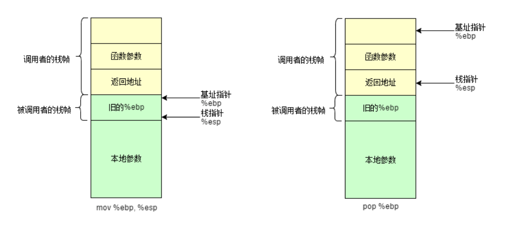

# 编译

## GCC
```bash
	gcc *.c -lpthread
	//编译时静态连接pthread库；为什么printf不需要?
```
## CMake
1. 给一个路径
	```cmake
	project(main C)
	INCLUDE_DIRECTORIES(/tmp/include/hello)
	LINK_DIRECTORIES(/tmp/lib/)
	ADD_EXCUTABLE(main **.c **.c)
	TARGET_LINK_LIBRARIES(main libhello.a)
	```
	
2. 直接找到包，然后连接  
	```cmake
	ADDD_EXCUTABLE(main **.c)
	INCLUDE_DIRECTORIES(/tmp/include/hello)
	find_library(LIBHELLO_PATH hello /tmp/lib)
	//从"/tmp/lib"中找到名为hello的库然后赋值给LIBHELLO_PATH
	IF(NOT LIBHELLO_PATH)
	MESSAGE(FATAL_ERROR "libhello not found")
	ENDIF(NOT LIBHELLO_PATH)
	MESSAGE(STATUS ${LIBHELLO_PATH} "found")
	TARGET_LINK_LIBRARIES(main ${LIBHELLO_PATH})//可以直接设置位置让CMAKE连接
	```
	

`参考`

- [Cmake 入门](https://www.hahack.com/codes/cmake/)
# 类型

## char
char 表示单个字符，C 语言的字符串则用 char “数组”表示；注意，字符串"abc“在内存里是 "abc\0"。

> Java 的字符串不需要 \0 ，为什么?

`参考`

- 	'\0' 的 ASCII 是 0

## 数组

声明数组必须得显示或隐式的指明大小；将一个变量声明为数组时即分配空间，不能再将这个变量指向其他地方。

```c
char str[3] = "abc";//错误，3代表包括'\0'可以放三个字符，不是char[0]到char[3]可用。
//声明str为指针，str的值是常量区字符串的首地址
char *str = "abc";
//声明str1数组时就“分得了数组区域”，
char str1[] = "abc";//“abc"把值填充进数组空间，不是改变数组变量指向"abc"；这是 = 特性限制，导致误解。
str1 = "def";//错误
```

数组之间不能整体赋值

```c
char a[2];
char b[3];
a = b;//错误
```
但是包含数组成员的结构体可以相互赋值
```c
struct a{
char name[20];
} a1,a2;
a1 = a2;//这样是可以的
```

`参考`

- [Assigning strings to arrays of characters](https://stackoverflow.com/questions/579734/assigning-strings-to-arrays-of-characters)

## 结构体

- **对齐**

  成员一个个的放。当放一个成员的时候，把空间当作以这个成员的大小划分的，然后把这个成员放在，这样划分后，第一个可用的位置。

  最后还要一次，以最大成员宽度划分的。

  注意：1. 指针是四个字节 2. 当成员是另一个结构体是，划分空间的标准是按照其最大成员的宽度，不是整个结构体的宽度。

# 常用函数

- **IO**
	io分类?

# 函数调用

栈帧可以说是一种特殊的栈，有两个指针：esp即为栈顶指针(SP，栈指针，低地址)，ebp为栈底指针（高地址）

<div align="center">
**函数参数**被调用函数的参数的值，从右到左依此入栈

**返回地址**回到调用者后，继续执行的代码的地址。

`参考`
- [C函数调用过程原理及函数栈帧分析](https://segmentfault.com/a/1190000007977460)

# 系统调用

## fork() 和 clone()

fork() 用来创建新进程。一般情况下，fork() 克隆一个进程，然后通过 exec() 执行另一个程序。所以，在这种情况下复制一个进程完全是浪费。Linux 引入了 写时复制 ，即当确定（子进程操作父进程相同的内容）不执行新程序时才会复制（子进程和新进程的代码相同，数据段和堆栈段不同），刚调用 fork() 时只是逻辑上产生新进程。

clone 是 Linux 为创建线程设计的（虽然也可以创建进程）。可以说 clone 是 fork 的升级版本，不仅可以创建进程或者线程，还可以创建新的命名空间（namespace）、有选择的继承父进程的内存、甚至可以将创建出来的进程变成父进程的兄弟进程等等。