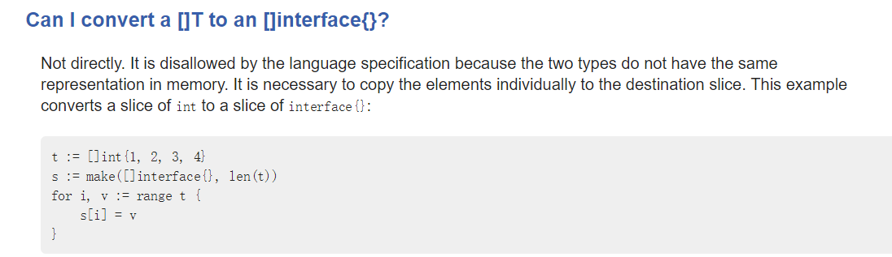

# Go 性能调优

- 解决整体耗时区域
  1. go test
  
  2. 下面两个命令几乎同时运行
	
	   ```go
	    go-wrk -d 60 http://localhost:8080/a@golang.org
		 go-torch -t 5
	   ```
 -  解决整体中某一部分的过多耗时
	1. 写 Benchmark方法
		 	func BenchmarkXX(b *testing.B)
	2. go test
	3.  go test -bench . -cpu.profile prof.cpu
	4.  go-torch --binaryname **.test -b prof.cpu

`参考`

- Youtube. Just For Func

# 语法



interface{} 是一个具体的类型，而不是代表所有类型。能直接把 []string 转换为 []int 吗？

## 声明空 slice

```go
var nums []int//nums 为 null
nums = append(nums,1)
```

## ...省略符的用法

```go
func Debug(format string, args ...interface{}) {
	if len(args) > 0 {
		log.Debugf(format, args...)//这里也用了不然多个符合就会变成一个符号，比如："a","b"成 “a b"
	} else {
		log.Debug(format)
	}
}
```

## ++和--

++ 和 -- 只能放在变量后面，而且

```go
nums[i--]
```

也是非法的；这么做是为了简化语法

## 反射和类型转换

反射，具体来说就是使用 type aseeration、type switch；反射是从抽象类型获取具体类型，而类型转换是不同静态类型之间的转换。

## 接口调用

为什么方法传入接口，不能传入接口指针。因为调用这个方法时，即使赋值的具体类型的实例是指针，只要这个具体类实现了这个方法都是这个接口，而不是接口的指针。

An interface can store either a struct directly *or* a pointer to a struct. In the latter case, you still **just** use the interface directly, *not* a pointer to the interface.

## <- chan 和 chan

```go
func randomNumberGenerator() <-chan int {}
chan   // read-write
<-chan // read only
chan<- // write only
```


# 网络编程
- 在 fd_unix.go 中可看出，go 的 read（针对“所有文件”）只要连接处于可以读取数据的状态，就会“尽力去读”。

- 客户端和服务器交流的应该是命令而“不是日志”。命令，应该根据数据的格式判断，而不是数据的具体内容来判断

  ```go
  // 不合适写法
  sturct GMsg{
      type string
  }
  // 合适写法
  struct AType{
  }
  struct BType{
  }
  ```

  

# 注意

- 结构体中根据成员首字母是否大写来定是否暴露，如果成员没暴露，外部模块将无法获取，但内部模块可以获取。
- 结构体转换为 json 字节数组,再由 json 字节数组转换为结构体的两个过程中，分别使用的结构体的成员的名字应该相同。**结构体得到的 json 字节不是根据“字节偏移”就能得到它是原来结构体中的哪个成员**。
- 定义一个 map 的初始值为 nil