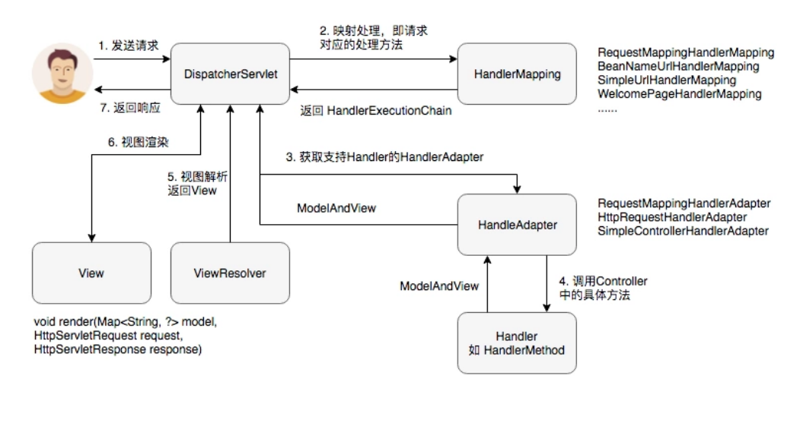

# Tomcat

conf/server.xml 下的几个元素

## Server 

代表 Catalina servlet container，逻辑上代表一个服务器，在一个 jvm 中只有一个实例。

## Service

将  Connector 和 Engine 关联起来。Service 是 Server 的一部分

## Connector

监听设定的端口，并把接收到的请求交给 Engine 处理。

## Engine

处理客户端请求。

当一个请求到来的时候，生成请求和相应的“包装对象”，并根据配置选择合适的 Servlet 的 Service() 处理。

# Servlet

客户端请求到达 servlet 容器，容器根据配置（WEB-INF/web.xml）选择合适的 servlet ，封装 request、response 对象。然后容器分配一个线程，调用 servlet 的 service 方法处理。service 方法根据请求是 GET 和 POST 调用不同的方法处理，处理完成后把结果写入 response 对象。线程结束。

Web 容器负责创建 servlet 和 filter 的实例，然后调用他们生命周期里的各个方法，如 init()，service()，destroy()。

https://www.studytonight.com/servlet/how-a-servlet-application-work.php

# Spring MVC

## 原理

第二步，遍历 HandlerMapping 队列，一旦从某个 Mapping 中得到 Chain，就返回此 Chain。一个 Chain 包含一个 Handler（如 HandlerMethod对象）和多个 Interceptor。从 Chain 中取出 Handler 并转换成 HandlerAdapter。执行 HandlerAdapter 得到 ModelAndView（此处的 View 还不是具体的 View 对象）。

`参考` 

- https://segmentfault.com/a/1190000013816079
- DispatchServlet 也会创建一个 IOC 容器，这个容器以 web.xml 中配置的容器为父。子可以访问父的 beans，反过来不行。但是当 MVC 生成 HandlerMapping 的时候，只查找 DispatchServlet 的容器，所以 Controller 得注册在子容器中。