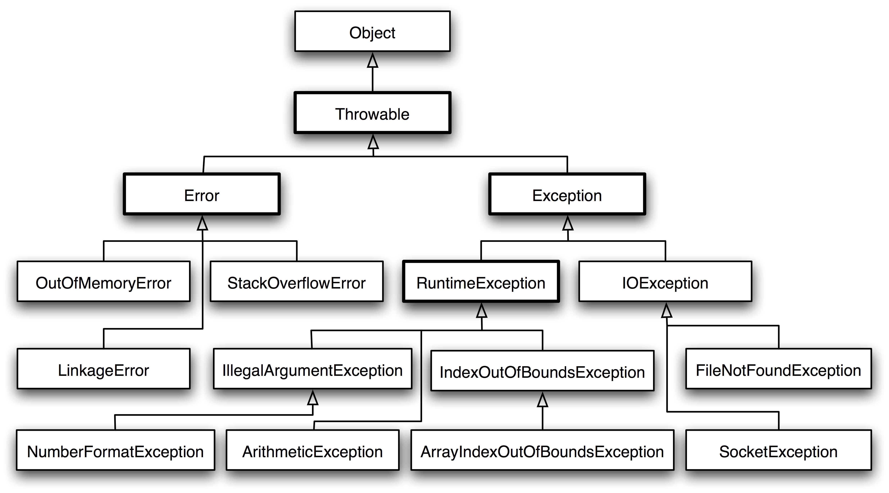

# 要求
## JRE or JDK

- JRE is the JVM program, Java application need to run on JRE.
- JDK is a superset of JRE, JRE + tools for developing java programs. e.g, it provides the compiler "javac"
## CLASSPATH

java 程序寻找可执行文件的位置，默认为当前文件夹。运行时必须指定 包名＋类名。

## Maven

Maven 是 Java 的“编译系统”；可用于获取第三方包，并可设置编译过程及行为。

Maven 本身不执行具体的任务，如编译、打包，而是交给插件（plugin-in）的目标（goal）来做；goal 是一类动作的组合。一个编译过程由几个阶段（phase）组成，检查、编译、测试、打包等。phase 要和 goal 关联，并且每个 phase 默认就关联若干个 goal。

# 数据类型

## 基本类型

- byte/8
- char/16
- short/16
- int/32
- float/32
- long/64
- double/64
- boolean/\~

JVM 未对 boolean 的存储方式规定，所以此处用~表示。
可以使用 1 bit 来存储。但一般是在编译时期 JVM 会将 boolean 类型的数据转换为 int，使用 1 来表示 true，0 表示 false。JVM 并不**直接**支持 boolean 数组，而是将 boolean 数组用 int 数组表示。


## 包装类型

```java
Integer a = 129;
Integer b = 129;
a == b;
```

## 比较

- 泛型

- 包装类型使用缓存池

- == 比较不拆箱

- 不可变

## 缓存池

- 自动装箱调用 Integer.valueof()；
- new Integer(123) 每次都会新建一个对象；

在 Java 8 中，Integer 缓存池的范围默认为 -128\~127。

```java
static final int low = -128;
static final int high;
static final Integer cache[];

static {
    // high value may be configured by property
    int h = 127;
    String integerCacheHighPropValue =
        sun.misc.VM.getSavedProperty("java.lang.Integer.IntegerCache.high");
    if (integerCacheHighPropValue != null) {
        try {
            int i = parseInt(integerCacheHighPropValue);
            i = Math.max(i, 127);
            // Maximum array size is Integer.MAX_VALUE
            h = Math.min(i, Integer.MAX_VALUE - (-low) -1);
        } catch( NumberFormatException nfe) {
            // If the property cannot be parsed into an int, ignore it.
        }
    }
    high = h;

    cache = new Integer[(high - low) + 1];
    int j = low;
    for(int k = 0; k < cache.length; k++)
        cache[k] = new Integer(j++);

    // range [-128, 127] must be interned (JLS7 5.1.7)
    assert IntegerCache.high >= 127;
}
```

基本类型对应的缓冲池如下：
- boolean values true and false
- all byte values
- short values between -128 and 127
- int values between -128 and 127
- char in the range \u0000 to \u007F

`参考`

- 为什么使用缓存池？

  享元模式

# String

## 概览

String 被声明为 final，因此它不可被继承。

在 Java 8 中，String 内部使用 char 数组存储数据。

```java
public final class String
    implements java.io.Serializable, Comparable<String>, CharSequence {
    /** The value is used for character storage. */
    private final char value[];
}
```

在 Java 9 之后，String 类的实现改用 byte 数组存储字符串，同时使用 `coder` 来标识使用了哪种编码。

```java
public final class String
    implements java.io.Serializable, Comparable<String>, CharSequence {
    /** The value is used for character storage. */
    private final byte[] value;

    /** The identifier of the encoding used to encode the bytes in {@code value}. */
    private final byte coder;
}
```

实现方法：让引用不变。同时不提供改变引用内容的方法。

为什么要不可变：包装类型都是不可变的，这样传参的时候就改不了传入的内容。

## new String("abc")

创建一个测试类，其 main 方法中使用这种方式来创建字符串对象。

```java
public class NewStringTest {
    public static void main(String[] args) {
        String s = new String("abc");
    }
}
```

使用 `javap -verbose` 进行反编译，得到以下内容（Java 7 反编译结果）：

```java
// ...
Constant pool:
// ...
   #2 = Class              #18            // java/lang/String
   #3 = String             #19            // abc
// ...
  #18 = Utf8               java/lang/String
  #19 = Utf8               abc
// ...

  public static void main(java.lang.String[]);
    descriptor: ([Ljava/lang/String;)V
    flags: ACC_PUBLIC, ACC_STATIC
    Code:
      stack=3, locals=2, args_size=1
         0: new           #2                  // class java/lang/String
         3: dup
         4: ldc           #3                  // String abc,常量池对象
         6: invokespecial #4                  // Method java/lang/String."<init>":(Ljava/lang/String;)V 生成栈中对象
         9: astore_1
// ...
```

```java
String s1 = new String("aaa");//这个创建几个对象？创建一个或2个
String s2 = "aaa";// aaa 不是引用上面的对象吗？会一样吗
System.out.println(s1 == s2); //false
System.out.println(s1.intern() == s2); //true
```

## String, StringBuffer and StringBuilder

**可变性** 

- String 不可变
- StringBuffer 和 StringBuilder 可变

**线程安全** 

- String 不可变，因此是线程安全的
- StringBuilder 不是线程安全的
- StringBuffer 是线程安全的，内部使用 synchronized 进行同步

```java
public static void m3() {
    String a = "ab";
    final String bb = "b";
    //相加的两个（final 和字面量)都在编译时确定，可直接从 string pool 中取出来，即 Integer.valueOf()。不能确定，则从堆中取出。
    String b = "a" + bb;
    System.out.println(a == b);  // true
}
```

# 运算

## 运算符优先级

- 加法比位运算优先级高

## 向下转型

Java 一般不能隐式执行向下转型，因为这会使得精度降低。

`1.1` 字面量属于 double 类型，不能直接将 1.1 直接赋值给 float 变量，因为这是向下转型。

```java
float f = 1.1;
```

`1.1f` 字面量才是 float 类型。

```java
float f = 1.1f;
```

## 隐式向下转型

因为字面量 1 是 int 类型，它比 short 类型精度要高，因此不能直接隐式地将 int 类型下转型为 short 类型。

```java
short s1 = 1;
// s1 = s1 + 1;
```

但是使用 += 或者 ++ 运算符可以执行隐式类型转换。

```java
s1 += 1;
// s1++;
```

上面的语句相当于将 s1 + 1 的计算结果进行了向下转型：

```java
s1 = (short) (s1 + 1);
```

`参考`

- [StackOverflow : Why don't Java's +=, -=, *=, /= compound assignment operators require casting?](https://stackoverflow.com/questions/8710619/why-dont-javas-compound-assignment-operators-require-casting)

## switch

从 Java 7 开始，可以在 switch 条件判断语句中使用 String 对象。

```java
String s = "a";
switch (s) {
    case "a":
        System.out.println("aaa");
        break;
    case "b":
        System.out.println("bbb");
        break;
}
```

switch 不支持 long，是因为 switch 的设计初衷是对那些只有少数的几个值进行等值判断

```java
// long x = 111;
// switch (x) { // Incompatible types. Found: 'long', required: 'char, byte, short, int, Character, Byte, Short, Integer, String, or an enum'
//     case 111:
//         System.out.println(111);
//         break;
//     case 222:
//         System.out.println(222);
//         break;
// }
```

# 继承

## 封装

Java 中有三个访问权限修饰符：private、protected（子类） 以及 public，如果不加访问修饰符，表示包级可见。

## 抽象类与接口

**抽象类** 

抽象的类基础，和普通类的区别就是 abstract 方法。

```java
public abstract class AbstractClassExample {
    protected int x;
    private int y;

    public abstract void func1();
    
    public void func2() {
        System.out.println("func2");
    }
}
```

```java
public class AbstractExtendClassExample extends AbstractClassExample {
    @Override
    public void func1() {
        System.out.println("func1");
    }
}
```

```java
// AbstractClassExample ac1 = new AbstractClassExample(); // 'AbstractClassExample' is abstract; cannot be instantiated
AbstractClassExample ac2 = new AbstractExtendClassExample();
ac2.func1();
```

**接口** 

在 Java 8 之前，它可以看成是一个**完全抽象的类**，所以看起来像是协议。

1. 可以实现多个接口。
2. 接口的**成员**默认都是 public 的，并且不允许定义为 private 或者 protected。
3. 接口的字段默认都是 static 和 final 的。

> 接口是”公用“的”契约“，为什么是public、static、final

```java
public interface InterfaceExample {
    void func1();

    default void func2(){
        System.out.println("func2");
    }
    
    int x = 123;
    // int y;               // Variable 'y' might not have been initialized
    public int z = 0;       // Modifier 'public' is redundant for interface fields
    // private int k = 0;   // Modifier 'private' not allowed here
    // protected int l = 0; // Modifier 'protected' not allowed here
    // private void fun3(); // Modifier 'private' not allowed here
}
```

## super

- 子类不继承父类构造函数，所以子类必须定义自己的。另外，构造函数中默认会“隐式”调用父类的无参构造函数。

## 重写与重载

**重写（Override）**

存在于继承体系中，指子类实现了一个与父类在**方法声明**上完全相同的一个方法。

为了满足里式替换原则，重写有有以下两个限制：

- 子类方法的访问权限必须大于等于父类方法；
- 子类方法的返回类型必须是父类方法返回类型或为其子类型(相同或相容，不然调用子类的地方)。

使用 @Override 注解，可以让编译器帮忙检查是否满足上面的两个限制条件。

> 为什么要满足“里氏代换原则”？

**重载（Overload）** 

在同一个类中，一个方法与已经存在的方法名称上相同，但是参数类型、个数、顺序至少有一个不同。

重载与否和返回值没有关系。

**实例** 

```java
class A {
    public String show(D obj) {
        return ("A and D");
    }

    public String show(A obj) {
        return ("A and A");
    }
}

class B extends A {
    public String show(B obj) {
        return ("B and B");
    }

    public String show(A obj) {
        return ("B and A");
    }
}

class C extends B {
}

class D extends B {
}
```

```java
public class Test {

    public static void main(String[] args) {
        A a1 = new A();
        A a2 = new B();
        B b = new B();
        C c = new C();
        D d = new D();
        System.out.println(a1.show(b)); // A and A
        System.out.println(a1.show(c)); // A and A
        System.out.println(a1.show(d)); // A and D
        System.out.println(a2.show(b)); // B and A
        System.out.println(a2.show(c)); // B and A
        System.out.println(a2.show(d)); // A and D
        System.out.println(b.show(b));  // B and B
        System.out.println(b.show(c));  // B and B
        System.out.println(b.show(d));  // A and D
    }
}
```

涉及到重写时，方法调用的优先级为：

- this.show(O)
- super.show(O)
- this.show((super)O)
- super.show((super)O)

# 关键字

## final

- **数据** 

  声明数据为常量，可以是编译时常量，也可以是在运行时被初始化后（即在构造函数中为 final 字段赋值）不能被改变的常量。

  - 对于基本类型，final 使数值不变；
  - 对于引用类型，final 使引用不变，即不能引用其它对象，但是被引用的对象本身是可以修改的。

  ```java
  final int x = 1;
  // x = 2;  // cannot assign value to final variable 'x'
  final A y = new A();
  y.a = 1;
  ```
- **类** 

  声明类不允许被**继承**。

- **方法** 

  声明方法不能被子类重写。

  private 方法**隐式地**被指定为 final；如果在子类中定义的方法和基类中的一个 private 方法签名相同，此时子类的方法不是重写基类方法，而是在子类中定义了一个新的方法。

# Stream

list.stream().filter(string->!string.isEmpty()).collect(Collectors.toList());

Stream&lt;Person>persons = Stream.of(a,b,c);

# 反射

运行时获取类信息，对“对象”进行操作

**使用**

动态代理：

1. JDK （原理）

   自动生成的代理对象委托 InvocationHandler 反射调用被代理对象的方法。
   
   ```java
   1. extends Proxy implements 接口
   2. 代理类知道要用哪个方法
   3. 委托 invocationHandler 去调用被代理对象的这个方法（组合）
   ```
   
2. CGLIB

     扩展已经存在的类。被扩展的类不能是 final，且得有无参构造器。

     Code Generation Lib

**缺点**

*    **性能**  ：
*    **安全**  ：不允许操作

# 枚举

枚举是预防糖。根本目的是杜绝了使用者产生枚举实例的“特殊类”

# 异常

 Error 表示 JVM 无法处理的错误，Exception 分为两种：

-  **受检异常** ：编译前必须要处理的异常。如 IOException(FileNotFoundException)、SQLException
-  **非受检异常** ：RuntimeException。运行时抛出：ClassCastException、越界、算术

<div align="center">  </div><br>
```java
public class Main {
    public static void main(String[] args) {
        System.out.println(testEx());
    }

    private static int testEx() {
        int r = 10;
        try {
            int i = 10 / 0;
        } catch (Exception e) {
            //执行表达式，获得表达式的值，保存返回结果
            //跳转到 finally，执行相关逻辑，然后再返回。
            //最后返回 10
            return r--;
        }finally {
            r--;
        }
        return -1;
    }
}
```

# 泛型

- **泛型数组**
	
	<div align="center">  </div><br>
- **擦除**
擦除会擦除到 Object 类型。所以泛型不能是原始类型。

# 注解

Java 注解是附加在代码中的一些元信息，用于一些**工具**在编译、运行时使用。

# Optional

Optional.of() 将一个值转化为 Optional;

​	.ofNullable() 如果要转的为 null，上面的式子会报错

**(Optional 实例).orElse(null);

​	如果 Optional 包含的值为 null，上面表达式的值就为 null

Optional 可以使用类似 Stream 的方法

# Java 与 C++ 的区别

- Java 基于虚拟机实现，有自动垃圾回收。

