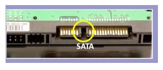
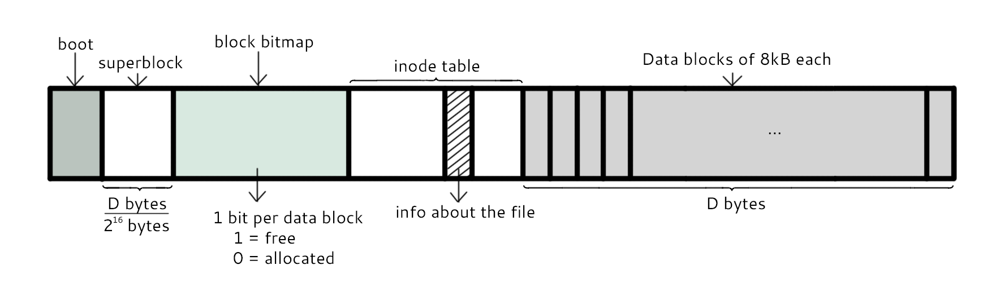
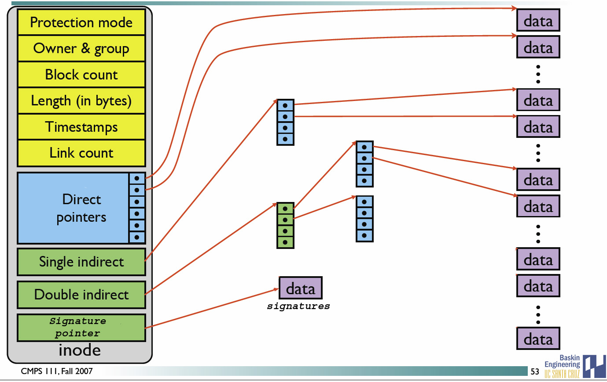
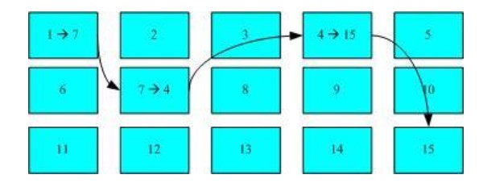

# GNU

GNU is an operating system that is free software。其中 GPL(General Public License) allows users to freely distribute copies of modified work, preserving the same rights, but in the end, maintains original copyright conditions.
-  开源协议

   - [Choose an open source license](https://choosealicense.com/)
   -  [如何选择开源许可证？](http://www.ruanyifeng.com/blog/2011/05/how_to_choose_free_software_licenses.html)

# 设备

- 固件

  直接和硬件绑定的软件；对硬件进行底层(low-level)控制，维持硬件运行，同时可用作硬件面向操作系统（驱动）的接口<sup>[1]</sup>。

  > 为什么固件不直接代替驱动程序？

- 蜂鸣器在命令行错误操作的滴滴声

  在~/.bashrc添加
  
  ```shell
  xset b off
  xset b 0 0 0
  ```

`参考`
1. [Where and when does firmware of a device run?](https://softwareengineering.stackexchange.com/questions/276981/where-and-when-does-firmware-of-a-device-run)


# 开机检测程序

## BIOS

BIOS（Basic Input/Output System，基本输入输出系统），它是一个固件，存放在ROM中。

BIOS 是开机的时候计算机执行的第一个程序，读取磁盘第一个扇区的主要开机记录（MBR），执行其中的开机管理程序。另外它作为一个“库”，让操作系统可以调用它来执行一些底层 IO

`参考`

- [BIOS](https://zh.wikipedia.org/wiki/BIOS)

## UEFI

BIOS 不可以读取 GPT 分区表，而 UEFI 可以，需要有一个 esp 分区。

机器启动会执行 esp 分区中的 efi 程序，efi 程序会根据配置找到 grub 程序(/boot/grub)，grub 程序读取配置(/boot/grub/grub.cfg) 生成启动项。


# 磁盘

## 磁盘接口

### IDE

IDE（ATA）全称 Advanced Technology Attachment，接口速度最大为 133MB/s，因为并口线的抗干扰性太差，且排线占用空间较大。

<div align="center">  </div><br>
### SATA

SATA 全称 Serial ATA。抗干扰性强；支持热插拔等功能；速度更快，SATA-II 的接口速度为 300MiB/s，而新的 SATA-III 标准可达到 600MiB/s 的传输速度。线更细。

<div align="center">  </div><br>
### SCSI

SCSI 全称是 Small Computer System Interface（小型机系统接口），不是专门为硬盘设计的接口。特性更多，如 CPU 占用率较低。价格较贵。

<div align="center">  </div><br>
### SAS

 *SAS(Serial Attached SCSI)*即串行连接*SCSI*，速度更快，线更细(占用空间更少>机箱通风更好)。

<div align="center">  </div><br>
`参考`

- [IDE、SATA、SCSI、SAS、FC、SSD 硬盘类型介绍](https://blog.csdn.net/tianlesoftware/article/details/6009110)
## 磁盘的文件名

Linux 中每个硬件都被当做一个文件，常见磁盘的文件名如下：

- IDE 磁盘：/dev/hd[a-d]
- SATA/SCSI/SAS 磁盘：/dev/sd[a-p]

其中文件名后面的序号的确定与系统检测到磁盘的顺序有关，而与磁盘所插入的插槽位置无关。


`参考`

- [partition table ](https://en.wikipedia.org/wiki/Partition_table)

# 文件系统

## 分区表

分区表用来记录硬盘上面的分区情况。分区表有两种类型MBR和GPT。

## 分区与文件系统

对分区进行格式化是为了在分区上建立文件系统。一个分区通常只能格式化为一个文件系统，但是磁盘阵列等技术可以将一个分区格式化为多个文件系统。

## 组成

组成部分如下：

- inode：记录文件的属性(不包括文件名），及 block 编号
- block：文件内容

除此之外还包括：

- superblock：记录文件系统的整体信息，包括 inode 和 block 的总量、使用量、剩余量，以及文件系统的格式与相关信息等；
- block bitmap：记录 block 是否被使用的位域。

<div align="center">  </div><br>
### inode

inode 具体包含以下信息：

- 权限 (read/write/excute)；
- 拥有者与群组 (owner/group)；
- 容量；
- 建立或状态改变的时间 (ctime)；
- 最近一次的读取时间 (atime)；
- 最近修改的时间 (mtime)；
- 定义文件特性的旗标 (flag)，如 SetUID...；
- 该文件真正内容的指向 (pointer)。

inode 具有以下特点：

- 每个 inode 大小均固定为 128 bytes (新的 ext4 与 xfs 可设定到 256 bytes)；
- 每个文件都仅会占用一个 inode。

inode 中记录了文件内容所在的 block 编号，但是每个 block 非常小，一个大文件随便都需要几十万的 block。而一个 inode 大小有限，无法直接引用这么多 block 编号。因此引入了间接、双间接、三间接引用。间接引用是指，让 inode 记录的引用 block 块记录引用信息。

<div align="center">  </div><br>
### block

在 Ext2 文件系统中所支持的 block 大小有 1K，2K 及 4K 三种，不同的大小限制了单个文件和文件系统的最大大小。

|     大小     | 1KB  |  2KB  | 4KB  |
| :----------: | :--: | :---: | :--: |
| 最大单一文件 | 16GB | 256GB | 2TB  |
| 最大文件系统 | 2TB  |  8TB  | 16TB |

一个 block 只能被一个文件所使用，未使用的部分直接浪费了。因此如果需要存储大量的小文件，那么最好选用比较小的 block。


## 文件读取

对于 Ext2 文件系统，当要读取一个文件的内容时，先在 inode 中去查找文件内容所在的所有 block，然后把所有 block 的内容读出来。

<div align="center">  </div><br>
而对于 FAT 文件系统，它没有 inode，每个 block 中存储着下一个 block 的编号。

<div align="center">  </div><br>
## 磁盘碎片

指一个文件内容所在的 block 过于分散。

## 日志

如果突然断电，那么文件系统会发生错误，例如断电前只修改了 block bitmap，而还没有将数据真正写入 block 中。

ext3/ext4 文件系统引入了日志功能，可以利用日志来修复文件系统。

## 目录配置

为了使不同 Linux 发行版本的目录结构保持一致性，Filesystem Hierarchy Standard (FHS) 规定了 Linux 的目录结构。最基础的三个目录如下：

- /usr (unix software resource)：所有系统默认软件都会安装到这个目录；
- /var (variable)：存放系统或程序运行过程中的数据文件。

<div align="center">  </div><br>
`参考`

- [File system design case studies](https://www.cs.rutgers.edu/\~pxk/416/notes/13-fs-studies.html)

# 文件

## 文件属性

例如 `drwxr-xr-x. 3 root root 17 May 6K 00:14 .config`

- drwxr-xr-x：文件类型以及权限，第 1 位为文件类型字段，后 9 位为文件权限字段
- 3：链接数
- May 6 00:14：文件最后被修改的时间

文件时间有以下三种：

- modification time (mtime)：文件的内容更新；
- change time (ctime)：文件的状态（权限、属性）更新或内容更新；
- access time (atime)：读取文件时就会更新。

## 权限

文件默认权限：文件默认没有可执行权限，因此为 666，也就是 -rw-rw-rw- 。

目录默认权限：目录必须要能够进入，也就是必须拥有可执行权限，因此为 777 ，也就是 	drwxrwxrwx。
可以通过 umask 设置或者查看文件的默认权限，通常以掩码的形式来表示，例如 002 表示其它用户的权限去除了一个 2 的权限，也就是写权限，因此建立新文件时默认的权限为 -rw-rw-r--。

文件名不是存储在一个文件的内容中，而是存储在一个文件所在的目录中。因此，拥有文件的 w 权限并不能对文件名进行修改。

目录存储文件列表，一个目录的权限也就是对其文件列表的权限。因此，目录的 r 权限表示可以读取文件列表；w 权限表示可以修改文件列表，具体来说，就是添加删除文件，对文件名进行修改；x 权限可以让该目录成为工作目录，x 权限是 r 和 w 权限的基础，如果不能使一个目录成为工作目录，也就没办法读取文件列表以及对文件列表进行修改了。

# PATH

声明可执行文件的路径

```shell
export PATH = /省略/bin:$PATH
```

# 进程管理

## 进程状态

| 状态 | 说明                                                         |
| :--: | ------------------------------------------------------------ |
|  R   | running or runnable (on run queue)                           |
|  D   | uninterruptible sleep (usually I/O)                          |
|  S   | interruptible sleep (waiting for an event to complete)       |
|  Z   | zombie (terminated but not reaped by its parent)             |
|  T   | stopped (either by a job control signal or because it is being traced) |

<div align="center">  </div><br>
## SIGCHLD

当一个子进程改变了它的状态时（停止运行，继续运行或者退出）会发送SIGCHLD

SIGCHLD 信号包含了子进程的信息，比如进程 ID、进程状态、进程使用 CPU 的时间等。

在子进程退出时，它的进程描述符(PCB)不会立即释放，这是为了让父进程得到子进程信息，父进程通过 wait() 和 waitpid() 来获得一个已经退出的子进程的信息。

<div align="center">  </div><br>
## 孤儿进程

一个父进程退出，而它的一个或多个子进程还在运行，那么这些子进程将成为孤儿进程。

孤儿进程将被 init 进程（进程号为 1）所收养，并由 init 进程对它们完成状态收集工作。

由于孤儿进程会被 init 进程收养，所以孤儿进程不会对系统造成危害。

## 僵尸进程

如果子进程退出，而父进程并没有调用 wait() 或 waitpid()，那么子进程的**进程描述符**仍然保存在系统中，这种进程称之为僵尸进程。

僵尸进程通过 ps 命令显示出来的状态为 Z（zombie）。

系统所能使用的进程号是有限的，如果产生大量僵尸进程，将因为没有可用的进程号而导致系统不能产生新的进程。

要消灭系统中大量的僵尸进程，只需要将其父进程杀死，此时僵尸进程就会变成孤儿进程，从而被 init 所收养，这样 init 就会释放所有的僵尸进程所占有的资源，从而结束僵尸进程。

# 网络

网卡接口在系统相当于一个“路由器”，该路由器的 ip 为电脑在此网络中的 ip。当一个包要发送时，会先查找路由表：

```shell
$ ip route
```

在表中查找目标主机所在的路由项，并选择距离(metric)较近的使用。可通过依次删除、添加路由项来修改距离，越小越近。

添加和删除路由项：

```shell
# ip route add/del 上条命令获得的路由表中的某一行
```

