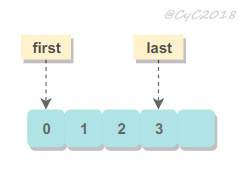
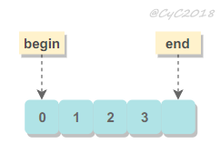

# 可读性的重要性

编程有很大一部分时间是在阅读代码，不仅要阅读自己的代码，而且要阅读别人的代码。因此，可读性良好的代码能够大大提高编程效率。只有在核心领域为了效率才可以放弃可读性，否则可读性是第一位。

# 用名字表达代码含义

## 常用规则
- 布尔相关的命名加上 is、can、should、has 等前缀。

- 用 min、max 表示数量范围；
- 用 first、last 表示访问空间的包含范围；

<div align="center">  </div><br>
- begin、end 表示访问空间的排除范围，end 不包含尾部。

<div align="center">  </div><br>
## 长度
名字应该有意义一点，表现就是长一点。名字长短的准则是：作用域越大，名字应该越长。短作用域可以使用简单名字。

## 名字不能带来歧义

起完名字要思考一下别人会对这个名字有何解读，会不会误解了原本想表达的含义。


# 良好的代码风格

- 适当的空行和缩进。

- 排列**整齐的**注释：
   ```java
   int a = 1;   // 注释
   int b = 11;  // 注释
   int c = 111; // 注释
   ```

- 语句顺序不能随意，比如与 html 表单相关联的变量的赋值应该和表单在 html 中的顺序一致。

# 为何编写注释

- 阅读代码首先会注意到注释，如果注释没太大作用，那么就会浪费代码阅读的时间。那些能直接看出含义的代码不需要写注释，比如那些简单的 getter 和 setter 方法，为这些方法写注释反而让代码可读性更差。

- 不能因为有注释就随便起个名字，而是争取起个好名字而不写注释。

- 注释用来提醒一些特殊情况。

# 如何编写注释

- 特殊注释标记：
   | 标记 | 用法 |
   |---|---|
   |TODO| 待做 |
   |FIXME| 待修复 |
   |HACK| 粗糙的解决方案 |
   |XXX| 危险！这里有重要的问题 |

- 尽量简洁明了：
   ```java
   // The first String is student's name
   // The Second Integer is student's score
   Map<String, Integer> scoreMap = new HashMap<>();
   ```

   ```java
   // Student's name -> Student's score
   Map<String, Integer> scoreMap = new HashMap<>();
   ```

- 添加测试用例来说明：

   ```java
   // ...
   // Example: add(1, 2), return 3
   int add(int x, int y) {
       return x + y;
   }
   ```

- 使用专业名词来缩短概念上的解释，比如用设计模式名来说明代码。

# 提高控制流的可读性

条件表达式中，左侧是变量，右侧是常数。比如下面第一个语句正确：

```java
if (len < 10)
if (10 > len)
```

只有在逻辑简单的情况下使用 ? : 三目运算符来使代码更紧凑，否则应该拆分成 if / else；

do / while 的条件放在后面，不够简单明了，并且会有一些迷惑的地方，最好使用 while 来代替。

如果只有一个 goto 目标，那么 goto 尚且还能接受，但是过于复杂的 goto 会让代码可读性特别差，应该避免使用 goto。

在嵌套的循环中，用一些 return 语句往往能减少嵌套的层数。

# 拆分长表达式

长表达式的可读性很差，可以引入一些解释变量从而拆分表达式：

```python
if line.split(':')[0].strip() == "root":
    ...
```
```python
username = line.split(':')[0].strip()
if username == "root":
    ...
```

使用摩根定理简化一些逻辑表达式：

```java
if (!a && !b) {
    ...
}
```
```java
if (!(a || b)) {
    ...
}
```

# 抽取函数

工程学就是把大问题拆分成小问题再把这些问题的解决方案放回一起。

首先应该明确一个函数的高层次目标，然后对于不是直接为了这个目标工作的代码，抽取出来放到独立的函数中。

介绍性的代码：

```java
int findClostElement(int[] arr) {
    int clostIdx;
    int clostDist = Interger.MAX_VALUE;
    for (int i = 0; i < arr.length; i++) {
        int x = ...;
        int y = ...;
        int z = ...;
        int value = x * y * z;
        int dist = Math.sqrt(Math.pow(value, 2), Math.pow(arr[i], 2));
        if (dist < clostDist) {
            clostIdx = i;
            clostDist = value;
        }
    }
    return clostIdx;
}
```

以上代码中循环部分主要计算距离，这部分不属于代码高层次目标，高层次目标是寻找最小距离的值，因此可以把这部分代替提取到独立的函数中。这样做也带来一个额外的好处有：可以单独进行测试、可以快速找到程序错误并修改。

```java
public int findClostElement(int[] arr) {
    int clostIdx;
    int clostDist = Interger.MAX_VALUE;
    for (int i = 0; i < arr.length; i++) {
        int dist = computDist(arr, i);
        if (dist < clostDist) {
            clostIdx = i;
            clostDist = value;
        }
    }
    return clostIdx;
}
```

并不是函数抽取的越多越好，如果抽取过多，在阅读代码的时候可能需要不断跳来跳去。只有在当前函数不需要去了解某一块代码细节而能够表达其内容时，把这块代码抽取成子函数才是好的。


# 减少代码量

不要过度设计，编码过程会有很多变化，过度设计的内容到最后往往是无用的。

多用标准库实现。


