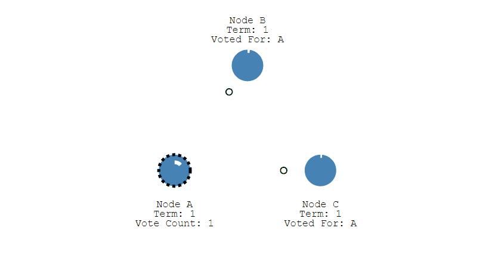
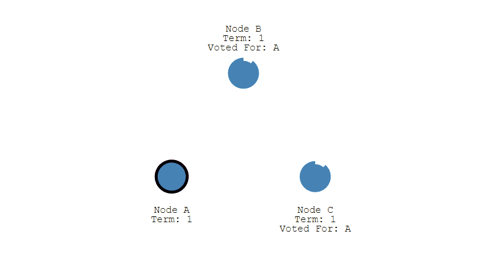
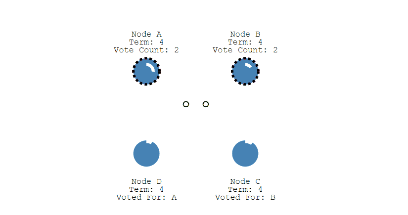
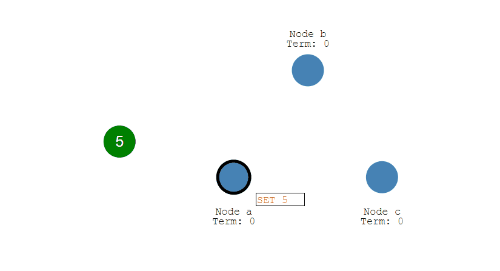

# CAP

分布式系统最多只能同时满足其中两项。

  
 
## 一致性

多个数据副本是否能保持一致

## 可用性

长时间正常服务的能力

## 分区容忍性

分布式节点之间相互依赖形成网络，当某些节点崩溃后，网络分区，各个区继续提供服务的能力。

# BASE

BASE 是基本可用（Basically Available）、软状态（Soft State）和最终一致性（Eventually Consistent）三个短语的缩写。

## 基本可用

指分布式系统在出现故障的时候，保证核心可用，允许损失一些功能。

## 软状态

指允许系统中的数据存在中间状态

## 最终一致性

最终一致性强调的是系统中所有的数据副本，在经过一段时间的同步后，最终能达到一致的状态。

# 分布式锁

## Mysql

建立唯一索引，插入数据

问题：

- 没有失效时间
- 不可重入

## Redis 的 SETNX 指令

### 问题

- 如果我申请的锁超时了，但是我对共享资源的操作还没结束，这时候其他人就可以申请这个锁了，那么我的处理过程会不会出错？

## RedLock 算法

- 依次尝试从 N 个 Redis 实例获取锁
- 在一次取锁过程中，取锁时间大于锁有效时间，获取失败
- 从超过一半实例上获取了锁，那么就认为获取成功
- 如果失败，到每个实例上放锁。

# 分布式事务

基础参考: https://developers.redhat.com/blog/2018/10/01/patterns-for-distributed-transactions-within-a-microservices-architecture/

## 本地消息表（saga）

本地消息表与业务数据表处于同一个数据库中，这样就能利用本地事务来保证在对这两个表的操作满足事务特性，并且使用了消息队列来保证最终一致性。

1. 在分布式事务操作的一方完成写业务数据的操作之后向本地消息表发送一个消息，本地事务能保证这个消息一定会被写入本地消息表中。
2. 之后将本地消息表中的消息转发到 Kafka 等消息队列中，如果转发成功则将消息从本地消息表中删除，否则继续重新转发。
3. 在分布式事务操作的另一方从消息队列中读取一个消息，并执行消息中的操作。

 

## 2PC

两阶段提交（Two-phase Commit，2PC），通过引入协调者（Coordinator）来协调参与者的行为，并最终决定这些参与者是否要真正执行事务。

# Paxos

用于达成共识性问题，即对多个节点产生的值，该算法能保证只选出唯一一个值。

主要有三类节点：

- 提议者（Proposer）：提议一个值；
- 接受者（Acceptor）：对每个提议进行投票；
- 告知者（Learner）：被告知投票的结果，不参与投票过程。

  
 
## 执行过程

规定一个提议包含两个字段：[n, v]，其中 n 为序号（具有唯一性），v 为提议值。

### Prepare 阶段

下图演示了两个 Proposer 和三个 Acceptor 的系统中运行该算法的初始过程，每个 Proposer 都会向所有 Acceptor 发送 Prepare 请求。

  
 
当 Acceptor 接收到一个 Prepare 请求，包含的提议为 [n1, v1]，并且之前还未接收过 Prepare 请求，那么发送一个 Prepare 响应，设置当前接收到的提议为 [n1, v1]，并且保证以后不会再接受序号小于 n1 的提议。

如下图，Acceptor X 在收到 [n=2, v=8] 的 Prepare 请求时，由于之前没有接收过提议，因此就发送一个 [no previous] 的 Prepare 响应，设置当前接收到的提议为 [n=2, v=8]，并且保证以后不会再接受序号小于 2 的提议。其它的 Acceptor 类似。

  
 
如果 Acceptor 接收到一个 Prepare 请求，包含的提议为 [n2, v2]，并且之前已经接收过提议 [n1, v1]。如果 n1 > n2，那么就丢弃该提议请求；否则，发送 Prepare 响应，该 Prepare 响应包含之前已经接收过的提议 [n1, v1]，设置当前接收到的提议为 [n2, v2]，并且保证以后不会再接受序号小于 n2 的提议。

如下图，Acceptor Z 收到 Proposer A 发来的 [n=2, v=8] 的 Prepare 请求，由于之前已经接收过 [n=4, v=5] 的提议，并且 n > 2，因此就抛弃该提议请求；Acceptor X 收到 Proposer B 发来的 [n=4, v=5] 的 Prepare 请求，因为之前接收到的提议为 [n=2, v=8]，并且 2 <= 4，因此就发送 [n=2, v=8] 的 Prepare 响应，设置当前接收到的提议为 [n=4, v=5]，并且保证以后不会再接受序号小于 4 的提议。Acceptor Y 类似。

  
 
### Accept 阶段

当一个 Proposer 接收到超过一半 Acceptor 的 Prepare 响应时，就可以发送 Accept 请求。

Proposer A 接收到两个 Prepare 响应之后，就发送 [n=2, v=8] Accept 请求。该 Accept 请求会被所有 Acceptor 丢弃，因为此时所有 Acceptor 都保证不接受序号小于 4 的提议。

Proposer B 过后也收到了两个 Prepare 响应，因此也开始发送 Accept 请求。需要注意的是，Accept 请求的 v 需要取它收到的最大提议编号对应的 v 值，也就是 8。因此它发送 [n=4, v=8] 的 Accept 请求。

  
 
### Learn 阶段

Acceptor 接收到 Accept 请求时，如果序号大于等于该 Acceptor 承诺的最小序号，那么就发送 Learn 提议给所有的 Learner。当 Learner 发现有大多数的 Acceptor 接收了某个提议，那么该提议的提议值就被 Paxos 选择出来。

  
 
## 约束条件

### 正确性

指只有一个提议值会生效。

因为每个Acceptor只接受一个提议，且只有大多数Acceptor接受的提议相同才能达成共识，所以可以保证正确性。

### 可终止性

提议者不断向目标靠拢，总会达成目标

Paxos 协议能够让 Proposer 发送的提议朝着能被大多数 Acceptor 接受的那个提议靠拢，因此能够保证可终止性。

# Raft

Raft 也是分布式一致性协议，主要是用来竞选主节点。

## 单个 Candidate 的竞选

有三种节点：Follower、Candidate 和 Leader。Leader 会周期性的发送心跳包给 Follower。每个 Follower 都设置了一个随机的竞选超时时间，一般为 150ms\~300ms，如果在这个时间内没有收到 Leader 的心跳包，就会变成 Candidate，进入竞选阶段。

- 下图展示一个分布式系统的最初阶段，此时只有 Follower 没有 Leader。Node A 等待一个随机的竞选超时时间之后，没收到 Leader 发来的心跳包，因此进入竞选阶段。

  
 
- 此时 Node A 发送投票请求给其它所有节点。

  
 
- 其它节点会对请求进行回复，如果超过一半的节点回复了，那么该 Candidate 就会变成 Leader。

  
 
- 之后 Leader 会周期性地发送心跳包给 Follower，Follower 接收到心跳包，会重新开始计时。

  
 
## 多个 Candidate 竞选

- 如果有多个 Follower 成为 Candidate，并且所获得票数相同，那么就需要重新开始投票。例如下图中 Node B 和 Node D 都获得两票，需要重新开始投票。

  
 
- 由于每个节点设置的随机竞选超时时间不同，因此下一次再次出现多个 Candidate 并获得同样票数的概率很低。

  
 
## 数据同步

- 来自客户端的修改都会被传入 Leader。注意该修改还未被提交，只是写入日志中。

  
 
- Leader 会把修改复制到所有 Follower。

  
 
- Leader 会等待大多数的 Follower 也进行了修改，然后才将修改提交。

  
 
- 此时 Leader 会通知的所有 Follower 让它们也提交修改，此时所有节点的值达成一致。

  
 
