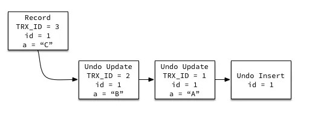

# 事务

## 概念

事务指满足 ACID 特性的一组操作。

<div align="center">  </div><br>
## ACID

### Atomicity

事务被视为不可分割的最小单元，事务内的操作要么都执行，要么都不执行。

### Consistency

一个正确的状态（系统约束得到满足）到另一个正确的状态.一致性是事务的目的。

### Isolation

一个事务所做的修改在最终提交以前，对其它事务是不可见的。

### Durability

提交后，即使系统崩溃，执行的结果也不能丢失。使用重做日志来保证持久性。

## AUTOCOMMIT

MySQL 默认一个操作就当一个事务。

# 并发一致性问题

在并发环境下，若没有实现隔离，会出现很多一致性问题。

## 丢失修改

两个事务同时修改，同时读最新的数据。同时在最新的数据上修改。
## 读脏数据

T<sub>1</sub> 修改一个数据，T<sub>2</sub> 随后读取这个数据。如果 T<sub>1</sub> 撤销了这次修改，那么 T<sub>2</sub> 读取的数据是脏数据（中间状态的数据）。

<div align="center">  </div><br>
## 不可重复读

T<sub>2</sub> 读取一个数据，T<sub>1</sub> 对该数据做了修改。如果 T<sub>2</sub> 再次读取这个数据，此时读取的结果和第一次读取的结果不同。

<div align="center">  </div><br>
## 幻影读

T<sub>1</sub> 读取某个范围的数据，T<sub>2</sub> 在这个范围内插入新的数据，T<sub>1</sub> 再次读取这个范围的数据，此时读取的结果和和第一次读取的结果不同（读取到了“幻行”）。

<div align="center">  </div><br>
# 隔离级别

隔离级别综合应用了封锁、MVCC、Next-Key Locks

## READ UNCOMMITTED

事务中的修改，即使没有提交，对其它事务也是可见的。

## READ COMMITTED

一个事务只能读取已经提交的事务所做的修改。换句话说，一个事务所做的修改在提交之前对其它事务是不可见的。

## REPEATABLE READ

保证在同一个事务中多次读取同样数据的结果是一样的。

## SERIALIZABLE

强制事务之间串行执行。

----

| 隔离级别 | 脏读 | 不可重复读 | 幻影读 |
| :---: | :---: | :---:| :---: |
| 未提交读 | √ | √ | √ |
| 提交读 | × | √ | √ |
| 可重复读 | × | × | √ |
| 可串行化 | × | × | × |

# 封锁
## 封锁粒度

MySQL 中提供了两种封锁粒度：行级锁以及表级锁。

应该尽量只锁定需要修改的那部分数据，而不是所有资源。锁定的数据量越少，发生锁争用的可能就越小，另外，锁的各种操作（包括获取锁、释放锁、以及检查锁状态）都会增加系统开销。因此封锁粒度越小，系统开销就越大。

<div align="center">  </div><br>
## 封锁类型

### 读写锁

- 排它锁（Exclusive），简写为 X 锁，又称写锁。
- 共享锁（Shared），简写为 S 锁，又称读锁。

锁的兼容关系如下：

|  -   |  X   |  S   |
| :--: | :--: | :--: |
|  X   |  ×   |  ×   |
|  S   |  ×   |  √   |

### 意向锁

在存在行级锁的情况下，事务想要对整个表 A 加锁，就需要先检测是否有其它事务对表的任意一行加了锁，非常耗时。

意向锁IX/IS 都是表锁，用来表示一个事务想要在表中的某个数据行上加 X 锁或 S 锁。

- 事务对某行加 S 锁之前，必须先获得表的 IS/IX 锁；
- 事务对某行加 X 锁之前，必须先获得表的 IX 锁。

这样后，只需要检查表有没有意向锁。

## 封锁协议

### 三级封锁协议

**一级封锁协议** 

事务 T 要修改数据 A 时必须加 X 锁，直到**T 结束**才释放锁。

可以解决丢失修改问题，因为不能同时有两个事务对同一个数据进行修改，那么事务的修改就不会被覆盖。

| T<sub>1</sub> | T<sub>2</sub> |
| :-----------: | :-----------: |
|   lock-x(A)   |               |
|   read A=20   |               |
|               |   lock-x(A)   |
|               |     wait      |
|  write A=19   |       .       |
|    commit     |       .       |
|  unlock-x(A)  |       .       |
|               |    obtain     |
|               |   read A=19   |
|               |  write A=21   |
|               |    commit     |
|               |  unlock-x(A)  |

**二级封锁协议**

在一级的基础上，要求读取数据 A 时必须加 S 锁，读取完马上释放 S 锁。

可以解决读脏数据问题。

| T<sub>1</sub> | T<sub>2</sub> |
| :-----------: | :-----------: |
|   lock-x(A)   |               |
|   read A=20   |               |
|  write A=19   |               |
|               |   lock-s(A)   |
|               |     wait      |
|   rollback    |       .       |
|     A=20      |       .       |
|  unlock-x(A)  |       .       |
|               |    obtain     |
|               |   read A=20   |
|               |  unlock-s(A)  |
|               |    commit     |

**三级封锁协议** 

在二级的基础上，要求读取数据 A 时必须加 S 锁，直到事务结束了才能释放 S 锁。

可以解决不可重复读的问题，因为读 A 时，其它事务不能对 A 加 X 锁，从而避免了在读的期间数据发生改变。

| T<sub>1</sub> | T<sub>2</sub> |
| :-----------: | :-----------: |
|   lock-s(A)   |               |
|   read A=20   |               |
|               |   lock-x(A)   |
|               |     wait      |
|   read A=20   |       .       |
|    commit     |       .       |
|  unlock-s(A)  |       .       |
|               |    obtain     |
|               |   read A=20   |
|               |  write A=19   |
|               |    commit     |
|               |  unlock-X(A)  |

### 两段锁协议

加锁和解锁分为两个阶段进行。

可串行化调度是指，通过并发控制，使得并发执行的事务结果与某个串行执行的事务结果相同。

事务遵循两段锁协议是保证可串行化调度的充分条件。例如以下操作满足两段锁协议，它是可串行化调度。

```html
lock-x(A)...lock-s(B)...lock-s(C)...unlock(A)...unlock(C)...unlock(B)
```

但不是必要条件，例如以下操作不满足两段锁协议，但是它还是可串行化调度。

```html
lock-x(A)...unlock(A)...lock-s(B)...unlock(B)...lock-s(C)...unlock(C)
```

## MySQL 隐式与显示锁定

会根据**隔离级别**在需要的时候自动加锁，并且所有的锁都是在**同一时刻**被释放，这被称为隐式锁定。

InnoDB 也可以使用特定的语句进行显示锁定：

```sql
SELECT ... LOCK In SHARE MODE;
SELECT ... FOR UPDATE;
```

# 多版本并发控制

多版本并发控制，用于高效实现提交读和可重复读。

## 版本号

- 系统版本号：每开始一个新事务，系统版本号就递增。
- 事务版本号：事务开始时的系统版本号。

## 隐藏的列

每行记录后面都保存着两个隐藏的列

- 创建版本号：指创建一个数据行的快照时的系统版本号；
- 删除版本号：如果该快照的删除版本号大于当前事务版本号表示该快照有效，否则表示该快照已经被删除了。

## Undo 日志

MVCC 使用到的快照存储在 Undo 日志中，该日志通过回滚指针把一个数据行（Record）的所有快照连接起来。

<div align="center">  </div><br>
## 实现过程

以下实现过程针对可重复读隔离级别。

当开始新一个事务时，该事务的版本号肯定会大于当前所有数据行快照的创建版本号。

### UPDATE

将当前**系统版本号**作为更新前的**数据行最新快照的**删除版本号，并将当前系统版本号作为更新后的数据行快照的创建版本号。不是在事务所读取到的快照基础上改的。

### SELECT

读取创建版本号小于**事务版本号**，而删除版本号大于事务版本号的快照。但是也有例外，如果有一个事务正在修改该数据行，那么它可以读取事务本身所做的修改，而不用和其它事务的读取结果一致。

### INSERT

将当前系统版本号作为数据行快照的创建版本号。

### DELETE

将当前系统版本号作为数据行快照的删除版本号。

## 快照读与当前读

### 快照读

使用 MVCC 读取的是快照中的数据，这样可以减少加锁所带来的开销。

```sql
select * from table ...;
```

### 当前读（locking read）

读取的是最新的数据，需要加锁。

```sql
select * from `user` where `id`=301 lock in share mode;
select * from table where ? for update;
```

**下面的操作也是当前读**

```sql
insert;
update;
delete;
```

# Next-Key Locks

MVCC 不能解决幻读的问题，Next-Key Locks 就是为了高效解决这个问题而存在的。

## Record Locks

锁特定行的索引。

主键会隐式创建索引。

如果还没索引，就锁表。

## Gap Locks

锁定**索引之间的间隙**。

```sql
# 如果索引的值有 8，19。那么 8 到 19 的间隙是不允许插入数据的。
SELECT c FROM t WHERE c BETWEEN 10 and 20 FOR UPDATE;
```

## Next-Key Locks

它是 Record Locks 和 Gap Locks 的结合，不仅锁定特定记录，也锁定间隙。

参考：https://blog.csdn.net/cug_jiang126com/article/details/50596729

# 关系数据库设计理论

## 函数依赖

记 A->B 表示 A 函数决定 B，也可以说 B 函数依赖于 A。

如果 {A1，A2，... ，An} 是关系的一个或多个属性的集合，该集合函数决定了关系的其它所有属性并且是最小的，那么该集合就称为键码。

对于 A->B，如果能找到 A 的真子集 A'，使得 A'-> B，那么 A->B 就是部分函数依赖，否则就是完全函数依赖。

对于 A->B，B->C，则 A->C 是一个传递函数依赖。

## 异常

以下的学生课程关系的函数依赖为 Sno, Cname -> Sname, Sdept, Mname, Grade，键码为 {Sno, Cname}。也就是说，确定学生和课程之后，就能确定其它信息。

| Sno | Sname | Sdept | Mname | Cname | Grade |
| :---: | :---: | :---: | :---: | :---: |:---:|
| 1 | 学生-1 | 学院-1 | 院长-1 | 课程-1 | 90 |
| 2 | 学生-2 | 学院-2 | 院长-2 | 课程-2 | 80 |
| 2 | 学生-2 | 学院-2 | 院长-2 | 课程-1 | 100 |
| 3 | 学生-3 | 学院-2 | 院长-2 | 课程-2 | 95 |

不符合范式的关系，会产生很多异常，主要有以下四种异常：

- 冗余数据（查）：例如 `学生-2` 出现了两次。
- 修改异常：修改了一个记录中的信息，但是另一个记录中相同的信息却没有被修改。
- 删除异常：删除一个信息，那么也会丢失其它信息。例如删除了 `课程-1` 需要删除第一行和第三行，那么 `学生-1` 的信息就会丢失。
- 插入异常（增）：例如想要插入一个学生的信息，如果这个学生还没选课，那么就无法插入。

## 范式

范式理论是为了解决以上提到四种异常。

高级别范式的依赖于低级别的范式，1NF 是最低级别的范式。

<div align="center">  </div><br>
### 第一范式 (1NF)

属性不可分。

### 第二范式 (2NF)

每个非主属性完全函数依赖于键码。

可以通过分解来满足。

<font size=4> **分解前** </font>

| Sno | Sname | Sdept | Mname | Cname | Grade |
| :---: | :---: | :---: | :---: | :---: |:---:|
| 1 | 学生-1 | 学院-1 | 院长-1 | 课程-1 | 90 |
| 2 | 学生-2 | 学院-2 | 院长-2 | 课程-2 | 80 |
| 2 | 学生-2 | 学院-2 | 院长-2 | 课程-1 | 100 |
| 3 | 学生-3 | 学院-2 | 院长-2 | 课程-2 | 95 |

以上学生课程关系中，{Sno, Cname} 为键码，有如下函数依赖：

- Sno -> Sname, Sdept
- Sdept -> Mname
- Sno, Cname-> Grade

Grade 完全函数依赖于键码，它没有任何冗余数据，每个学生的每门课都有特定的成绩。

Sname, Sdept 和 Mname 都部分依赖于键码，当一个学生选修了多门课时，这些数据就会出现多次，造成大量冗余数据。

<font size=4> **分解后** </font>

关系-1

| Sno | Sname | Sdept | Mname |
| :---: | :---: | :---: | :---: |
| 1 | 学生-1 | 学院-1 | 院长-1 |
| 2 | 学生-2 | 学院-2 | 院长-2 |
| 3 | 学生-3 | 学院-2 | 院长-2 |

有以下函数依赖：

- Sno -> Sname, Sdept
- Sdept -> Mname

关系-2

| Sno | Cname | Grade |
| :---: | :---: |:---:|
| 1 | 课程-1 | 90 |
| 2 | 课程-2 | 80 |
| 2 | 课程-1 | 100 |
| 3 | 课程-2 | 95 |

有以下函数依赖：

- Sno, Cname ->  Grade

### 第三范式 (3NF)

非主属性不传递函数依赖于键码。

上面的 关系-1 中存在以下传递函数依赖：

- Sno -> Sdept -> Mname

可以进行以下分解：

关系-11

| Sno | Sname | Sdept |
| :---: | :---: | :---: |
| 1 | 学生-1 | 学院-1 |
| 2 | 学生-2 | 学院-2 |
| 3 | 学生-3 | 学院-2 |

关系-12

| Sdept | Mname |
| :---: | :---: |
| 学院-1 | 院长-1 |
| 学院-2 | 院长-2 |

# ER 图

Entity-Relationship，有三个组成部分：实体、属性、联系。

用来进行关系型数据库系统的概念设计。

## 实体的三种联系

包含一对一，一对多，多对多三种。

- 如果 A 到 B 是一对多关系，那么画个带箭头的线段指向 B；
- 如果是一对一，画两个带箭头的线段；
- 如果是多对多，画两个不带箭头的线段。

下图的 Course 和 Student 是一对多的关系。

<div align="center">  </div><br>
## 表示出现多次的关系

一个实体在联系出现几次，就要用几条线连接。

下图表示一个课程的先修关系，先修关系出现两个 Course 实体，第一个是先修课程，后一个是后修课程，因此需要用两条线来表示这种关系。

<div align="center">  </div><br>
## 联系的多向性

虽然老师可以开设多门课，并且可以教授多名学生，但是对于特定的学生和课程，只有一个老师教授，这就构成了一个三元联系。

<div align="center">  </div><br>
一般只使用二元联系，可以把多元联系转换为二元联系。

<div align="center">  </div><br>
## 表示子类

用一个三角形和两条线来连接类和子类，与子类有关的属性和联系都连到子类上，而与父类和子类都有关的连到父类上。

<div align="center">  </div><br>
# 参考资料

- AbrahamSilberschatz, HenryF.Korth, S.Sudarshan, 等. 数据库系统概念 [M]. 机械工业出版社, 2006.
- 施瓦茨. 高性能 MYSQL(第3版)[M]. 电子工业出版社, 2013.
- 史嘉权. 数据库系统概论[M]. 清华大学出版社有限公司, 2006.
- [The InnoDB Storage Engine](https://dev.mysql.com/doc/refman/5.7/en/innodb-storage-engine.html)
- [Transaction isolation levels](https://www.slideshare.net/ErnestoHernandezRodriguez/transaction-isolation-levels)
- [Concurrency Control](http://scanftree.com/dbms/2-phase-locking-protocol)
- [The Nightmare of Locking, Blocking and Isolation Levels!](https://www.slideshare.net/brshristov/the-nightmare-of-locking-blocking-and-isolation-levels-46391666)
- [Database Normalization and Normal Forms with an Example](https://aksakalli.github.io/2012/03/12/database-normalization-and-normal-forms-with-an-example.html)
- [The basics of the InnoDB undo logging and history system](https://blog.jcole.us/2014/04/16/the-basics-of-the-innodb-undo-logging-and-history-system/)
- [MySQL locking for the busy web developer](https://www.brightbox.com/blog/2013/10/31/on-mysql-locks/)
- [浅入浅出 MySQL 和 InnoDB](https://draveness.me/mysql-innodb)
- [Innodb 中的事务隔离级别和锁的关系](https://tech.meituan.com/2014/08/20/innodb-lock.html)
