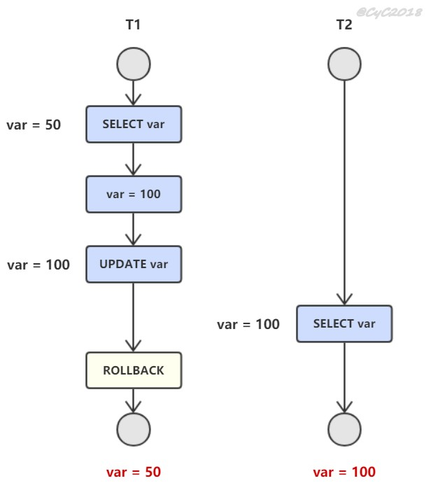
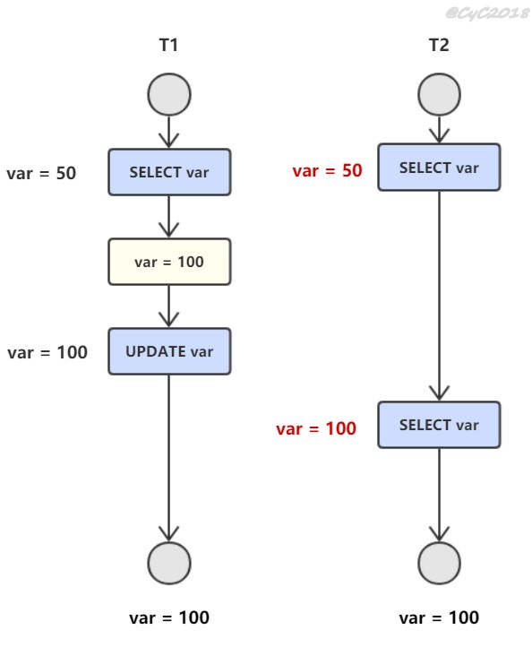
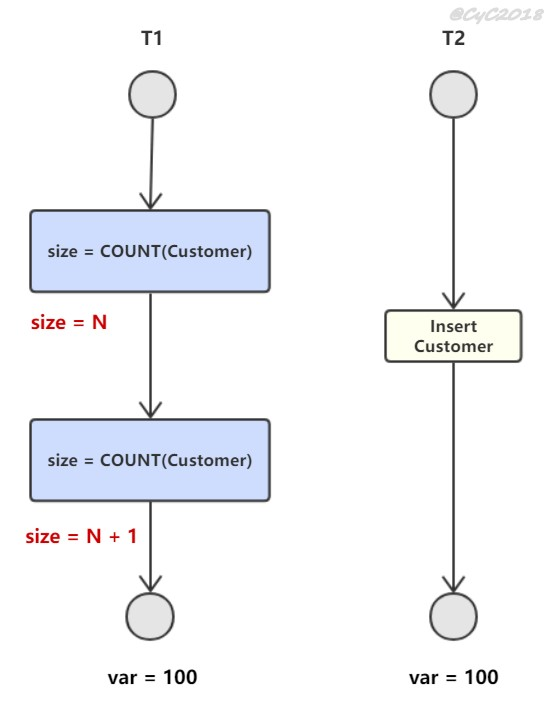

# 并发一致性问题

## 丢失修改

两个事务同时修改，可能造成某个事务的修改结果丢失。
## 读脏数据

T1 修改一个数据，T2 随后读取这个数据。如果 T1 撤销了这次修改，那么 T2 读取的数据是脏数据（中间状态的数据）。

  
 
## 不可重复读

T2 读取一个数据，T1 对该数据做了修改。如果 T2 再次读取这个数据，此时读取的结果和第一次读取的结果不同。

  
 
## 幻影读

T1 读取某个范围的数据，T2 在这个范围内插入新的数据，T1 再次读取这个范围的数据，此时读取的结果和和第一次读取的结果不同（读取到了“幻行”）。

  
 
# 事务

## 概念

事务指满足 ACID 特性的一组操作。

  
 
## ACID

### Atomicity

事务被视为不可分割的最小单元，事务内的操作要么都执行，要么都不执行。

### Consistency

一个正确的状态（系统约束得到满足）到另一个正确的状态.一致性是事务的目的。

### Isolation

一个事务所做的修改在最终提交以前，对其它事务是不可见的。

### Durability

提交后，即使系统崩溃，执行的结果也不能丢失。使用重做日志来保证持久性。

## AUTOCOMMIT

MySQL 默认一个操作就当一个事务。

# 关系数据库设计理论

## 函数依赖

记 A->B 表示 A 函数决定 B，也可以说 B 函数依赖于 A。

如果 {A1，A2，... ，An} 是关系的一个或多个属性的集合，该集合函数决定了关系的其它所有属性并且是最小的，那么该集合就称为键码。

对于 A->B，如果能找到 A 的真子集 A'，使得 A'-> B，那么 A->B 就是部分函数依赖，否则就是完全函数依赖。

对于 A->B，B->C，则 A->C 是一个传递函数依赖。

## 异常

以下的学生课程关系的函数依赖为 Sno, Cname -> Sname, Sdept, Mname, Grade，键码为 {Sno, Cname}。也就是说，确定学生和课程之后，就能确定其它信息。

| Sno | Sname | Sdept | Mname | Cname | Grade |
| :---: | :---: | :---: | :---: | :---: |:---:|
| 1 | 学生-1 | 学院-1 | 院长-1 | 课程-1 | 90 |
| 2 | 学生-2 | 学院-2 | 院长-2 | 课程-2 | 80 |
| 2 | 学生-2 | 学院-2 | 院长-2 | 课程-1 | 100 |
| 3 | 学生-3 | 学院-2 | 院长-2 | 课程-2 | 95 |

不符合范式的关系，会产生很多异常，主要有以下四种异常：

- 冗余数据（查）：例如 `学生-2` 出现了两次。
- 修改异常：修改了一个记录中的信息，但是另一个记录中相同的信息却没有被修改。
- 删除异常：删除一个信息，那么也会丢失其它信息。例如删除了 `课程-1` 需要删除第一行和第三行，那么 `学生-1` 的信息就会丢失。
- 插入异常（增）：例如想要插入一个学生的信息，如果这个学生还没选课，那么就无法插入。

## 范式

范式理论是为了解决以上提到四种异常。

高级别范式的依赖于低级别的范式，1NF 是最低级别的范式。

  
 
### 第一范式 (1NF)

属性不可分。

### 第二范式 (2NF)

每个非主属性完全函数依赖于键码。

可以通过分解来满足。

 **分解前** 

| Sno | Sname | Sdept | Mname | Cname | Grade |
| :---: | :---: | :---: | :---: | :---: |:---:|
| 1 | 学生-1 | 学院-1 | 院长-1 | 课程-1 | 90 |
| 2 | 学生-2 | 学院-2 | 院长-2 | 课程-2 | 80 |
| 2 | 学生-2 | 学院-2 | 院长-2 | 课程-1 | 100 |
| 3 | 学生-3 | 学院-2 | 院长-2 | 课程-2 | 95 |

以上学生课程关系中，{Sno, Cname} 为键码，有如下函数依赖：

- Sno -> Sname, Sdept
- Sdept -> Mname
- Sno, Cname-> Grade

Grade 完全函数依赖于键码，它没有任何冗余数据，每个学生的每门课都有特定的成绩。

Sname, Sdept 和 Mname 都部分依赖于键码，当一个学生选修了多门课时，这些数据就会出现多次，造成大量冗余数据。

 **分解后** 

关系-1

| Sno | Sname | Sdept | Mname |
| :---: | :---: | :---: | :---: |
| 1 | 学生-1 | 学院-1 | 院长-1 |
| 2 | 学生-2 | 学院-2 | 院长-2 |
| 3 | 学生-3 | 学院-2 | 院长-2 |

有以下函数依赖：

- Sno -> Sname, Sdept
- Sdept -> Mname

关系-2

| Sno | Cname | Grade |
| :---: | :---: |:---:|
| 1 | 课程-1 | 90 |
| 2 | 课程-2 | 80 |
| 2 | 课程-1 | 100 |
| 3 | 课程-2 | 95 |

有以下函数依赖：

- Sno, Cname ->  Grade

### 第三范式 (3NF)

非主属性不传递函数依赖于键码。

上面的 关系-1 中存在以下传递函数依赖：

- Sno -> Sdept -> Mname

可以进行以下分解：

关系-11

| Sno | Sname | Sdept |
| :---: | :---: | :---: |
| 1 | 学生-1 | 学院-1 |
| 2 | 学生-2 | 学院-2 |
| 3 | 学生-3 | 学院-2 |

关系-12

| Sdept | Mname |
| :---: | :---: |
| 学院-1 | 院长-1 |
| 学院-2 | 院长-2 |

# 设计工具

ER图，有三个组成部分：实体、属性、联系。用来进行关系型数据库系统的概念设计。

逻辑模型（CDM），概念模型的具体化。增加了实体的信息，添加了实体的约束。

物理模型（PDM），逻辑模型的物理化。将相关信息转换为数据库对应的概念（如“关系”转化为外键）。