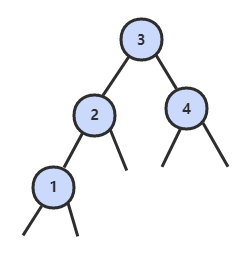
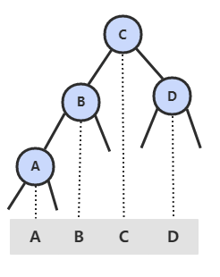
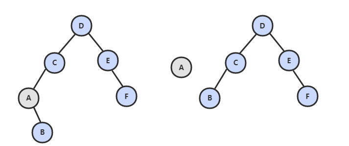
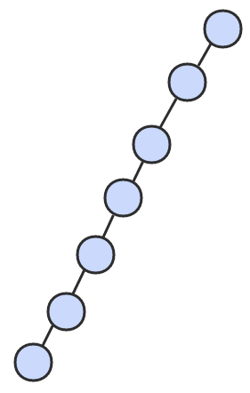
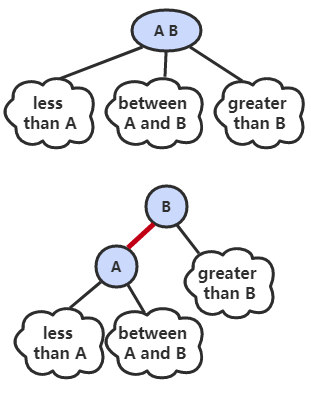
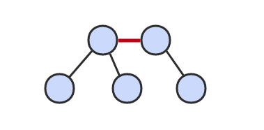
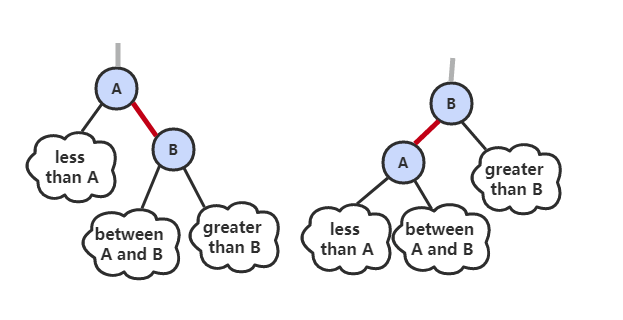
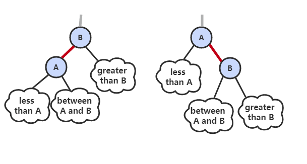

# 前言

符号表（Symbol Table）是逻辑上双列的结构。

符号表分有序、无序两种；有序指支持比较键，所以键要可以比较（Comparable）。

# 初级实现

##  链表实现无序符号表

```java
public class ListUnorderedST<Key, Value> implements UnorderedST<Key, Value> {

    private Node first;

    private class Node {
        Key key;
        Value value;
        Node next;

        Node(Key key, Value value, Node next) {
            this.key = key;
            this.value = value;
            this.next = next;
        }
    }

    @Override
    public int size() {
        int cnt = 0;
        Node cur = first;
        while (cur != null) {
            cnt++;
            cur = cur.next;
        }
        return cnt;
    }

    @Override
    public void put(Key key, Value value) {
        Node cur = first;
        // 如果在链表中找到节点的键等于 key 就更新这个节点的值为 value
        while (cur != null) {
            if (cur.key.equals(key)) {
                cur.value = value;
                return;
            }
            cur = cur.next;
        }
        // 否则使用头插法插入一个新节点
        first = new Node(key, value, first);
    }

    @Override
    public void delete(Key key) {
        if (first == null)
            return;
        if (first.key.equals(key))
            first = first.next;
        Node pre = first, cur = first.next;
        while (cur != null) {
            if (cur.key.equals(key)) {
                pre.next = cur.next;
                return;
            }
            pre = pre.next;
            cur = cur.next;
        }
    }

    @Override
    public Value get(Key key) {
        Node cur = first;
        while (cur != null) {
            if (cur.key.equals(key))
                return cur.value;
            cur = cur.next;
        }
        return null;
    }
}
```

## 二分查找实现有序符号表

使用一对平行数组，一个存储键一个存储值。数据是存储在“一堆的”。

```java
public class BinarySearchOrderedST<Key extends Comparable<Key>, Value> implements OrderedST<Key, Value> {

    private Key[] keys;
    private Value[] values;
    private int N = 0;

    public BinarySearchOrderedST(int capacity) {
        keys = (Key[]) new Comparable[capacity];
        values = (Value[]) new Object[capacity];
    }

    @Override
    public int size() {
        return N;
    }

    //获取 key 的位置。
    //如果元素不存在
    //元素在已有范围内，值会在范围里，但是选中目标不是 key
    //元素不在，选中目标则在范围外一格。
    @Override
    public int rank(Key key) {
        int l = 0, h = N - 1;
        while (l <= h) {
            int m = l + (h - l) / 2;
            int cmp = key.compareTo(keys[m]);
            if (cmp == 0)
                return m;
            else if (cmp < 0)
                h = m - 1;
            else
                l = m + 1;
        }
        return l;
    }

    @Override
    public List<Key> keys(Key l, Key h) {
        int index = rank(l);
        List<Key> list = new ArrayList<>();
        while (keys[index].compareTo(h) <= 0) {
            list.add(keys[index]);
            index++;
        }
        return list;
    }

    @Override
    public void put(Key key, Value value) {
        int index = rank(key);
        // 如果找到已经存在的节点键为 key，就更新这个节点的值为 value
        if (index < N && keys[index].compareTo(key) == 0) {
            values[index] = value;
            return;
        }
        // 否则在数组中插入新的节点，需要先将插入位置之后的元素都向后移动一个位置
        for (int j = N; j > index; j--) {
            keys[j] = keys[j - 1];
            values[j] = values[j - 1];
        }
        keys[index] = key;
        values[index] = value;
        N++;
    }

    @Override
    public Value get(Key key) {
        int index = rank(key);
        if (index < N && keys[index].compareTo(key) == 0)
            return values[index];
        return null;
    }

    @Override
    public Key min() {
        return keys[0];
    }

    @Override
    public Key max() {
        return keys[N - 1];
    }
}
```

# 二叉查找树

**二叉查找树** （BST）是一颗二叉树，并且每个节点的值都大于等于其左子树中的所有节点的值而小于等于右子树的所有节点的值。

<div align="center">  </div><br>
BST 有一个重要性质，就是它的中序遍历结果递增排序。

<div align="center">  </div><br>
基本数据结构：

```java
public class BST<Key extends Comparable<Key>, Value> implements OrderedST<Key, Value> {

    protected Node root;

    protected class Node {
        Key key;
        Value val;
        Node left;
        Node right;
        // 以该节点为根的子树节点总数
        int N;

        Node(Key key, Value val, int N) {
            this.key = key;
            this.val = val;
            this.N = N;
        }
    }

    @Override
    public int size() {
        return size(root);
    }

    private int size(Node x) {
        if (x == null)
            return 0;
        return x.N;
    }
}
```

## get()

- 如果树是空的，则查找未命中；
- 如果被查找的键和根节点的键相等，查找命中；
- 否则递归地在子树中查找：如果被查找的键较小就在左子树中查找，较大就在右子树中查找。

```java
@Override
public Value get(Key key) {
    return get(root, key);
}

private Value get(Node x, Key key) {
    if (x == null)
        return null;
    int cmp = key.compareTo(x.key);
    if (cmp == 0)
        return x.val;
    else if (cmp < 0)
        return get(x.left, key);
    else
        return get(x.right, key);
}
```

## put()

当插入的键不存在于树中，需要创建一个新节点，并且更新上层节点的链接指向该节点，使得该节点正确地链接到树中。

<div align="center">  </div><br>
```java
public void put(K k, V v) {
    root = put(root, k, v);
}

// 放进去，并计算结点数目
public Node put(Node node, K k, V v) {
    if (node == null) {
        return new Node(k, v, 1);
    }

    int cmp = node.k.compareTo(k);
    if (cmp == 0) {
        node.v = v;
        return node;
    }
    if (cmp < 0) {
        node.right = put(node.right, k, v);
    } else {
        node.left = put(node.left, k, v);
    }

    // 递归才能计算 sum
    node.sum = 1;
    if (node.left != null) {
        node.sum += node.left.sum;
    }
    if (node.right != null) {
        node.sum += node.right.sum;
    }
    return node;

}
```


## floor()

floor(key)：小于等于键的最大键

```java
public K floor(K k) {
    Node t = floor(root, k);
    if (t == null) {
        return null;
    }
    return t.k;
}

private Node floor(Node node, K k) {
    if (node == null) {
        return null;
    }

    int cmp = node.k.compareTo(k);
    if (cmp == 0) {
        return node;
    }
    if (cmp > 0) {
        return floor(node.left, k);
    }
    Node t = floor(node.right, k);
    return t == null ? node : t;
}
```

## rank()

```java
public int rank(K k) {
    return rank(root, k);
}

private int rank(Node x, K k) {
    if (x == null) {
        //参与排名，总得占个位置吧
        return 1;
    }

    int cmp = x.k.compareTo(k);
    int leftSum = x.left == null ? 0 : x.left.sum;
    if (cmp == 0) {
        return leftSum + 1;
    }
    if (cmp < 0) {
        return leftSum + 1 + rank(x.right, k);
    }
    return rank(x.left, k);
}
```

## min()

```java
public Key min() {
    return min(root).key;
}

private Node min(Node x) {
    if (x == null)
        return null;
    if (x.left == null)
        return x;
    return min(x.left);
}
```

## deleteMin()

<div align="center">  </div><br>
```java
public void deleteMin() {
    root = deleteMin(root);
}

public Node deleteMin(Node x) {
    if (x.left == null)
        return x.right;
    x.left = deleteMin(x.left);
    recalculateSize(x);
    return x;
}
```

## delete()

<div align="center">  </div><br>
```java
public void delete(Key key) {
    root = delete(root, key);
}
private Node delete(Node x, Key key) {
    if (x == null)
        return null;
    int cmp = key.compareTo(x.key);
    if (cmp < 0)
        x.left = delete(x.left, key);
    else if (cmp > 0)
        x.right = delete(x.right, key);
    else {
        //注意下面两个变化
        if (x.right == null)
            return x.left;
        if (x.left == null)
            return x.right;
        Node t = x;
        x = min(t.right);
        x.right = deleteMin(t.right);
        x.left = t.left;
    }
    recalculateSize(x);
    return x;
}
```

## keys()

```java
public List<Key> keys(Key l, Key h) {
    return keys(root, l, h);
}

private List<Key> keys(Node x, Key l, Key h) {
    List<Key> list = new ArrayList<>();
    if (x == null)
        return list;
    int cmpL = l.compareTo(x.key);
    int cmpH = h.compareTo(x.key);
    if (cmpL < 0)
        list.addAll(keys(x.left, l, h));
    if (cmpL <= 0 && cmpH >= 0)
        list.add(x.key);
    if (cmpH > 0)
        list.addAll(keys(x.right, l, h));
    return list;
}
```

## 分析

最好的情况下树是完全平衡的，每条空链接和根节点的距离都为 logN。

<div align="center">  </div><br>
在最坏的情况下，树的高度为 N。

<div align="center">  </div><br>
# 2-3 查找树

2-3 查找树引入了 2- 节点和 3- 节点，目的是为了让树平衡。一颗完美平衡的 2-3 查找树的所有空链接到根节点的距离应该是相同的。

<div align="center">  </div><br>
## 插入操作

将新节点插入到叶子节点上。

根据叶子节点的类型不同，有不同的处理方式：

- 如果插入到 2- 节点上，那么直接将新节点和原来的节点组成 3- 节点即可。

<div align="center">  </div><br>
- 如果是插入到 3- 节点上，就会产生一个临时 4- 节点时，需要将 4- 节点分裂成 3 个 2- 节点，并将中间的 2- 节点移到上层节点中。如果上移操作继续产生临时 4- 节点则一直进行分裂上移，直到不存在临时 4- 节点。

<div align="center">  </div><br>
## 性质

2-3 查找树插入操作的变换都是局部的，而这些局部变换不会影响树的全局有序性和平衡性。

2-3 查找树的查找和插入操作复杂度和插入顺序无关，在最坏的情况下查找和插入操作访问的节点必然不超过 logN 个，含有 10 亿个节点的 2-3 查找树最多只需要访问 30 个节点就能进行任意的查找和插入操作。

# 红黑树

红黑树是 2-3 查找树，但它不需要分别定义 2- 节点和 3- 节点，而是在普通的二叉查找树之上，为节点添加颜色。指向一个节点的链接颜色如果为红色，那么这个节点和上层节点表示的是一个 3- 节点，而黑色则是普通链接。

<div align="center">  </div><br>
红黑树具有以下性质：

- 每个节点黑或红
- 根节点黑
- 叶子节点（NIL）黑
- 一个节点红，其子节点黑
- 从任一节点到其每个叶子的所有路径都包含相同数目的黑色节点。

画红黑树时可以将红链接画平。

<div align="center">  </div><br>
```java
public class RedBlackBST<Key extends Comparable<Key>, Value> extends BST<Key, Value> {

    private static final boolean RED = true;
    private static final boolean BLACK = false;

    private boolean isRed(Node x) {
        if (x == null)
            return false;
        return x.color == RED;
    }
}
```

## 左旋转

因为合法的红链接都为左链接，如果出现右链接为红链接，那么就需要进行左旋转操作。

<div align="center">  </div><br>
```java
public Node rotateLeft(Node h) {
    Node x = h.right;
    h.right = x.left;
    x.left = h;
    x.color = h.color;
    h.color = RED;
    x.N = h.N;
    recalculateSize(h);
    return x;
}
```

## 右旋转

进行右旋转是为了转换两个连续的左红链接，这会在之后的插入过程中探讨。

<div align="center">  </div><br>
```java
public Node rotateRight(Node h) {
    Node x = h.left;
    h.left = x.right;
    x.color = h.color;
    h.color = RED;
    x.N = h.N;
    recalculateSize(h);
    return x;
}
```

## 颜色转换

一个 4- 节点在红黑树中表现为一个节点的左右子节点都是红色的。分裂 4- 节点除了需要将子节点的颜色由红变黑之外，同时需要将父节点的颜色由黑变红，从 2-3 树的角度看就是将中间节点移到上层节点。

<div align="center">  </div><br>
```java
void flipColors(Node h) {
    h.color = RED;
    h.left.color = BLACK;
    h.right.color = BLACK;
}
```

## 插入

先将一个节点按二叉查找树的方法插入到正确位置，然后再进行如下颜色操作：

- 如果右子节点是红色的而左子节点是黑色的，进行左旋转；
- 如果左子节点是红色的，而且左子节点的左子节点也是红色的，进行右旋转；
- 如果左右子节点均为红色的，进行颜色转换。

<div align="center">  </div><br>
```java
@Override
public void put(Key key, Value value) {
    root = put(root, key, value);
    root.color = BLACK;
}

private Node put(Node x, Key key, Value value) {
    if (x == null) {
        Node node = new Node(key, value, 1);
        node.color = RED;
        return node;
    }
    int cmp = key.compareTo(x.key);
    if (cmp == 0)
        x.val = value;
    else if (cmp < 0)
        x.left = put(x.left, key, value);
    else
        x.right = put(x.right, key, value);

    if (isRed(x.right) && !isRed(x.left))
        x = rotateLeft(x);
    if (isRed(x.left) && isRed(x.left.left))
        x = rotateRight(x);
    if (isRed(x.left) && isRed(x.right))
        flipColors(x);

    recalculateSize(x);
    return x;
}
```

可以看到该插入操作和二叉查找树的插入操作类似，只是在最后加入了旋转和颜色变换操作即可。

根节点一定为黑色，因为根节点没有上层节点，也就没有上层节点的左链接指向根节点。flipColors() 有可能会使得根节点的颜色变为红色，每当根节点由红色变成黑色时树的黑链接高度加 1.

## 分析

一颗大小为 N 的红黑树的高度不会超过 2logN。最坏的情况下是它所对应的 2-3 树，构成最左边的路径节点全部都是 3- 节点而其余都是 2- 节点。

红黑树大多数的操作所需要的时间都是对数级别的。

# 散列表

散列表在 O(1) 的时间完成数据的随机访问。

散列表类似于数组。它将“键”通过散列函数映射为散列值，然后转化到“内部数组”的下标，最后通过此下标存取数据。

由于无法通过散列值知道键的大小关系，因此散列表无法实现有序性操作。

## 散列函数

散列函数能够把任意键转换为正整数，该正整数即为 hash 值。
散列函数应该满足以下三个条件：
- 计算结果是非负整数

- 如果键相等，散列值相等。

- 键不等，散列值应该不等。

散列表存在冲突，也就是两个不同的键可能有相同的 hash 值。

和哈希算法对比：

1. 哈希算法产生的尽可能随机
2. 根据哈希结果无法反推输入

## 解决冲突的办法：

1. 开放寻址法

   如果出现冲突，就重新探测一个空闲位置。常用的探测方式是“线性探测”：当向散列表插入数据时，计算出的下标已经有元素，于是依次往后查找，直到空闲位置放入新元素。查找时，冲突后依次往后找，但是一旦碰到空闲，则查找失败。删除时，则只是设置要删除元素的标志位（如果清空，要查找被删除元素之后的元素会发生什么？）。

   “开放寻址”还有：二次探测（找新位置不是 +1，而是二次方）、双重散列（实际上是多重）

2. 拉链法

   散列表中每个位置不再放一个元素，而是一个”桶“，放一个链表的元素。

当散列表空闲不够时，不论采用那种方法，冲突都会经常发生，特别是“开放寻址”，找空位会花去大量时间。所以设置了一个指标（装载因子，load factor）保证空闲的基本数量。装载因子 = 表中元素个数/散列表长度。

## 调整数组大小

线性探测法的成本取决于连续条目的长度，连续条目也叫聚簇。当聚簇很长时，在查找和插入时也需要进行很多次探测。例如下图中 2\~5 位置就是一个聚簇。

<div align="center">  </div><br>
α = N/M，把 α 称为使用率，装载因子。理论证明，当 α 小于 1/2 时探测的预计次数只在 1.5 到 2.5 之间。为了保证散列表的性能，应当调整数组的大小，使得 α 在 [1/4, 1/2] 之间。

```java
private void resize() {
    if (N >= M / 2)
        resize(2 * M);
    else if (N <= M / 8)
        resize(M / 2);
}

private void resize(int cap) {
    LinearProbingHashST<Key, Value> t = new LinearProbingHashST<Key, Value>(cap);
    for (int i = 0; i < M; i++)
        if (keys[i] != null)
            t.putInternal(keys[i], values[i]);

    keys = t.keys;
    values = t.values;
    M = t.M;
}
```

# 小结

## 符号表算法比较

| 算法 | 插入 | 查找 |
| :---: | :---: | :---: |
| 链表实现的无序符号表 | N | N |
| 二分查找实现的有序符号表 | N | logN |
| 2-3 查找树 | logN | logN |
| 拉链法实现的散列表 | N/M | N/M |
| 线性探测法实现的散列表 | 1 | 1 |

应当优先考虑散列表，当需要有序性操作时使用红黑树。

## Java 的符号表实现

- java.util.TreeMap：红黑树
- java.util.HashMap：拉链法的散列表

##  稀疏向量乘法

当向量为稀疏向量时，可以使用符号表来存储向量中的非 0 索引和值，使得乘法运算只需要对那些非 0 元素进行即可。

```java
public class SparseVector {
    private HashMap<Integer, Double> hashMap;

    public SparseVector(double[] vector) {
        hashMap = new HashMap<>();
        for (int i = 0; i < vector.length; i++)
            if (vector[i] != 0)
                hashMap.put(i, vector[i]);
    }

    public double get(int i) {
        return hashMap.getOrDefault(i, 0.0);
    }

    public double dot(SparseVector other) {
        double sum = 0;
        for (int i : hashMap.keySet())
            sum += this.get(i) * other.get(i);
        return sum;
    }
}
```

