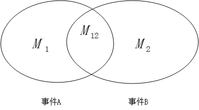
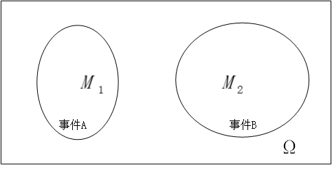

## 条件概率

事件 A 在 B 发生的情况下发生的概率，即后验概率：
$$
\begin{align*}
\\P(A|B) &= \frac{M_{12}}{M_2} \\
&= \frac{\frac{M_{12}}{N}}{\frac{M_{2}}{N}} \\
&= \frac{P_{AB}}{P_B}
\end{align*}
$$

- 独立性

  $$
  如果 P_A=P(A|B)，即，B的发生对 A 没有影响，那么：\\
  P(A|B) = \frac{P_{AB}}{P_B} => P_{AB} = P_AP_B
  $$
  
- 不相容和独立性
  
  
  
  $$
  事件 A 和事件 B 不相容，即:\\
  P_{AB} = 0；有：\\
  P(A|B) = \frac{P_{AB}}{P_B}\\
  如果 A、B 独立，有 P(A|B) = P_{A}，那么：\\
  P_{AB} = P_AP_B，P_A和P_B都>0，所以 P_{AB}>0，和已有条件矛盾。\\
  故相容的事件，不独立。
  $$
  
- 条件独立
$$
  在事件C发生下，有：\\
  P(A \cap B|C) = P(A|C)P(B|C)\\
  则事件 A 和事件 B在给定条件 C 下条件独立\\
  P(A \cap B|C) = \frac{P(A \cap B \cap C)}{P(C)}\\
  \begin{align*}
  又 P(A \cap B \cap C) &= P(A|B \cap C)P(B \cap C)\\
  &=P(A|B \cap C)P(B|C)P(C)
  \end{align*}
  \\
  综合以上三式，可得:\\
  P(A|B \cap C) = P(A|C)\\
  若事件 A、B条件独立，事件 B 是否发生，并不影响此时事件 A 发生的概率
$$

- 独立和条件独立

  > 假设依次投掷均匀硬币两次，事件 A 表示第一枚硬币正面向上，事件 B 表示第二枚硬币正面向上，事件 C 表示两次试验结果不一致。事件 A 是否与事件 B 独立？在 C 发生的情况下，事件 A 和事件 B 是否条件独立？
  
- 一组事件的独立性
  $$
  若事件 A、B、C 相互独立，则需满足以下必要条件：\\
  P(A \cap B ) = P(A)P(B)\\
  P(A \cap C) = P(A)P(C)\\
  P(B \cap C) = P(B)P(C)\\
  P(A \cap B \cap C) = P(A)P(B)P(C)\\
  $$
  那么在**上一小节**例子中的事件 A、B、C 是否独立？

  如果一个试验由一系列独立且相同的试验组成，这种试验为独立重复试验。当每个小试验的结果只有两种时，称为伯努利试验。
  
- 全概率

  

$$
如果:\\
B_iB_j=\varnothing\\
B_1+B_2+...+B_n=\Omega\\
那么：\\
\begin{align*}
P_A = P_{A\Omega} &= P_{A(B_1+B_2+...+B_n)}\\
&= P_{(AB_1+AB_2+...+AB_n)}
\end{align*}
\\
由于 AB_1、AB_2、AB_n 不相容\\
P_A = P_{AB_1} + P_{AB_2}+...+P_{AB_n}\\
= P(A|B_1)P_{B_1} + P(A|B_2)P_{B_2} + ... + + P(A|B_n)P_{B_n}\\
全部的概率被分成了许多部分的概率之和
$$

- 贝叶斯公式
  $$
  P(A|B_i)P_{B_i} = P(B_i|A)P_A\\
  P_A = P(A|B_1)P_{B_1}+P(A|B_2)P_{B_2}+...+P(A|B_n)P_{B_n}
  $$
  

- 随机变量

  随机变量映射“变化的试验现象”。
  $$
  随机变量 X(大写) 取值为 x(小写) 的概率，表示为：
  P_X(x) = P(\{X=x\})
  $$
  当取值为离散时，即为离散随机变量。特性：

  1. 所有取值，概率之和为1
  2. 事件{X=x}彼此之间互不相容。所以某“集合事件”可以通过子事件相加得到。

  分布列为“取值”和概率的对应二维表；还有概率质量函数PMF(Probability Mass Function)用于图形展示随机变量分布。