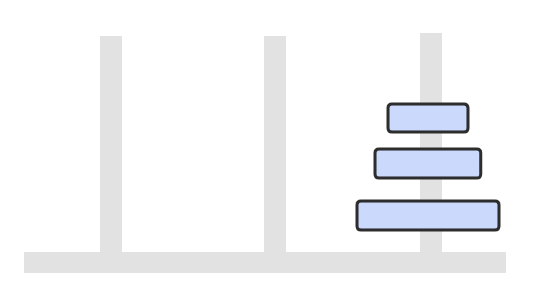

# 汉诺塔

<div align="center">  </div><br>
有三个柱子，分别为 from、buffer、to。

分为三步求解：

① 将 n-1 个圆盘从 from -> buffer

<div align="center">  </div><br>
② 将 1 个圆盘从 from -> to

<div align="center">  </div><br>
③ 将 n-1 个圆盘从 buffer -> to

<div align="center">  </div><br>
如果只有一个圆盘，那么只需要进行一次移动操作。

从上面的讨论可以知道，移动 n 个圆盘的次数 a<sub>n</sub> = 2 * a<sub>n-1</sub> + 1，根据逆推关系，计算出 n 和 a<sub>n</sub> 的关系， a<sub>n</sub> = 2<sup>n</sup> - 1。

```java
public class Hanoi {

    private static void hanoi(int n,String from,String buffer,String to){
        if (n==1){
            System.out.println("把一个从"+from+"移到"+to);
            return;
        }
        hanoi(n-1,from,to,buffer);
        hanoi(1,from,buffer,to);
        hanoi(n-1,buffer,from,to);
    }

    public static void main(String[] args) {
        hanoi(3,"C1","C2","C3");
    }
}
```

```html
把一个从C1移到C3
把一个从C1移到C2
把一个从C3移到C2
把一个从C1移到C3
把一个从C2移到C1
把一个从C2移到C3
把一个从C1移到C3
```

# 哈夫曼编码

根据数据出现的频率对数据进行编码，从而压缩原始数据。

例如对于一个文本文件，其中各种字符出现的次数如下：

- a : 10
- b : 20
- c : 40
- d : 80

可以将每种字符转换成二进制编码，例如将 a 转换为 00，b 转换为 01，c 转换为 10，d 转换为 11。这是最简单的一种编码方式，没有考虑各个字符的权值（出现频率）。而哈夫曼编码采用了贪心策略，使出现频率最高的字符的编码最短，从而保证整体的编码长度最短。

<div align="center">  </div><br>
```java
public class Huffman {

    private class Node implements Comparable<Node> {
        char ch;
        int freq;
        boolean isLeaf;
        Node left, right;

        public Node(char ch, int freq) {
            this.ch = ch;
            this.freq = freq;
            isLeaf = true;
        }

        public Node(Node left, Node right, int freq) {
            this.left = left;
            this.right = right;
            this.freq = freq;
            isLeaf = false;
        }

        @Override
        public int compareTo(Node o) {
            return this.freq - o.freq;
        }
    }

    public Map<Character, String> encode(Map<Character, Integer> frequencyForChar) {
        //默认为最小堆，调用放入元素的 compareTO()
        PriorityQueue<Node> priorityQueue = new PriorityQueue<>();
        for (Character c : frequencyForChar.keySet()) {
            priorityQueue.add(new Node(c, frequencyForChar.get(c)));
        }
        while (priorityQueue.size() != 1) {
            Node node1 = priorityQueue.poll();
            Node node2 = priorityQueue.poll();
            priorityQueue.add(new Node(node1, node2, node1.freq + node2.freq));
        }
        return encode(priorityQueue.poll());
    }

    private Map<Character, String> encode(Node root) {
        Map<Character, String> encodingForChar = new HashMap<>();
        encode(root, "", encodingForChar);
        return encodingForChar;
    }

    private void encode(Node node, String encoding, Map<Character, String> encodingForChar) {
        if (node.isLeaf) {
            encodingForChar.put(node.ch, encoding);
            return;
        }
        encode(node.left, encoding + '0', encodingForChar);
        encode(node.right, encoding + '1', encodingForChar);
    }
}
```


# KMP


算法运行过程:


```java
//生成 KMP 前缀表
public static int[] prefixTable(String needle) {
    
    int[] prefix = new int[needle.length()];

    if(needle.length()==0){
        return prefix;
    }
    
    prefix[0] = -1;
    if(needle.length()==1){
        return prefix;
    }

    //一个字母的最大公共前缀为0
    prefix[1] = 0;
    for(int i=1;i<needle.length()-1;i++){
        if(needle.charAt(i)==needle.charAt(prefix[i])){
            prefix[i+1] = prefix[i]+1;
        }else{
            int count = 0;
            for(int j=0;j<i;j++){
                if(needle.charAt(j)==needle.charAt(i-j)){
                    count++;
                }else{
                    break;
                }
            }
            prefix[i+1] = count;
            
        }
    }

    return prefix;
}
```


`参考`

- [KMP算法（研究总结，字符串）](https://www.cnblogs.com/SYCstudio/p/7194315.html)
- [视频](https://www.youtube.com/watch?v=dgPabAsTFa8)