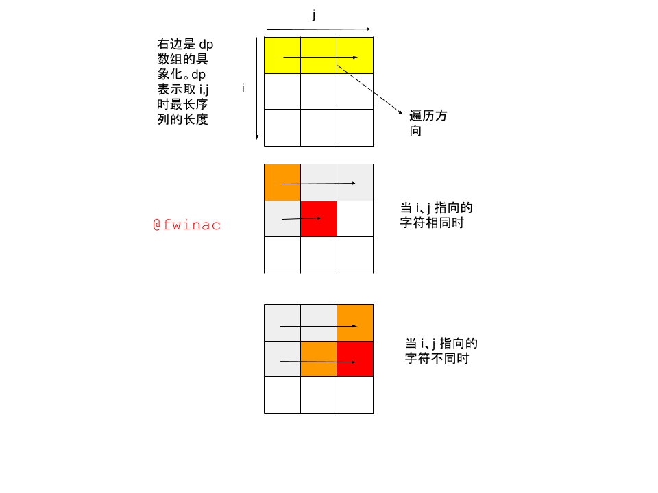

# 动态规划

## 常见问题

- 最长公共子序列

  

## 分类

### “背包”

有目标限制。分为两种实现方式：

1. 外循环每次定目标，每个目标循环待选择的数据

   这种方式，待选择数据的不同排列就是一个新的解（完全背包），所以解的数量比较多。

2. 外循环每次定待选择的数，每个待选择的数循环目标。

   这种方式还再分两种：一种，待选择的数可以重复使用（完全背包），从前向后循环目标。另一种，待选择的数不可以重复使用（01背包），从后向前循环目标。

   这种方式，一个数“出现在不同位置”不是一个新的解，所以解的数量比较少。

### 最优

循环待选择的数，当到达每个选择的数的时候，进行状态转换，上一个状态可能是多个、”多人“。

# 递归

常见操作对象为树，在树中圈一小块解决一下这个特殊情况，再递归解决左边情况和右边情况。