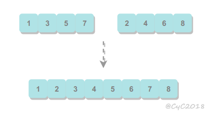
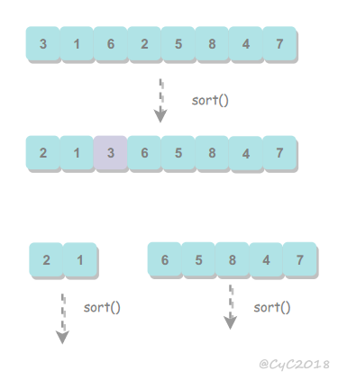
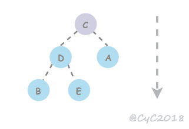

## 排序算法的衡量

- 最好、最坏、平均时间复杂度
- 空间复杂度
- 稳定性

## 选择排序

从序号0开始，依次选择右边剩下元素最小的、次小的等等

不稳定，例如：

序列5 8 5 2 9， 我们知道第一遍选择第1个元素5会和2交换，那么原序列中2个5的相对前后顺序就被破坏了

## 冒泡排序

一直和右边的数比，把自己交换到最大处，然后下一步。如果一轮交换过程中没有发生一次交换，则退出排序。

## 插入排序

左边的排好了，右边的是乱的。每次取右边的第一个，从左边的最右边开始，依次比下去。若取出的牌更小，则把属于左边的牌往右一步。可把位置0设为哨兵，每次取出的牌放在哨兵处，这样可以避免检查越界。


## 归并排序

归并排序的思想是将数组分成两部分，分别进行排序，然后归并起来。

<div align="center">  </div><br>
- 归并方法

  归并方法将数组中两个已经排序的部分归并成一个。

  ```java
  private static Integer[] merge(Integer[] arr, int l, int m, int h) {
  //        Integer[] arr1 = (Integer[])new Comparable[h-l+1];
          Integer[] arr1 = new Integer[h - l + 1];
          int i = 0;
          int c = m;
          while (l < m && m <= h) {
              if (arr[l] <= arr[m]) {
                  arr1[i] = arr[l];
                  l++;
              } else {
                  arr1[i] = arr[m];
                  m++;
              }
              i++;
          }
          while (l < c) {
              arr1[i++] = arr[l++];
          }
          while (m <= h) {
              arr1[i++] = arr[m++];
          }
          return arr1;
      }
  ```

- ”自下向上“

  ```java
  private void sort(T[] nums, int l, int h) {
          if (h <= l) {
              return;
          }
          int mid = l + (h - l) / 2;
          sort(nums, l, mid);
          sort(nums, mid + 1, h);
          merge(nums, l, mid, h);
  }
  ```


## 快速排序

- partition

  选一个 pivot，调整数组使左边的比pivot小，右边的比它大

  <div align="center">  </div><br>
  
- 算法改进

  - 切换到插入排序

    因为快速排序在小数组中也会递归调用自己，对于小数组，插入排序比快速排序的性能更好，因此在小数组中可以切换到插入排序。
    
  - 三向切分
  
    大量重复元素的数组，将数组切分为三部分，分别对应小于、等于和大于切分元素。
  
    ```java
    public class ThreeWayQuickSort<T extends Comparable<T>> extends QuickSort<T> {
    
        @Override
        protected void sort(T[] nums, int l, int h) {
            if (h <= l) {
                return;
            }
            int lt = l, i = l + 1, gt = h;
            T v = nums[l];
            while (i <= gt) {
                int cmp = nums[i].compareTo(v);
                if (cmp < 0) {
                    swap(nums, lt++, i++);
                } else if (cmp > 0) {
                    swap(nums, i, gt--);
                } else {
                    i++;
                }
            }
            sort(nums, l, lt - 1);
            sort(nums, gt + 1, h);
        }
    }
    ```

- 选择第K个

  可用快速排序的 partition() 方法找出数组的第 k 个元素。

  该算法是线性级别的，假设每次能将数组二分，那么比较的总次数为 (N+N/2+N/4+..)，直到找到第 k 个元素，这个和显然小于 2N。

  ```java
  public T select(T[] nums, int k) {
      int l = 0, h = nums.length - 1;
      while (h > l) {
          int j = partition(nums, l, h);
  
          if (j == k) {
              return nums[k];
  
          } else if (j > k) {
              h = j - 1;
  
          } else {
              l = j + 1;
          }
      }
      return nums[k];
  }
  ```

## 堆排序

### 最大堆

<div align="center">  </div><br>
```java
public class Heap<T extends Comparable<T>> {
    T[] elems;
    int size;

    Heap(int cap) {
        elems = (T[]) new Comparable[cap];
    }

    /**
     * 比较两个位置的大小
     */
    boolean less(int i, int j) {
        return elems[i].compareTo(elems[j]) < 0;
    }

    void swap(int i, int j) {
        T t = elems[i];
        elems[i] = elems[j];
        elems[j] = t;
    }
}
```

### 上浮和下沉

在堆中，当一个节点比父节点大，那么需要交换这个两个节点。交换后还可能比它新的父节点大，因此需要不断地进行比较和交换操作，把这种操作称为上浮。

<div align="center">  </div><br>
```java
void swim(int i) {
        while (i > 0) {
            int p = (i - 1) / 2;
            if (less(p, i)) {
                swap(p, i);
                i = p;
            } else {
                break;
            }
        }
    }
```

类似地，当一个节点比子节点来得小，则要不断下沉。

<div align="center">  </div><br>
```java
void sink(int i) {
        int cl;
        int cr;
        int bigger;
        //FAULT：最后一个可用父节点，没确定准确
        while (i <= (size - 2) / 2) {
            cl = 2 * i + 1;
            cr = 2 * i + 2;
            if (cr >= size) {
                bigger = cl;
            } else {
                bigger = less(cl, cr) ? cr : cl;
            }
            if (less(i, bigger)) {
                swap(i, bigger);
                i = bigger;
            } else {
                break;
            }
        }
    }
```

### 插入元素

将新元素放到数组末尾，然后上浮到合适的位置。

```java
void insert(T e) {
        if(size==elems.length){
            throw new IndexOutOfBoundsException("堆已经满了");
        }
        elems[size] = e;
        swim(size);
        size++;
 }
```

### 删除最大元素

将最大和最后一个交换

```java
T removeMax() {
        if (size < 1) {
            return null;
        }
        swap(0, size - 1);
        T t = elems[size - 1];
        elems[size - 1] = null;
        size--;
        //FAULT:在没有删除旧元素的时候sink
        sink(0);
        return t;
}
```

### 堆排序

传入的数组从第二个元素开始，当作插入堆。插入完毕后，依次把最大元素和最后一个元素交换位置，并且不删除它，那么就可以得到一个从尾到头的递减序列。


### 分析

堆排序是一种原地排序，没有利用额外的空间。

现代操作系统很少使用堆排序，因为它无法利用局部性原理进行缓存，也就是数组元素很少和相邻的元素进行比较和交换。


## 排序算法的比较

| 算法 | 稳定性 | 时间复杂度 | 空间复杂度 | 备注 |
| :---: | :---: |:---: | :---: | :---: |
| 选择排序 | × | N<sup>2</sup> | 1 | |
| 冒泡排序 | √ |  N<sup>2</sup> | 1 | |
| 插入排序 | √ |  N \~ N<sup>2</sup> | 1 | 小规模数据或输入基本有序时比较有效 |
| 快速排序 | ×  | NlogN | logN | |
| 归并排序 | √ |  NlogN | N | |
| 堆排序 | ×  |  NlogN | 1 | 无法利用局部性原理|

快速排序是最快的通用排序算法，它的内循环的指令很少，而且它还能利用缓存。它的运行时间近似为 \~cNlogN，这里的 c 比其它线性对数级别的排序算法都要小。

## Java 的排序算法实现

Java 主要排序方法为 java.util.Arrays.sort()，对于原始数据类型使用快速排序，对于引用类型使用归并排序（引用类型需要稳定性）。

待排序的元素需要实现 Comparable 接口。

