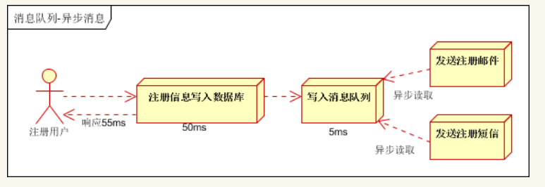

# 衡量系统的标准

## 安全性

在应对各种攻击手段时能够有可靠的应对措施。

## 性能

当前处理能力

### 吞吐量(TPS)

指在单位时间内可以处理的请求数量，和响应时间（RT）成反比。好的“多用户访问的系统”的平均响应时间不随用户增加而线性增加。QPS 是特定场景（如域名服务器，强调查询的系统）时的 TPS。

### 优化

- **集群**

  多台服务器同时面对请求

- **异步**

  

- **缓存**

## 伸缩性

能够通过增加服务器来提升处理能力的能力

要求应用服务器无状态

## 可用性

### 措施

- **冗余**

  即预防；常见的是避免“单点故障”，多台服务器提供相同功能

- **监控**

  即避免；监控系统状况，当阈值时处理

- **服务降级**

  实在处理不了，只提供基本服务

## 扩展性

可维护性，升级的能力，关键在程序本身，

