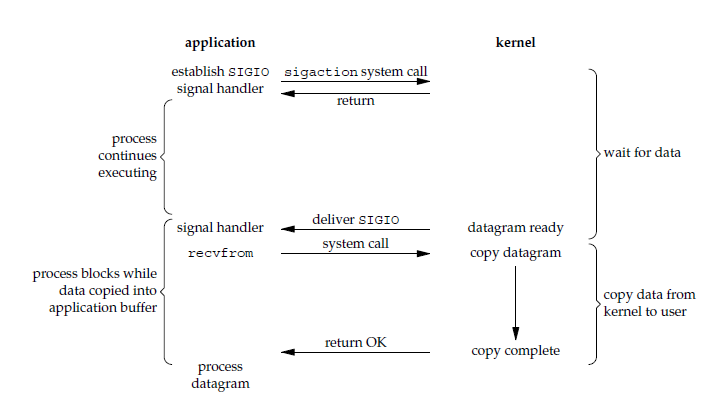
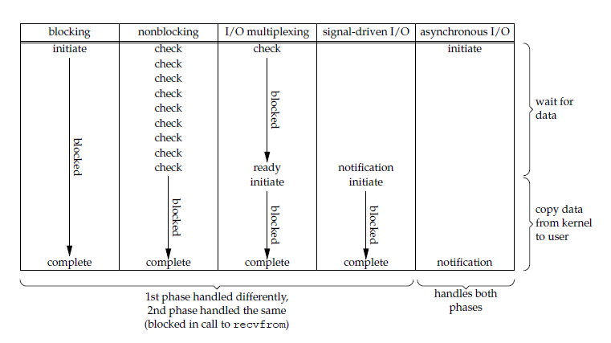

# I/O 模型

一个输入操作包括两个阶段：

- 等待数据准备好
- 从内核向应用进程复制数据

## 阻塞式 I/O

内核挂起调用，等待调用指定的事件发生。

```c
ssize_t recvfrom(int sockfd, void *buf, size_t len, int flags, struct sockaddr *src_addr, socklen_t *addrlen);
```

<div align="center">  </div><br>
## 非阻塞式 I/O

当事件没有发生时，不再阻塞。

<div align="center">  </div><br>
## I/O 复用

使用 select 或者 poll 一个线程集中等待多个套接字中的任何一个发生事件，这一过程会阻塞。当某一个套接字可读时，再用 recvfrom 把数据从内核阻塞地复制到应用进程中。

被称为 Event Driven I/O，即事件驱动 I/O。

<div align="center">  </div><br>
## 信号驱动 I/O

应用进程使用 sigaction 系统调用，应用进程继续执行。当数据全部到达内核时，向应用进程发送 SIGIO 信号，应用进程收到之后调用 recvfrom 阻塞地将数据从内核复制到应用进程中，可以看出在第一阶段应用进程是非阻塞的。

<div align="center">  </div><br>
## 异步 I/O

应用进程执行 aio_read 系统调用后立即返回，应用进程继续执行。内核会在**所有操作**完成之后向应用进程发送信号。

异步 I/O 的信号是通知应用进程 I/O 完成，而信号驱动 I/O 的信号是通知应用进程可以开始从内核 I/O。

<div align="center">  </div><br>
## 五大 I/O 模型比较

- 同步 I/O：将数据从内核复制到应用进程会阻塞。
- 异步 I/O：整个过程不阻塞。

<div align="center">  </div><br>
# I/O 复用

select/poll/epoll 都是 I/O 多路复用的具体实现，select 最早，之后是 poll，再是 epoll。

## select

```c
int select(int n, fd_set *readfds, fd_set *writefds, fd_set *exceptfds, struct timeval *timeout);
```

有三种的描述符类型：readset、writeset、exceptset，分别对应读、写、异常条件的描述符集合。fd_set 使用数组实现，数组大小使用 FD_SETSIZE 定义。

timeout 为超时参数，调用 select 会一直阻塞直到有事件到达或者等待的时间超过 timeout。

成功调用返回结果大于 0，出错返回 -1，超时返回 0。

```c
fd_set fd_in, fd_out;
struct timeval tv;

// Reset the sets
FD_ZERO( &fd_in );
FD_ZERO( &fd_out );

// Monitor sock1 for input events
FD_SET( sock1, &fd_in );

// Monitor sock2 for output events
FD_SET( sock2, &fd_out );

// Find out which socket has the largest numeric value as select requires it
int largest_sock = sock1 > sock2 ? sock1 : sock2;

// Wait up to 10 seconds
tv.tv_sec = 10;
tv.tv_usec = 0;

// Call the select
int ret = select( largest_sock + 1, &fd_in, &fd_out, NULL, &tv );

// Check if select actually succeed
if ( ret == -1 )
    // report error and abort
else if ( ret == 0 )
    // timeout; no event detected
else
{
    if ( FD_ISSET( sock1, &fd_in ) )
        // input event on sock1

    if ( FD_ISSET( sock2, &fd_out ) )
        // output event on sock2
}
```

## poll

```c
int poll(struct pollfd *fds, unsigned int nfds, int timeout);
```

pollfd 使用链表实现。

```c
// The structure for two events
struct pollfd fds[2];

// Monitor sock1 for input
fds[0].fd = sock1;
fds[0].events = POLLIN;

// Monitor sock2 for output
fds[1].fd = sock2;
fds[1].events = POLLOUT;

// Wait 10 seconds
int ret = poll( &fds, 2, 10000 );
// Check if poll actually succeed
if ( ret == -1 )
    // report error and abort
else if ( ret == 0 )
    // timeout; no event detected
else
{
    // If we detect the event, zero it out so we can reuse the structure
    if ( fds[0].revents & POLLIN )
        fds[0].revents = 0;
        // input event on sock1

    if ( fds[1].revents & POLLOUT )
        fds[1].revents = 0;
        // output event on sock2
}
```


## epoll

```c
int epoll_create(int size);
int epoll_ctl(int epfd, int op, int fd, struct epoll_event *event)；
int epoll_wait(int epfd, struct epoll_event * events, int maxevents, int timeout);
```

epoll_ctl() 用于向内核注册新的描述符或者改变某个描述符的状态。已注册的描述符在内核中会被维护在一棵红黑树上；通过回调函数内核会将有事件发生的的描述符加入到一个链表中，进程调用 epoll_wait() 便可以得到所有有事件发生的描述符。

从上面的描述可以看出，epoll 只需要将描述符从进程缓冲区向内核缓冲区拷贝一次，并且进程不需要通过轮询来获得事件完成的描述符。

```c
// Create the epoll descriptor. Only one is needed per app, and is used to monitor all sockets.
// The function argument is ignored (it was not before, but now it is), so put your favorite number here
int pollingfd = epoll_create( 0xCAFE );

if ( pollingfd < 0 )
 // report error

// Initialize the epoll structure in case more members are added in future
struct epoll_event ev = { 0 };

// Associate the connection class instance with the event. You can associate anything
// you want, epoll does not use this information. We store a connection class pointer, pConnection1
ev.data.ptr = pConnection1;

// Monitor for input, and do not automatically rearm the descriptor after the event
ev.events = EPOLLIN | EPOLLONESHOT;
// Add the descriptor into the monitoring list. We can do it even if another thread is
// waiting in epoll_wait - the descriptor will be properly added
if ( epoll_ctl( epollfd, EPOLL_CTL_ADD, pConnection1->getSocket(), &ev ) != 0 )
    // report error

// Wait for up to 20 events (assuming we have added maybe 200 sockets before that it may happen)
struct epoll_event pevents[ 20 ];

// Wait for 10 seconds, and retrieve less than 20 epoll_event and store them into epoll_event array
int ready = epoll_wait( pollingfd, pevents, 20, 10000 );
// Check if epoll actually succeed
if ( ret == -1 )
    // report error and abort
else if ( ret == 0 )
    // timeout; no event detected
else
{
    // Check if any events detected
    for ( int i = 0; i < ret; i++ )
    {
        if ( pevents[i].events & EPOLLIN )
        {
            // Get back our connection pointer
            Connection * c = (Connection*) pevents[i].data.ptr;
            c->handleReadEvent();
         }
    }
}
```

epoll 有两种触发模式，LT*(level trigger)*和 ET*(edge trigger)*：

- **LT 模式**
	当调用 epoll_wait() 得到到达的事件时，进程可以不立即处理，下次调用 epoll_wait() 会再次通知。默认模式，同时支持 Blocking 和 No-Blocking。

- **ET 模式**
	
	边缘触发
	
	和 LT 模式不同的是，通知之后进程必须立即处理，下次再调用 epoll_wait() 时不会再得到通知。
	很大程度上减少了 epoll 事件被重复触发，因此效率要比 LT 模式高。只支持 No-Blocking，以避免由于当对一个事件处理时，把剩下的事件”饿死“。

## 比较

| 复用类型 |   平台   |    数据结构    | 支持事件类型 | 文件描述符处理方式 | 超时精确 | 文件描述符被使用时关闭 | 事件发生处理方式 |
| :------: | :------: | :------------: | :----------: | ------------------ | :------: | :--------------------: | :--------------: |
|  select  | 几乎所有 | 数组(默认1024) |     较少     | 每次调用复制       |    ns    |          异常          |       轮询       |
|   poll   |   较新   |      链表      |     较多     | 同上               |    ms    |          异常          |       轮询       |
|  epoll   |  Linux   | 红黑树(内核中) |     更多     | 注册在内核         |    ms    |          正常          |   epoll_wait()   |


# 服务器模式

## 经典(BIO)

connection per thread

一个请求交给一个线程“完全处理”，这个线程负责这个请求的整个处理过程。适合少量连接（会不断建立线程）、高带宽（可能一次返回多个处理结果，低带宽，阻塞）、一次发送大量数据（少量数据，连接一直保留）

## Reactor(NIO)

Reactor 根据不同的事件类型交给不同的 Handler 去处理。有事件发生才会 让 Handler 处理，那么 Handler不会像经典方式那样阻塞等待事件发生（那么 handler 被选中执行处理过程，这个处理过程不会阻塞），而是由 IO 复用阻塞等待。

简直妙人啊，IO 复用在任何时候都可以响应新事件，每个处理过程又不会阻塞（理想情况下，把各种可能阻塞的都交给 IO 复用去等），因为**所有的阻塞等待**交给了 Reactor 线程（Handler 线程不会阻塞）。