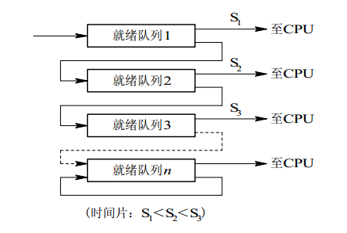

# 进程与线程

## 进程

进程是资源分配的基本单位。

进程控制块 (Process Control Block, PCB) 描述进程的基本信息和运行状态，所谓的创建进程和撤销进程，都是指对 PCB 的操作。

`参考`

- 进程是在什么时候出现的?为什么有进程? 
- 进程有哪些资源?
- Linux中用什么代表一个文件?文件在Linux里面可以表示什么?

## 线程

线程是调度的基本单位，线程之间并发执行。

线程的并发执行使得一个进程既可以响应用户的操作也可以同时进行费时操作，比如下载数据，计算等。

一个进程中可以有多个线程，它们共享进程资源。


<div align="center">  </div><br>

`参考`

- 所有线程都是操作系统调度吗?

## 区别

- **拥有资源**
	进程是资源分配的基本单位，但是线程不拥有资源，线程可以访问所在进程的资源。

- **调度**
	线程是独立调度的基本单位。

- **系统开销**
	由于创建或撤销进程时，系统都要为之分配或回收资源，所付出的开销远大于创建或撤销线程。

- **通信方面**
	线程间可以通过直接读写同一进程中的数据进行通信，但是进程通信需要借助 IPC。

# 进程状态的切换

<div align="center">  </div><br>

- 就绪状态（ready）：没有CPU资源
- 阻塞状态（waiting）：没有除CPU外的某种资源

`参考`
- 每种状态到另一状态转换发生的条件?

# 进程调度算法

不同调度算法目标不同，因此针对不同目标讨论。

##  批处理系统

批处理系统接受一批计算任务，执行好后把结果打印就行。批处理系统没有太多的用户操作，在该系统中，调度算法目标是保证吞吐量和周转时间（从任务提交到任务完成的时间）。

**1. 先来先服务 first-come first-serverd（FCFS）** 

按照任务提交的顺序调度。

有利于长作业，但不利于短作业，短作业大部分时间在等待长作业完成，然后执行。

**2. 短作业优先 shortest job first（SJF）** 

按**估计**运行时间最短的顺序调度。

如果一直有短作业到来，那么长作业一直得不到调度，“饿死”。

**3. 最短剩余时间优先 shortest remaining time next（SRTN）** 

按估计剩余时间最短的顺序进行调度。

## 交互式系统

交互式系统运行程序过程中可以执行用户发来的指令。交互式系统有大量的用户交互操作，在该系统中调度算法的目标是快速地响应用户。

**1. 时间片轮转** 

将所有就绪进程按 FCFS 的原则排成一个队列，每次调度时，把 CPU 时间分配给队首进程，该进程可以执行一个时间片。当时间片用完时，由计时器发出时钟中断，调度程序便停止该进程的执行，并将它送往就绪队列的末尾，同时继续把 CPU 时间分配给队首的进程。

时间片轮转算法的效率和时间片的大小有很大关系：

- 因为进程切换都要保存进程的信息并且载入新进程的信息，如果时间片太小，会导致进程切换得太频繁，在进程切换上就会花过多时间，进程切换的时间没有进行“有效计算”，所以这些花费的时间被浪费了。
- 而如果时间片过长，那么实时性就不能得到保证。

<div align="center">  </div><br>

**2. 优先级调度** 

为每个进程分配一个优先级，按优先级调度。

为了防止低优先级的进程永远等不到调度，可以随着时间的推移增加等待进程的优先级。

**3. 多级反馈队列** 

一个进程需要执行 100 个时间片，如果采用时间片轮转调度算法，那么需要交换 100 次。

多级队列是为这种需要连续执行多个时间片的进程考虑，它设置了多个队列，每个队列时间片大小都不同，例如 1,2,4,8,..。进程在第一个队列没执行完，就会被移到下一个队列。这种方式下，之前的进程只需要交换 7 次。

每个队列优先权也不同，最上面的优先权最高。因此只有上一个队列没有进程在排队，才能调度当前队列上的进程。

可以将这种调度算法看成是时间片轮转调度算法和优先级调度算法的结合。

<div align="center">  </div><br>

## 实时系统

实时系统要求一个请求在一个确定时间内得到响应。

分为硬实时和软实时，前者必须满足绝对的截止时间，后者可以容忍一定的超时。

# 进程同步

## 临界区

对临界资源*(一个时间只允许一个进程访问，如果多个访问会怎么样?)*进行访问的那段代码称为临界区。

为了互斥访问临界资源，每个进程在进入临界区之前，需要先进行检查。

```html
// entry section
// critical section;
// exit section
```

## 同步与互斥

- 同步：多个进程按一定顺序执行；
- 互斥：多个进程在同一时刻只有一个进程能进入临界区。

## 信号量

操作系统本身是并发和异步的，信号量用来克服它们的缺点，实现同步和互斥。

信号量（Semaphore）是一个**整型**变量，可以对其执行 down 和 up 操作，也就是P 和 V 操作。

-  **down**  :对信号量减一，-1后如果信号量小于0，执行操作的进程睡眠；
-  **up** ：对信号量加一 ，+1后如果信号量小于等于0，唤醒睡眠的进程。

down 和 up 操作需要被设计成原语(操作不可只执行一半)，通常的做法是在执行这些操作的时候屏蔽中断。

如果信号量的取值只能为 0 或者 1，那么就成为了  **互斥量（Mutex）** ，0 表示临界区已经加锁，1 表示临界区解锁。

```c
typedef int semaphore;
semaphore mutex = 1;
void P1() {
    down(&mutex);
    // 临界区
    up(&mutex);
}

void P2() {
    down(&mutex);
    // 临界区
    up(&mutex);
}
```
`参考`
- 当中断来的时候，操作系统会马上停止执行“手头上的程序”，立刻去处理中断
- 什么是屏蔽中断?

### 生产者-消费者问题

问题描述：使用一个缓冲区来保存物品，只有缓冲区没有满，生产者才可以放入物品；只有缓冲区不为空，消费者才可以拿走物品。

1. 缓冲区属于临界资源，因此需要使用一个互斥量(信号量的一种) mutex 来控制对缓冲区的互斥访问。
  2. 为了控制生产者和消费者的行为，需要记录缓冲区中物品的数量，数量可以使用信号量来进行统计。这里需要使用两个信号量：empty 记录空闲空间的数量，full 记录使用了的空间的数量。其中，empty 信号量是生产者使用，当 empty 不为 0 时，生产者才可以放入物品；full 信号量是消费者使用，当 full 信号量不为 0 时，消费者才可以取走物品。
  3. 注意不能先执行 down(mutex) 再执行 down(empty)。如果这么做了，那么可能会出现这种情况：生产者对缓冲区加锁后，执行 down(empty) 操作，发现 empty = 0，生产者睡眠。这时消费者不能进入临界区，因为生产者对缓冲区加锁了，这样消费者就无法执行 up(empty) ，empty 永远为 0。消费者和生产者只能一直等待。
```c
#define N 100
typedef int semaphore;
semaphore mutex = 1;
semaphore empty = N;
semaphore full = 0;
//进程一
void producer() {
	 while(TRUE) {
    	int item = produce_item();
  	  	down(&empty);
  	  	down(&mutex);
  	  	insert_item(item);
  	  	up(&mutex);
  	  	up(&full);
  	  }
}
//进程二
void consumer() {
  	  while(TRUE) {
 	  	down(&full);
      	down(&mutex);
 	  	int item = remove_item();
      	consume_item(item);
 	    up(&mutex);
  	    up(&empty);
	 }
}
```

### 管程

使用信号量机制实现的生产者消费者问题需要客户端代码做很多控制，而管程把控制的代码独立出来，不仅不容易出错，也使得客户端代码调用更容易。

c 语言不支持管程，下面的示例代码使用了类 Pascal 语言来描述管程。

管程引入了  **条件变量**  以及相关的操作：**wait()** 和 **signal()** 来实现同步操作。对条件变量执行 wait() 操作会导致调用进程阻塞，把管程让出来给另一个进程持有。signal() 操作用于唤醒被阻塞的进程。

**使用管程实现生产者-消费者问题** 

```pascal
// 管程
monitor ProducerConsumer
    condition full, empty;
    integer count := 0;
    condition c;

    procedure insert(item: integer);
    begin
        if count = N then wait(full);
        insert_item(item);
        count := count + 1;
        if count = 1 then signal(empty);
    end;

    function remove: integer;
    begin
        if count = 0 then wait(empty);
        remove = remove_item;
        count := count - 1;
        if count = N -1 then signal(full);
    end;
end monitor;

// 生产者客户端
procedure producer
begin
    while true do
    begin
        item = produce_item;
        ProducerConsumer.insert(item);
    end
end;

// 消费者客户端
procedure consumer
begin
    while true do
    begin
        item = ProducerConsumer.remove;
        consume_item(item);
    end
end;
```

# 经典同步问题

生产者和消费者问题前面已经讨论过了。

##  读者-写者问题

允许多个进程同时对数据进行读操作，但是不允许读和写以及写和写操作同时发生。

整型变量 count 记录在对数据进行读操作的进程数量

```c
typedef int semaphore;
semaphore count_mutex = 1;
semaphore data_mutex = 1;
int count = 0;

void reader() {
    while(TRUE) {
        down(&read_mutex);
        count++;
        if(count == 1) down(&write_mutex); // 第一个读者需要对数据进行加锁，防止写进程访问
        up(&read_mutex);
        read();
        down(&read_mutex);
        count--;
        if(count == 0) up(&write_mutex);
        up(&read_mutex);
    }
}

void writer() {
    while(TRUE) {
        down(&write_mutex);
        write();
        up(&write_mutex);
    }
}
```


## 哲学家进餐问题

<div align="center">  </div><br>

五个哲学家围着一张圆桌，每个哲学家面前放着食物。哲学家的生活有两种交替活动：吃饭以及思考。当一个哲学家吃饭时，需要先拿起自己左右两边的两根筷子，并且一次只能拿起一根筷子。

下面是一种错误的解法，考虑到如果所有哲学家同时拿起左手边的筷子，那么就无法拿起右手边的筷子，造成死锁。

```c
#define N 5

void philosopher(int i) {
    while(TRUE) {
        think();
        take(i);       // 拿起左边的筷子
        take((i+1)%N); // 拿起右边的筷子
        eat();
        put(i);
        put((i+1)%N);
    }
}
```

为了防止死锁的发生，可以设置两个条件：

- 必须同时拿起左右两根筷子；
- 只有在两个邻居都没有进餐的情况下才允许进餐。

```c
#define N 5
#define LEFT (i + N - 1) % N // 左邻居
#define RIGHT (i + 1) % N    // 右邻居
#define THINKING 0
#define HUNGRY   1
#define EATING   2
int state[N];                // 跟踪每个哲学家的状态
semaphore mutex = 1;         // 临界区的互斥
semaphore s[N];              // 每个哲学家一个信号量

void philosopher(int i) {
    while(TRUE) {
        think();
        take_forks(i);
        eat();
        put_two(i);
    }
}

void take_forks(int i) {//i为哲学家编号
    down(&mutex);//
    state[i] = HUNGRY;
    test(i);//试图拿起两把叉子
    up(&mutex);
    down(&s[i]);//得不到叉子就阻塞
}

void put_two(i) {
    down(&mutex);
    state[i] = THINKING;
    test(LEFT);
    test(RIGHT);
    up(&mutex);
}

void test(i) {         // 尝试拿起两把筷子
    if(state[i] == HUNGRY && state[LEFT] != EATING && state[RIGHT] !=EATING) {
        state[i] = EATING;
        up(&s[i]);
    }
}
```

# 进程通信

进程同步与进程通信很容易混淆，它们的区别在于：

- 进程同步：控制多个进程按一定顺序执行；
- 进程通信：进程间传输信息。

进程通信是一种手段，而进程同步是一种目的。为了能够达到进程同步的目的，需要让进程进行通信，传输一些进程同步所需要的信息。

## 管道

管道是通过调用 pipe 函数创建的，fd[0] 用于读，fd[1] 用于写。

```c
#include <unistd.h>
int pipe(int fd[2]);
```

它具有以下限制：

- 只支持半双工通信（单向交替传输）；
- 只能在父子进程中使用。

<div align="center">  </div><br>

## FIFO

First In First Out，也称命名管道

- 脱离进程存在
- 操作FIFO的方式和操作文件一样

```c
#include <sys/stat.h>
int mkfifo(const char *path, mode_t mode);
int mkfifoat(int fd, const char *path, mode_t mode);
```

FIFO 常用于客户-服务器应用程序中，FIFO 用作汇聚点，在客户进程和服务器进程之间传递数据。

<div align="center">  </div><br>

## 消息队列

相比于 FIFO，消息队列：

- 避免了 FIFO 的同步阻塞问题

- 读进程可以根据消息类型有选择地接收消息

`参考`

- [同步阻塞问题](https://blog.csdn.net/qnqanger/article/details/38124273)

## 信号量

用于控制多个进程对共享对象的访问。

## 共享内存

所有要通信的进程直接操作同一块内存区域。两个不同的虚拟地址通过页表*(MMU查询的表)*映射到物理空间的同一区域*(把同一段物理内存映射到不同进程的地址空间里)*。

速度比较快，但需要使用信号量用来同步对共享内存的访问。

另外 XSI 共享内存<sup>[1]</sup>不是使用文件，而是使用使用内存的匿名段。

`参考`

- “MMU”请参考操作系统内存管理的虚拟内存部分
1. [XSI and Realtime](https://stackoverflow.com/questions/18742644/posix-shared-memory-xsi-or-realtime) 

   XSI(System V)和Realtime(POSIX)是共享内存的两种实现

## 套接字

与其它通信机制不同的是，它可用于不同机器间的进程通信。