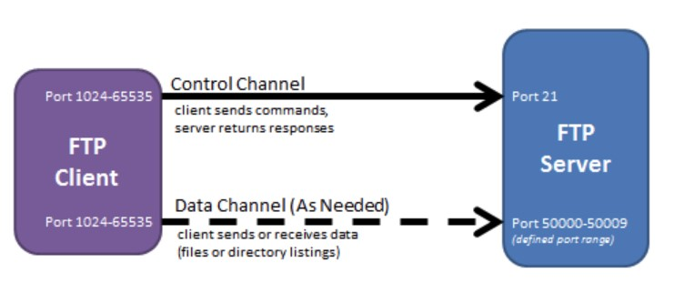

应用层是网络体系结构的最上面的一层，借助运输层提供的服务，应用层可以实现许多具体的功能。

# 域名系统

DNS 是一套分布式域名服务系统。众多客户程序使用 DNS 协议来向 DNS 服务器查询目标主机的 IP 地址。

域名具有层次结构，从上到下依次为：根域名、顶级域名、二级域名。

  
 
DNS 可以使用 UDP 或者 TCP 进行传输，使用的端口号都为 53。大多数情况下 DNS 使用 UDP ，这就要求域名解析器和域名服务器都必须自己来保证可靠性。在下面两种情况下会使用 TCP 进行传输：

- 如果返回的响应超过的 512 字节*(UDP 最大只支持 512 字节的数据)*。

- 区域传送*(区域传送是主域名服务器向辅助域名服务器传送变化的那部分数据)*。

`参考`

- 当输入一个网址后，具体的解析过程是怎样的?
- 为什么根域名服务器，不直接保存某个域名对应的 IP？

# 文件传送协议

FTP 使用 TCP 进行连接，它需要两个连接：

- 控制连接：服务器打开端口号 21 等待客户端的连接，客户端主动建立连接后，使用这个连接将客户端的命令传送给服务器，并传回服务器的应答。
- 数据连接：用来传送文件数据。

根据数据连接是否是服务器端主动建立，FTP 有主动和被动两种模式：

- 主动模式：服务器端主动建立**数据连接**，其中服务器端的端口号为 20，客户端的端口号随机，但是必须大于 1024，因为 0\~1023 是熟知端口号。

  
 
- 被动模式：客户端主动建立数据连接，其中客户端的端口号由客户端自己指定，服务器端的端口号随机。

  
 
主动模式要求客户端开放端口号给服务器端，需要去配置客户端的防火墙。被动模式只需要服务器端开放端口号即可，但是被动模式会导致服务器端的安全性减弱，因为开放了过多的端口号。

# 动态主机配置协议

DHCP (Dynamic Host Configuration Protocol) 提供了即插即用的连网方式，用户不再需要手动配置 IP 地址，网关地址、DNS服务器地址等信息。

DHCP 工作过程如下：

1. 客户端发送 Discover 报文，该报文的目的地址为 255.255.255.255:67，源地址为 0.0.0.0:68，被放入 UDP 中，该报文被广播到同一个子网的所有主机上。如果客户端和 DHCP 服务器不在同一个子网，就需要使用中继代理。
2. DHCP 服务器收到 Discover 报文之后，发送 Offer 报文给客户端，该报文包含了客户端所需要的信息。因为客户端可能收到多个 DHCP 服务器提供的信息，因此客户端需要进行选择。
3. 如果客户端选择了某个 DHCP 服务器提供的信息，那么就发送 Request 报文给该 DHCP 服务器。
4. DHCP 服务器发送 Ack 报文，表示客户端此时可以使用提供给它的信息。

  
 
# 远程登录协议

TELNET 用于登录到远程主机上。

TELNET 可以适应许多计算机和操作系统的差异，例如不同操作系统系统的换行符定义。

# 电子邮件协议

一个电子邮件系统由三部分组成：用户代理、邮件服务器以及邮件协议。

邮件协议包含发送协议和读取协议，发送协议常用 SMTP，读取协议常用 POP3 和 IMAP。

  
 
## SMTP

发邮件

  
 
## POP3

收邮件

## IMAP

收邮件；并同步本地客户端操作到服务器。

# WebSocket

对 HTTP 的拓展，支持了真正的长连接（只需要在开始发送状态信息，头部）

# 常用端口

|应用| 应用层协议 | 端口号 | 传输层协议 | 备注 |
| :---: | :--: | :--: | :--: | :--: |
| 域名解析 | DNS | 53 | UDP/TCP | 长度超过 512 字节时使用 TCP |
| 动态主机配置协议 | DHCP | 67/68 | UDP | |
| 简单网络管理协议 | SNMP | 161/162 | UDP | |
| 文件传送协议 | FTP | 20/21 | TCP | 控制连接 21，数据连接 20 |
| 远程终端协议 | TELNET | 23 | TCP | |
| 超文本传送协议 | HTTP | 80 | TCP | |
| 简单邮件传送协议 | SMTP | 25 | TCP | |
| 邮件读取协议 | POP3 | 110 | TCP | |
| 网际报文存取协议 | IMAP | 143 | TCP | |

可使用 `cat /etc/services|grep 53`查看特定端口对应的应用。

# 网络的“分用”过程

当底层协议要上上层多个协议提供服务时，底层协议就期望数据包告诉它怎么选择。

# Web 页面请求过程

1. DHCP 配置主机信息
如果用户主机最开始没有 IP 地址等信息，那么就可以使用 DHCP 来获取。
2. DNS 解析 HTTP 服务器域名
3. HTTP 请求页面
	- 有了 HTTP 服务器的 IP 地址之后，主机就能生成 TCP 套接字。
	- 在生成 TCP 套接字之前，先与 HTTP 服务器进行三次握手来建立连接。生成一个目的端口为 80 的 TCP SYN 报文段，并向 HTTP 服务器发送该报文段。
	- HTTP 服务器收到该报文段之后，生成 TCP SYN ACK 报文段，发回给主机。
	- 连接建立之后，浏览器生成 HTTP 请求报文，并发给 HTTP 服务器。
	- HTTP 服务器从 TCP 套接字读取 HTTP 请求报文，处理后生成 HTTP 响应报文，发送给浏览器。
	- 浏览器收到 HTTP 响应报文后，抽取出 Web 页面内容，之后进行渲染显示。
