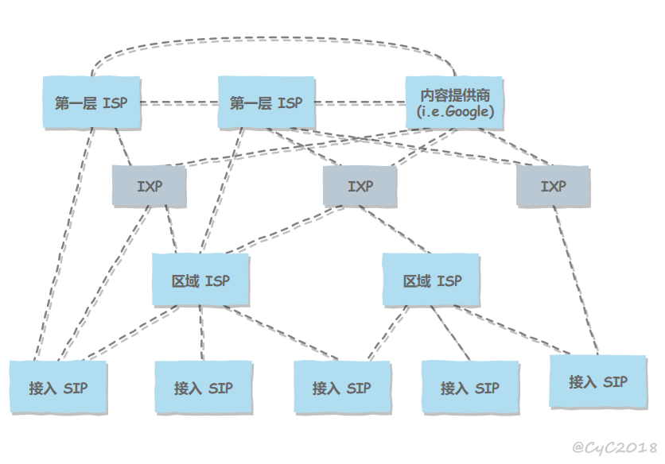
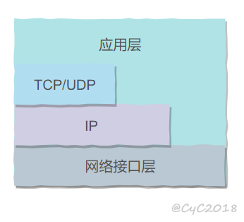

# 互联网

网络把主机连接起来，而互联网连接**全世界**的网络。

  
 
`参考`

- 互联网和互连网有什么区别?

# ISP

互联网服务提供商 *(ISP)* 拥有通信线路、路由器等联网设备，同时从互联网管理机构*(如ICANN)*获得许多 IP 地址。用户向 ISP 申请就可以接入互联网。

  
 
互联网是一种多层 ISP 结构，ISP 根据覆盖面积的大小分为第一层 ISP、区域 ISP 和接入 ISP，低级的ISP需要向高级的申请资源(如IP)。互联网交换点 IXP(Internet Exchage Point) 允许两个 ISP 直接相连而不用经过其他ISP。

  
 
`参考`

- 为什么ISP要分层?

# 电路交换与分组交换

## 电路交换

电路交换用于电话通信系统，两个用户要通信之前需要建立一条专用的链路，并且在整个通信过程中始终占用该链路。由于通信的过程中不可能"一直在说话"，因此电路交换对线路的利用率很低，往往不到 10%。

## 分组交换

把**要通信的信息**分成一个个小部分*(分组)*，每个"分组"包含目标地址。主机把一个个“分组”发送到线路上，同一个线路上可以同时传输不同主机发送的“分组”，路由器根据“分组”的目标地址转发到不同的方向。

可以看出，在"分组交换"中，只有要传输的信息会占用链路。

在一个邮递系统中，邮局收到一份邮件之后，先存储下来，然后把相同目的地的邮件一起转发到下一个目的地，这个过程就是存储转发过程，分组交换类似存储转发过程。

# 时延

## 发送时延

发送数据，从数据的第一位发送出去到最后一位发送出去所经过的时间。

$$
delay=\frac{l(bit)}{v(bit/s)}
$$

其中l是要传送多少位的数据，v是每秒可以发送多少位数据。

## 传播时延

分组的发送过程会把分组转化为可以在线路上传输的信号，信号从起点到终点所经过的时间就是传播时延。
$$
delay=\frac{l(m)}{v(m/s)}
$$

其中 l 表示线路长度，v 表示信号的传播速度。

## 排队时延

源主机和目标主机之间没有一条直达线路，中间需要经过多个路由器转发。信号到达路由器会被重新转化为分组。由于路由器的处理能力有限，所以分组需要在路由器的输入队列和输出队列中排队等待处理。等待的时间取决于网络当前的通信量。

## 处理时延

主机或路由器收到分组时进行处理所需要的时间，如检验分组是否正确、从分组中提取目标地址然后定向发送等。

## 总时延

发送时延 + 传播时延 + 排队时延 + 处理时延

  
 
# 主机之间的通信方式

- 客户-服务器（C/S）：客户端是服务的请求方，服务器是服务的提供方。

  
 
- 对等（P2P）：客户之间提供服务，而不是一个“中心”提供服务。

  
 
# 体系结构

主机之间要传输数据需要解决许多问题。这些问题**不是同一层级**的问题，比如得首先解决怎么把数据从一台电脑传输到另一台电脑，才能解决怎么把数据从这台电脑的这个程序传输到另一台电脑的那个程序。网络的体系结构就是从低层级到高层级依次解决信息传输过程中的各种问题。

  
 

 
各协议运行在内核空间，要让应用程序使用他们提供的服务，需要一组系统调用 API，如 socket。用户程序执行系统调用后，即使阻塞，相关网络操作在内核仍然自行进行。

## 五层协议

-  **物理层** ：考虑的是怎样在传输媒体*(如铜线)*上传输比特流*(信息在电脑里的表现形式)*，物理层不是指具体的传输媒体。物理层的作用是尽可能屏蔽传输方式的差异，使数据链路层感觉不到这些差异。
-  **数据链路层** ：为同一网络内的主机提供数据传输服务。封装分组为帧。
-  **网络层** ：为在不同网络上的主机提供数据传输服务。封装报文段*(segment)*或用户数据报为分组。
-  **运输层** ：提供不同主机上，进程到进程的通信服务。
-  **应用层** ：各类**程序特定**的信息的格式(如http报文的格式)和方式(如https的内容加密，ftp通信要建立两个连接)。
## OSI

Open System Interconnection；是官方*(ISO)*定义的**概念模型**。

-  **表示层** ：数据转换，加密，压缩。

-  **会话层** ：建立及管理会话。

## TCP/IP

实际使用的体系结构，它使用起来效率更高，也更灵活。

它只有四层；TCP/IP 不严格遵循 OSI 分层概念，应用层可以直接使用 IP 层或者网络接口层。

  
 
## 数据在各层之间的传递过程

在向下的过程中，需要添加下层协议所需要的首部或者尾部(所有PDU都有尾部吗?)，而在向上的过程中不断拆开首部和尾部。

路由器只有下面三层协议，因为路由器位于网络核心中，**不需要为进程或者应用程序提供服务**，因此也就不需要传输层和应用层。
