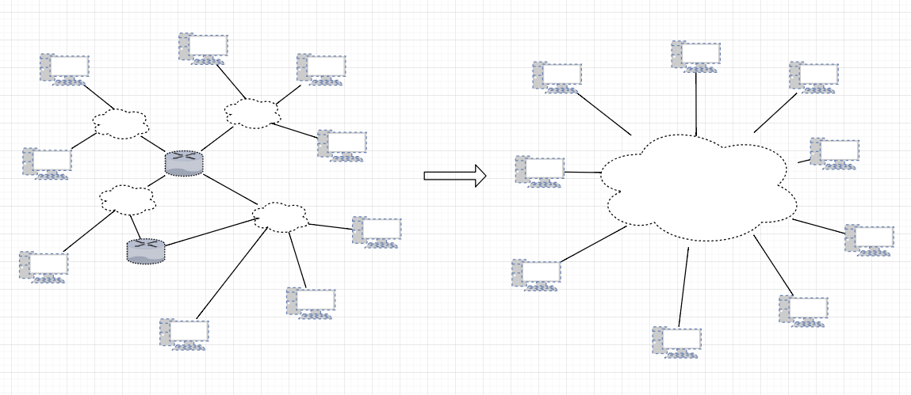
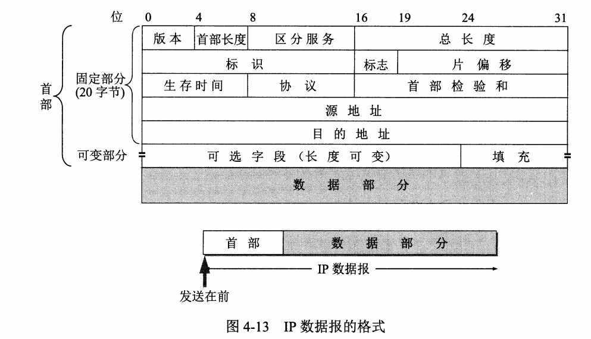
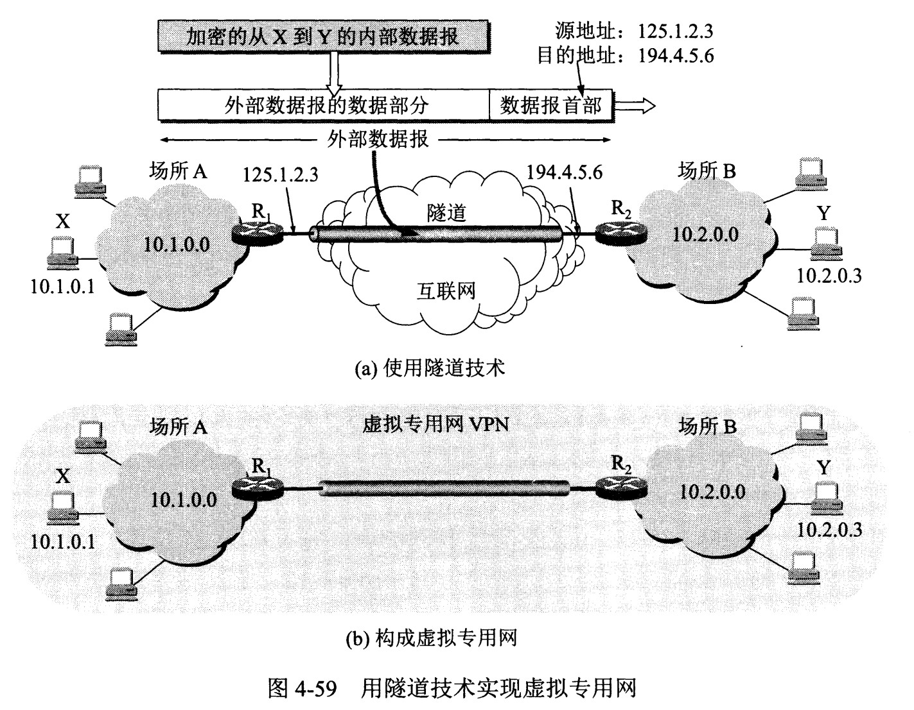

# 概述

为了实现互联网上主机间的通信，使用 IP 协议把异构的（如以太网和无线网）一个个网络连接起来，使得连接后，在网络层多个网络变成了一个**“统一的网络”**。它为上层提供无状态（如不清楚通信对方接收到的包是哪些）、无连接（IP 层通信过程中每次都需要指定 IP 地址）、不可靠（传输过程中发现包错误，直接丢弃）的服务。

  
 
网络层包含多个协议，与 IP 协议配套使用的还有三个协议：

- 地址解析协议 ARP（Address Resolution Protocol）
- 网际控制报文协议 ICMP（Internet Control Message Protocol）
- 网际组管理协议 IGMP（Internet Group Management Protocol）

# IP 数据报格式

  
 
-  **版本**  :  IP 协议的版本。

-  **首部长度**  : 占 4 位，因此最大值为 15，单位是4个字节。因为首部固定长度为 20 字节，因此该值最小为 5。如果可选字段的长度不是 4 字节的整数倍，就用尾部的填充部分补齐。

-  **区分服务（服务类型，Type Of Service）**  

-  **总长度**  : 包括首部长度和数据部分长度。

-  **生存时间**  ：TTL*(Time To Live)*，它的存在是为了防止无法交付的分组在互联网中不断兜圈子，浪费网络资源。以路由器跳数为单位，每到达一个路由器就先把TTL减1，当 TTL 为 0 时就丢弃该分组。

-  **协议** ：指出携带的数据应该上交给哪个协议进行处理，例如 ICMP、TCP、UDP 等。

-  **首部检验和** ：用来确定首部在传输过程中是否出错；因为分组每经过一个路由器，都要检验，因此只检验首部可以减少计算的工作量。

-  **标识**  : 在分组长度过长从而发生分片的情况下，用于标记某个分片属于那个分组，相同分组的不同分片具有相同的标识符。

-  **片偏移**  : 用于发生分片的情况。说明“分片的数据部分的第一个数据”在“原分组数据部分”的位置，单位为 8 字节。

  
 
# IP 地址编址方式

IP 地址的编址方式经历了三个历史阶段：

- 分类
- 子网划分
- 无分类

## 分类

由两部分组成，网络号和主机号，其中不同分类具有不同的网络号长度，并且是固定的。

IP 地址 ::= {< 网络号 >, < 主机号 >}

  
 
- A类地址最高位为0

## 子网划分

通过在主机号字段中拿一部分作为子网号，把两级 IP 地址划分为三级 IP 地址。

IP 地址 ::= {< 网络号 >, < 子网号 >, < 主机号 >}

要使用子网，必须配置子网掩码。一个 B 类地址的默认子网掩码为 255.255.0.0，如果 B 类地址的子网占两个比特，那么子网掩码为 11111111 11111111 11000000 00000000，也就是 255.255.192.0。

注意，外部网络看不到子网的存在。

## 无分类

无分类编址 CIDR 消除了传统 A 类、B 类和 C 类地址以及划分子网的概念，使用网络前缀和主机号来对 IP 地址进行编码，网络前缀的长度可以根据需要变化。

IP 地址 ::= {< 网络前缀号 >, < 主机号 >}

CIDR 的记法上采用在 IP 地址后面加上网络前缀长度的方法，例如 128.14.35.7/20 表示前 20 位为网络前缀。

CIDR 的地址掩码可以继续称为子网掩码。

一个 CIDR 地址块中有很多地址，一个 CIDR 表示的网络就可以表示原来的很多个网络，并且在路由表中只需要一个路由就可以代替原来的多个路由，减少了路由表项的数量。把这种通过使用网络前缀来减少路由表项的方式称为路由聚合，也称为  **构成超网** 。

在路由表中的项目由“网络前缀”和“下一跳地址”组成，在查找时可能会得到不止一个匹配结果，应当采用最长前缀匹配来确定应该匹配哪一个。

## 专用地址

由于 IP 地址的紧缺，一个机构能申请到的 **互联网**IP 地址数往往远小于本机构所拥有的主机数，但是一个机构并不需要把所有的主机接入到外部的互联网中，但是每个计算机得有IP地址，所以得有只在机构内部有效的 IP 地址(专用地址)。

专用地址有三块：

- 10.0.0.0 \~ 10.255.255.255
- 172.16.0.0 \~ 172.31.255.255
- 192.168.0.0 \~ 192.168.255.255

# 分片

当要传输的数据大小超过 MTU 时，会被拆成多个 IP 分片。除最后一个分片外，所有分片的 IP 头部会设置 MF（More Fragment）标志，且每个头部会设置片偏移值。

# 路由器分组转发流程

提取目标 IP 地址。依次看有没有 IP 直接对应的、目标网络的、默认的路由项。

`参考`

- 当确定了下一跳的IP地址（既可能就是目标主机的地址也可能是下一跳路由器的地址）后？接下来路由器的下一个协议层要做什么呢?

# 地址解析协议 ARP

在通信过程中，IP 数据报的源地址和目的地址始终不变，而帧的MAC 地址随着所在的网络改变而改变。

  
 
ARP 实现由 IP 地址得到 MAC 地址。

  
 
每个主机都有一个 ARP 高速缓存，里面有本局域网上的各主机和路由器的 IP 地址到对应的MAC 地址的映射表。

如果主机 A 知道主机 B 的 IP 地址，但是缓存中没有相应MAC 地址。此时 A 便向所在网络广播 ARP 请求，请求中包含目标机器的网络地址。只有目标机器会响应此请求，发送自己的物理地址。

  
 
# 网际控制报文协议 ICMP

为了更有效地转发 IP 数据报。如图，它封装在 IP 数据报中，但不是高层协议。不向上层协议提供服务。ICMP 协议头部至少8字节。

  
 
- **类型**
  ICMP 报文分为差错报告报文和询问报文。
  
   
  
 

- **代码**
  用来进一步细分操作。如：代码0表示网络重定向、代码1表示主机重定向。

- **检验和**
  使用循环冗余检验。

## Ping

Ping 是 ICMP 的一个重要应用，主要用来测试两台主机间的连通性。

Ping 的原理是通过向目的主机发送Echo 请求报文，目的主机收到之后会发送 Echo 回答报文。Ping 会根据时间和成功响应的次数估算往返时间以及丢包率。

## Traceroute

Traceroute 是 ICMP 的另一个应用，用来跟踪一个分组从源点到终点的路径。

Traceroute 发送的 IP 数据报封装的是无法交付的用户数据报。

- 源主机向目的主机发送一连串的 IP 数据报。
- 第一个数据报 P1 的生存时间 TTL 设置为 1，当 P1 到达路径上的第一个路由器 R1 时，R1 收下它并把 TTL 减 1，此时 TTL 等于 0，R1 就把 P1 丢弃，并向源主机发送一个 ICMP **时间超过差错报告报文**；
- 源主机接着发送第二个数据报 P2，并把 TTL 设置为 2。P2 先到达 R1，R1 收下后把 TTL 减 1 再转发给 R2，R2 收下后也把 TTL 减 1，此时 TTL 等于 0，R2 丢弃 P2，并向源主机发送一个 ICMP 时间超过差错报文。
- 不断执行这样的步骤，直到最后一个数据报到达目的主机，主机不转发数据报，也不把 TTL 值减 1。但是因为数据报封装的是无法交付的 UDP，因此目的主机要向源主机发送 ICMP **终点不可达**差错报告报文。
- 之后源主机知道了到达目的主机所经过的路由器 IP 地址以及到达每个路由器的往返时间。

`参考`

- 无法交付的用户数据包是怎么样的?

# 虚拟专用网 VPN

虚拟专用网络，其中，专用指专供机构内部使用的网络；虚拟表明：由于这个专用网络在实现上借助了公用的互联网，是“虚拟的专用”。

VPN 使用互联网作为本机构各专用网之间进行通信的载体。

下图中，场所 A 和 B 都有自己专用的网络，它们之间通信经过互联网。如果场所 A 的主机 X 要和另一个场所 B 的主机 Y 通信，IP 数据报的源地址是 10.1.0.1，目的地址是 10.2.0.3。该IP数据报被发送到与互联网相连的路由器 R1，R1 对这个IP数据包加密，将其作为一个新的分组的数据部分，并加上新的首部，封装成一个新的分组；其中源地址变成了路由器 R1 的全球地址 125.1.2.3，目的地址是路由器 R2 的全球地址 194.4.5.6。路由器 R2 收到新的IP数据报后将数据部分解密，恢复原来的数据报，此时目的地址为 10.2.0.3，就交付给 Y。

  
 
# 网络地址转换 NAT

专用网内部的主机使用本地 IP 地址又想和互联网上的主机通信时，可以使用 NAT 来将本地 IP 转换为全球 IP。

在以前，NAT 将本地 IP 和全球 IP 一一对应，这种方式下拥有 n 个全球 IP 地址最多只可以**同时**有 n 台内部主机接入互联网。为了更有效地利用全球 IP 地址，现在常用的 NAT 转换把运输层的端口号也用上了，使得多个内部主机**同时**共用一个全球 IP 地址；使用端口号的 NAT 也叫做网络地址与端口转换 NAPT。

  
 