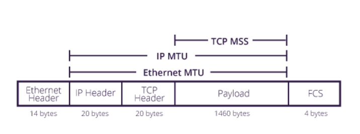

# 概述

- 用户数据报协议 UDP（User Datagram Protocol）面向报文。

- 传输控制协议 TCP（Transmission Control Protocol）面向字节流。=>要实现可靠性 => 对多实现困难

# UDP 首部格式

  
 
首部字段只有 8 个字节，包括源端口、目的端口、长度、检验和。12 字节的伪首部是为了计算检验和临时添加的。

# TCP 首部格式

  
 
-  **序号**  ：用于对字节流进行编号，例如序号为 301，表示数据部分第一个字节的编号为 301，如果携带的数据长度为 100 字节，那么下一个报文**段**的序号应为 401。
-  **确认号**  ：期望收到的下一个报文段的序号。例如 B 正确收到 A 发送来的一个报文段，序号为 501，携带的数据长度为 200 字节，因此 B 期望下一个报文段的序号为 701，B 发送给 A 的确认报文段中确认号就为 701。
-  **数据偏移**  ：指的是数据部分距离报文段起始处的偏移量，实际上指的是首部的长度。
-  **确认 ACK**  ：当 ACK=1 时确认号字段有效，否则无效。TCP 规定，在连接建立后所有传送的报文段都必须把 ACK 置 1。
-  **同步 SYN**  ：在连接建立过程中用来同步序号。当 SYN=1，ACK=0 时表示这是一个连接请求报文段。若对方同意建立连接，则响应报文中 SYN=1，ACK=1。
-  **终止 FIN**  ：用来释放一个连接。当 FIN=1 时，表示此报文段的发送方的数据已发送完毕，并要求释放连接。
-  **窗口**  ：窗口值作为接收方让发送方设置其发送窗口的依据。之所以要有这个限制，是因为接收方的数据缓存空间是有限的。

`参考`

- (TCP) MSS，Max Segment Size，指数据部分的大小

# TCP 可靠传输

超时重传。发出一个包等多久才能判断超时了？往返一次。

发送再到接收到确认所经过的时间称为往返时间 RTT：

  
其中，0 ≤ a ＜ 1，RTTs 随着 a 的增加更容易受到 RTT 的影响。

超时时间 RTO 应该略大于 RTTs，TCP 使用的超时时间计算如下：

  
其中 RTTd 为偏差的加权平均值。

# TCP 的三次握手

  
 
当服务端收到 SYN 后，会把连接加入 syns queue（大小为 backlog)，当服务端接受了连接，会加入 accept queue（大小为 somaxconn 和 backlog 的较小值）。

- 如果客户端发出了大量的 SYN，没有第三次握手，会发生什么。

# TCP 粘包

如果每发送一次包含的是一个操作的信息，接收端读到的也是一次的数据，然后按一个操作解析，就没有问题。但是，**如果读的数据是几次发送“拼合”起来的，我们这时还把它当一个操作来解析就会出错**，这就是粘包。

# TCP 确认机制

TCP 的粘包机制，

交流少量数据，立即确认。大量数据，直到要满了才确认。为什么不一直确认？怎样让连续的“少量数据”不产生大量确认（Nagle 算法）。

`参考`

- 服务器怎么判断客户端要接受满了？

# TCP 的四次挥手

  
 
- A 发送连接释放请求，FIN=1。
- B 收到之后发出确认；此时 TCP 属于“半关闭状态”，B 能向 A 发送数据但是 A 不能向 B 发送数据。
- 当 B 不再需要连接时，发送连接释放报文，FIN=1。
- A 收到后发出确认，进入 TIME-WAIT 状态，等待 2 MSL*(最大报文存活时间)*后释放连接。
- B 收到 A 的确认后释放连接。

连接的两端一端 close 后，会发出 FIN 包，等待对面的 FIN， 但是**对面需要很长时间才 FIN**，所以两边长时间处于 CLOSE_WAIT 和 FIN_WAIT_2 状态。对面接下来如果要发数据会发一个 PSH 标志的包（FIN 只能表示对面数据发送完了。PSH 表示接收端应该立即从缓冲区读走数据，以接收后续数据），如果关闭的那边真是读写**都**关了就会回一个 RST 包（要求对方重新建立连接）。也可以通过设置 linger，让一 close 就发 RST 包，两边都进入 CLOSED状态。

`参考`

- 为什么有 CLOSE-WAIT ?
让服务器把数据发完

- 为什么服务器还有 LAST-ACK ？
确保客户端收到关闭确认

- 为什么有 TIME_WAIT ?
  客户端接收到服务器端的 FIN 报文后进入此状态，等待 2MSL*(Max Segment Life)*。这么做有两个理由：

  - 确保客户端的确认能够到达服务器。如果服务器端没有接收到确认报文就会重发 FIN 报文，TIME_WAIT 状态能够确认。

  - 等待一段时间是为了使网络上旧连接的数据都消失，避免新连接接收到旧连接的数据。

    在 Linux 中，不能建立重复“四元组”的连接。所以一个处于 TIME_WAIT 的 TCP 连接可以占用端口直到可能接收完所有数据。如果没有 TIME_WAIT，新连接可能会收到旧连接的数据。另外，处于 TIME_WAIT 状态的端口默认将不能绑定（bind），除非设置了 SO_REUSEADDR。

- 半关闭：这会导致进入 FIN-WAIT-2 状态的关闭端接收到数据的时候反应不一样。半打开：连接的两端 "一端关闭了，另一端没有仍处于完全打开状态（没有收到 FIN）”。

# TCP 滑动窗口

窗口是一段用来**暂时存放字节流**的空间。

发送方和接收方各有一个窗口。窗口大小是“变化的”，接收方通过 TCP 报文段中的窗口字段告诉发送方自己的窗口大小，发送方根据这个值设置自己的窗口大小。

在发送窗口内的字节允许被发送，在接收窗口内的字节允许被接收。如果发送窗口左部的字节已经发送并收到了确认，那么就将发送窗口向右滑动一定距离，直到左部不是已发送且已确认的状态；接收窗口的滑动类似，接收窗口左部字节已收到并发送了确认，就向右滑动接收窗口。

接收窗口只会对窗口内最后一个**按序到达**的字节进行确认，例如接收窗口已经收到的字节为 {30, 31, 34, 35}，其中 {30, 31} 按序到达，而 {34, 35} 就不是，因此只对字节 31 进行确认。发送方得到一个字节的确认之后，就知道这个字节之前的所有字节都已经被接收。

  
 
# TCP 流量控制

要符合接收方的处理能力。

接收方发送的确认报文中的窗口字段可以用来控制发送方窗口大小，将窗口字段设置为 0，则发送方不能发送数据。

# TCP 拥塞控制

发现网络阻塞（怎么发现是阻塞？）时，发包速度应该减慢。

目标就一个：在尽可能多发的情况下，试探阻塞的边缘。

需要一个状态量，设置当前允许发的包的数量，它叫拥塞窗口。

刚开始一个，没问题，翻倍、翻倍、翻倍...，突然拥塞了，回到一个。如果运气好，一直翻倍都没问题，但是到了一个比较大的量时（threshold），很明显，快要阻塞了，这时候，每次收到确认，只加一个。如果发送过程中，发生了包丢失，可以直接快重传、快恢复。

  
 

  
 
## 慢开始与拥塞避免

发送的最初执行慢开始，即令 cwnd = 1，发送方只能发送 1 个报文段；一收到确认，就将 cwnd 加倍，因此之后发送方能够发送的报文段数量为：2、4、8 ...

由于每个轮次都将 cwnd 加倍，这样会让 cwnd 增长速度非常快，网络拥塞的可能性也就更高。设置一个慢开始门限 ssthresh，当 cwnd >= ssthresh 时，就进入拥塞避免，收到确认只将 cwnd 加 1。

如果出现了**超时**，则令 ssthresh = cwnd / 2，然后重新执行慢开始。

## 快重传与快恢复

在接收方，**每次**接收到报文段都对最后一个已收到的**有序**报文段进行确认。

在发送方，如果收到三个重复确认，发生这种情况，是因为丢失了个别报文段，而**不是网络拥塞**。此时执行快重传，即立即重传丢失的报文段。

先令 ssthresh = cwnd / 2 ，然后令 cwnd = ssthresh ，此时直接进入拥塞避免。

  
 