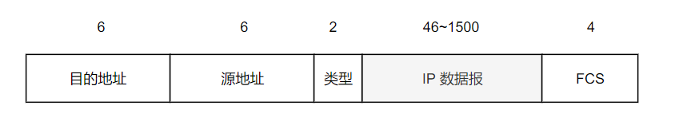

# 三个问题

- **封装成帧**
将网络层传下来的分组添加首部和尾部，用于标记帧的开始和结束。

  
 
- **透明传输**
透明表示一个实际存在的事物看起来好像不存在一样。
帧使用首部和尾部进行定界，如果帧的数据部分含有和首部尾部相同的内容，那么帧的开始和结束位置就会被错误的判定。所以在帧的数据部分中的首部、尾部、转义符前面插入转义符，接收时又去掉。用户察觉不到转义字符的存在。

  
 
- **差错检测**
  **一个帧**经过传输媒体传输后，信号可能会因为干扰，发生变化。数据链路层需要能够发现一个帧是否出错，所以借助循环冗余检验（CRC）来检查出一些比特差错情况。

`参考`

- CRC 既然不能检查出所有错误情况，为什么还使用它?

# MAC 地址

MAC 地址是链路层地址，长度为 6 字节，用于唯一标识网络适配器（网卡）。一台主机拥有多少个网络适配器就有多少个 MAC 地址。

# 局域网

局域网是一种典型的广播信道。主要有以太网、令牌环网、FDDI 和 ATM 等，目前以太网是主流。

可以按照网络拓扑结构对局域网进行分类：

  
 
# 以太网

以太网是一种星型拓扑局域网。

早期使用集线器作中间节点进行连接。集线器是物理层设备；当一个比特从一个接口进入集线器后，集线器将其信号强度放大并复制多个，然后转发到剩下的所有接口。

如果集线器同时收到两个来自不同接口的帧，那么就发生了碰撞。

目前以太网使用交换机替代了集线器。交换机是一种链路层设备，它不会发生碰撞，因为它能根据目标的 MAC 地址进行定向转发。

以太网帧格式：

-  **类型** ：标记上层使用的协议；
-  **数据** ：长度在 46-1500 之间，如果太小则需要填充；
-  **FCS** ：帧检验序列，使用的是 CRC 检验方法；

  
 
`参考`

- 交换机替代集线器后，以太网还是广播信道吗?
- MTU: Max Transmit Unit. 帧最多能携带多少上层协议的数据。