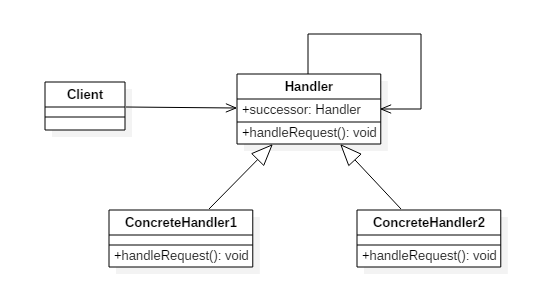
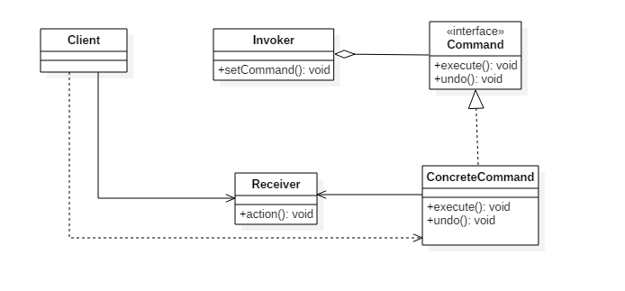
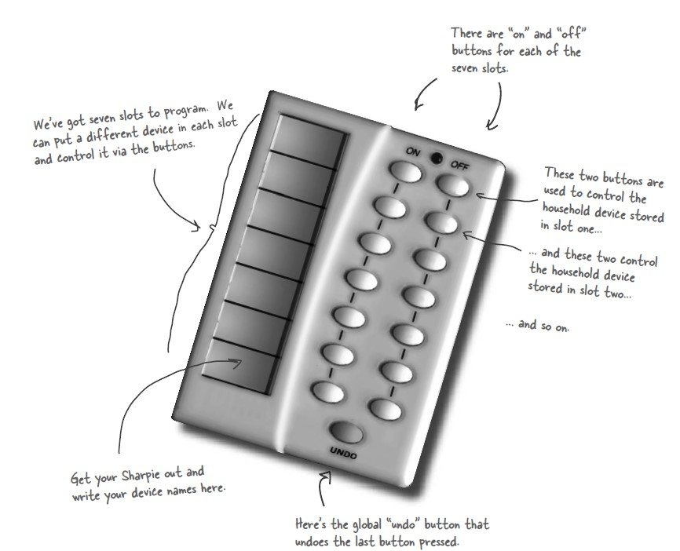
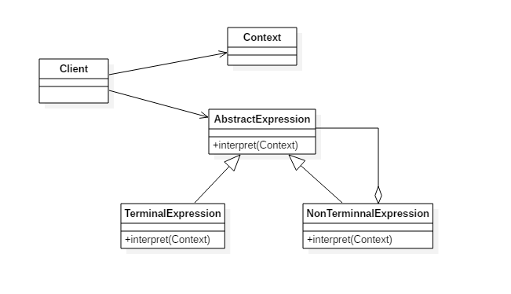
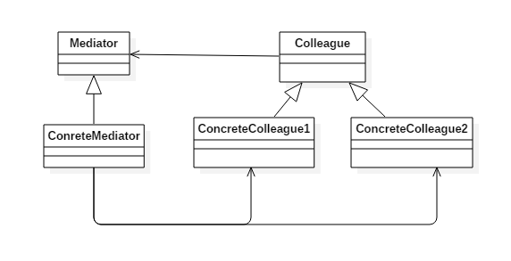
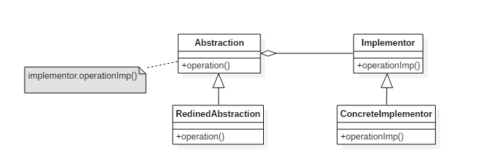
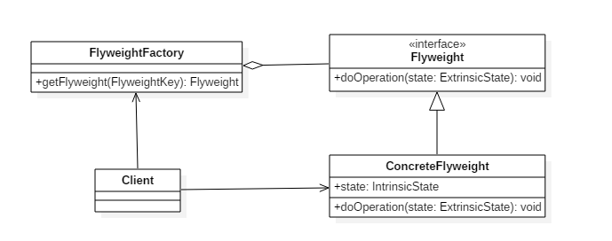
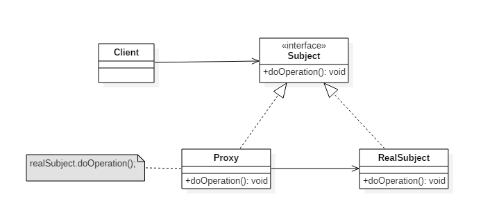

# 评价代码

- 可维护性（maintainability）

  对原来的代码进行修改或添加新功能是否简单。要求分层清晰，模块化（高内聚低耦合），设计模式

- 可读性（readability）

  > Any fool can write code that a computer can understand. Good programmers write code that humans can understand.
  >
  > Martin Fowler

  要求符命名达意、**注释详尽**、函数长短合适、**满足可维护性**

# 设计原则

-  开闭原则
  对扩展开发，对修改关闭。即要增添新功能的时候，避免修改原来的类，而是扩展已经有的类。
- 单一职责原则
  分层，模块化，方法
- 迪米特法则（最小知识原则）
  一个对象对其他对象应该了解的最少。模块暴露的公共方法应该比较少、一个方法内部除了使用传入的对象外，不要再使用其他对象。
- 接口隔离原则
  模块之间依赖的是最小接口。一个模块只给其他模块暴露一小部分接口。
- 依赖倒转原则
  依赖抽象而不是实现。
- 里氏代换原则
  所有引用基类的地方，都能透明引用其子类。子类重写方法的权限、返回值


# 创建

## 单例（Singleton）

- 饿汉式

- 懒汉式 (加 synchronized) 

- DCL

  ```java
  public class Singleton {
      private volatile static Singleton uniqueInstance;
  
      private Singleton() {
      }
  
      public static Singleton getUniqueInstance() {
          if (uniqueInstance == null) {
              synchronized (Singleton.class) {
                  if (uniqueInstance == null) {
                      uniqueInstance = new Singleton();
                  }
              }
          }
          return uniqueInstance;
      }
  }
  ```

- 枚举类

  ```java
  public enum Singleton{
      INSTANCE;
  }
  ```

- 内部静态类（使用时创建）

  ```java
  public class Singleton{
      private Singleton(){}
      //private
      private static class InstanceHolder{
          //private final
          private static final Singleton singleton = new Singleton();
      }
      public static Singleton getInstance(){
          return InstanceHolder.singleton;
      }
  }
  ```


### Examples

- Logger Classes
- Configuration Classes
- Accesing resources in shared mode
- Factories implemented as Singletons

### JDK

- [java.lang.Runtime#getRuntime()](http://docs.oracle.com/javase/8/docs/api/java/lang/Runtime.html#getRuntime%28%29)
- [java.awt.Desktop#getDesktop()](http://docs.oracle.com/javase/8/docs/api/java/awt/Desktop.html#getDesktop--)
- [java.lang.System#getSecurityManager()](http://docs.oracle.com/javase/8/docs/api/java/lang/System.html#getSecurityManager--)

## 简单工厂

统一创建类

<div align="center">  </div><br>
```java
public interface Product {
}
```

```java
public class ConcreteProduct implements Product {
}
```

```java
public class ConcreteProduct1 implements Product {
}
```

```java
public class ConcreteProduct2 implements Product {
}
```

不用

```java
public class Client {

    public static void main(String[] args) {
        int type = 1;
        Product product;
        if (type == 1) {
            product = new ConcreteProduct1();
        } else if (type == 2) {
            product = new ConcreteProduct2();
        } else {
            product = new ConcreteProduct();
        }
        // do something with the product
    }
}
```

用

```java
public class SimpleFactory {

    public Product createProduct(int type) {
        if (type == 1) {
            return new ConcreteProduct1();
        } else if (type == 2) {
            return new ConcreteProduct2();
        }
        return new ConcreteProduct();
    }
}
```

```java
public class Client {

    public static void main(String[] args) {
        SimpleFactory simpleFactory = new SimpleFactory();
        Product product = simpleFactory.createProduct(1);
        // do something with the product
    }
}
```

## 抽象工厂

多个工厂

<div align="center">  </div><br>
```java
public class AbstractProductA {
}
```

```java
public class AbstractProductB {
}
```

```java
public class ProductA1 extends AbstractProductA {
}
```

```java
public class ProductA2 extends AbstractProductA {
}
```

```java
public class ProductB1 extends AbstractProductB {
}
```

```java
public class ProductB2 extends AbstractProductB {
}
```

```java
public abstract class AbstractFactory {
    abstract AbstractProductA createProductA();
    abstract AbstractProductB createProductB();
}
```

```java
public class ConcreteFactory1 extends AbstractFactory {
    AbstractProductA createProductA() {
        return new ProductA1();
    }

    AbstractProductB createProductB() {
        return new ProductB1();
    }
}
```

```java
public class ConcreteFactory2 extends AbstractFactory {
    AbstractProductA createProductA() {
        return new ProductA2();
    }

    AbstractProductB createProductB() {
        return new ProductB2();
    }
}
```

```java
public class Client {
    public static void main(String[] args) {
        AbstractFactory abstractFactory = new ConcreteFactory1();
        AbstractProductA productA = abstractFactory.createProductA();
        AbstractProductB productB = abstractFactory.createProductB();
        // do something with productA and productB
    }
}
```

### JDK

- [javax.xml.parsers.DocumentBuilderFactory](http://docs.oracle.com/javase/8/docs/api/javax/xml/parsers/DocumentBuilderFactory.html)
- [javax.xml.transform.TransformerFactory](http://docs.oracle.com/javase/8/docs/api/javax/xml/transform/TransformerFactory.html#newInstance--)
- [javax.xml.xpath.XPathFactory](http://docs.oracle.com/javase/8/docs/api/javax/xml/xpath/XPathFactory.html#newInstance--)

## 生成器

有 build 过程，在最后一步前一直对目标调用各种方法来构造。如果返回是本身，则连续调用。

<div align="center">  </div><br>
```java
public class AbstractStringBuilder {
    protected char[] value;

    protected int count;

    public AbstractStringBuilder(int capacity) {
        count = 0;
        value = new char[capacity];
    }

    public AbstractStringBuilder append(char c) {
        ensureCapacityInternal(count + 1);
        value[count++] = c;
        return this;
    }

    private void ensureCapacityInternal(int minimumCapacity) {
        // overflow-conscious code
        if (minimumCapacity - value.length > 0)
            expandCapacity(minimumCapacity);
    }

    void expandCapacity(int minimumCapacity) {
        int newCapacity = value.length * 2 + 2;
        if (newCapacity - minimumCapacity < 0)
            newCapacity = minimumCapacity;
        if (newCapacity < 0) {
            if (minimumCapacity < 0) // overflow
                throw new OutOfMemoryError();
            newCapacity = Integer.MAX_VALUE;
        }
        value = Arrays.copyOf(value, newCapacity);
    }
}
```

```java
public class StringBuilder extends AbstractStringBuilder {
    public StringBuilder() {
        super(16);
    }

    @Override
    public String toString() {
        // Create a copy, don't share the array
        return new String(value, 0, count);
    }
}
```

```java
public class Client {
    public static void main(String[] args) {
        StringBuilder sb = new StringBuilder();
        final int count = 26;
        for (int i = 0; i < count; i++) {
            sb.append((char) ('a' + i));
        }
        System.out.println(sb.toString());
    }p
}
```

```html
abcdefghijklmnopqrstuvwxyz
```

### JDK

- [java.lang.StringBuilder](http://docs.oracle.com/javase/8/docs/api/java/lang/StringBuilder.html)
- [java.nio.ByteBuffer](http://docs.oracle.com/javase/8/docs/api/java/nio/ByteBuffer.html#put-byte-)
- [java.lang.StringBuffer](http://docs.oracle.com/javase/8/docs/api/java/lang/StringBuffer.html#append-boolean-)
- [java.lang.Appendable](http://docs.oracle.com/javase/8/docs/api/java/lang/Appendable.html)
- [Apache Camel builders](https://github.com/apache/camel/tree/0e195428ee04531be27a0b659005e3aa8d159d23/camel-core/src/main/java/org/apache/camel/builder)

## 原型模式

clone()

<div align="center">  </div><br>
```java
public abstract class Prototype {
    abstract Prototype myClone();
}
```

```java
public class ConcretePrototype extends Prototype {

    private String filed;

    public ConcretePrototype(String filed) {
        this.filed = filed;
    }

    @Override
    Prototype myClone() {
        return new ConcretePrototype(filed);
    }

    @Override
    public String toString() {
        return filed;
    }
}
```

```java
public class Client {
    public static void main(String[] args) {
        Prototype prototype = new ConcretePrototype("abc");
        Prototype clone = prototype.myClone();
        System.out.println(clone.toString());
    }
}
```

```html
abc
```

### JDK

- [java.lang.Object#clone()](http://docs.oracle.com/javase/8/docs/api/java/lang/Object.html#clone%28%29)

# 行为

## 责任链

和双亲委派相反

- Handler：定义处理请求的接口，并且实现后继链（successor）

<div align="center">  </div><br>
```java
public abstract class Handler {

    protected Handler successor;


    public Handler(Handler successor) {
        this.successor = successor;
    }


    protected abstract void handleRequest(Request request);
}
```

```java
public class ConcreteHandler1 extends Handler {

    public ConcreteHandler1(Handler successor) {
        super(successor);
    }


    @Override
    protected void handleRequest(Request request) {
        if (request.getType() == RequestType.TYPE1) {
            System.out.println(request.getName() + " is handle by ConcreteHandler1");
            return;
        }
        if (successor != null) {
            successor.handleRequest(request);
        }
    }
}
```

```java
public class ConcreteHandler2 extends Handler {

    public ConcreteHandler2(Handler successor) {
        super(successor);
    }


    @Override
    protected void handleRequest(Request request) {
        if (request.getType() == RequestType.TYPE2) {
            System.out.println(request.getName() + " is handle by ConcreteHandler2");
            return;
        }
        if (successor != null) {
            successor.handleRequest(request);
        }
    }
}
```

```java
public class Request {

    private RequestType type;
    private String name;


    public Request(RequestType type, String name) {
        this.type = type;
        this.name = name;
    }


    public RequestType getType() {
        return type;
    }


    public String getName() {
        return name;
    }
}

```

```java
public enum RequestType {
    TYPE1, TYPE2
}
```

```java
public class Client {

    public static void main(String[] args) {

        Handler handler1 = new ConcreteHandler1(null);
        Handler handler2 = new ConcreteHandler2(handler1);

        Request request1 = new Request(RequestType.TYPE1, "request1");
        handler2.handleRequest(request1);

        Request request2 = new Request(RequestType.TYPE2, "request2");
        handler2.handleRequest(request2);
    }
}
```

```html
request1 is handle by ConcreteHandler1
request2 is handle by ConcreteHandler2
```

### JDK

- [java.util.logging.Logger#log()](http://docs.oracle.com/javase/8/docs/api/java/util/logging/Logger.html#log%28java.util.logging.Level,%20java.lang.String%29)
- [Apache Commons Chain](https://commons.apache.org/proper/commons-chain/index.html)
- [javax.servlet.Filter#doFilter()](http://docs.oracle.com/javaee/7/api/javax/servlet/Filter.html#doFilter-javax.servlet.ServletRequest-javax.servlet.ServletResponse-javax.servlet.FilterChain-)

## 命令

<div align="center">  </div><br>
设计一个遥控器，可以控制电灯开关。

<div align="center">  </div><br>
```java
//important
public interface Command {
    void execute();
}
```

```java
public class LightOnCommand implements Command {
    Light light;

    public LightOnCommand(Light light) {
        this.light = light;
    }

    @Override
    public void execute() {
        light.on();
    }
}
```

```java
public class LightOffCommand implements Command {
    Light light;

    public LightOffCommand(Light light) {
        this.light = light;
    }

    @Override
    public void execute() {
        light.off();
    }
}
```

```java
public class Light {

    public void on() {
        System.out.println("Light is on!");
    }

    public void off() {
        System.out.println("Light is off!");
    }
}
```

```java
/**
 * 遥控器
 */
public class Invoker {
    private Command[] onCommands;
    private Command[] offCommands;
    private final int slotNum = 7;

    public Invoker() {
        this.onCommands = new Command[slotNum];
        this.offCommands = new Command[slotNum];
    }

    public void setOnCommand(Command command, int slot) {
        onCommands[slot] = command;
    }

    public void setOffCommand(Command command, int slot) {
        offCommands[slot] = command;
    }

    public void onButtonWasPushed(int slot) {
        onCommands[slot].execute();
    }

    public void offButtonWasPushed(int slot) {
        offCommands[slot].execute();
    }
}
```

```java
public class Client {
    public static void main(String[] args) {
        Invoker invoker = new Invoker();
        Light light = new Light();
        Command lightOnCommand = new LightOnCommand(light);
        Command lightOffCommand = new LightOffCommand(light);
        invoker.setOnCommand(lightOnCommand, 0);
        invoker.setOffCommand(lightOffCommand, 0);
        invoker.onButtonWasPushed(0);
        invoker.offButtonWasPushed(0);
    }
}
```

### JDK

- [java.lang.Runnable](http://docs.oracle.com/javase/8/docs/api/java/lang/Runnable.html)

  https://www.cnblogs.com/longfurcat/p/9864175.html

- [Netflix Hystrix](https://github.com/Netflix/Hystrix/wiki)

- [javax.swing.Action](http://docs.oracle.com/javase/8/docs/api/javax/swing/Action.html)

## 解释器

为语言创建解释器，通常由语言的语法和语法分析来定义。

<div align="center">  </div><br>
以下是一个规则检验器实现，具有 and 和 or 规则，通过规则可以构建一颗解析树，用来检验一个文本是否满足解析树定义的规则。

例如一颗解析树为 D And (A Or (B C))，文本 "D A" 满足该解析树定义的规则。

这里的 Context 指的是 String。

```java
public abstract class Expression {
    public abstract boolean interpret(String str);
}
```

```java
public class TerminalExpression extends Expression {

    private String literal = null;

    public TerminalExpression(String str) {
        literal = str;
    }

    public boolean interpret(String str) {
        StringTokenizer st = new StringTokenizer(str);
        while (st.hasMoreTokens()) {
            String test = st.nextToken();
            if (test.equals(literal)) {
                return true;
            }
        }
        return false;
    }
}
```

```java
public class AndExpression extends Expression {

    private Expression expression1 = null;
    private Expression expression2 = null;

    public AndExpression(Expression expression1, Expression expression2) {
        this.expression1 = expression1;
        this.expression2 = expression2;
    }

    public boolean interpret(String str) {
        return expression1.interpret(str) && expression2.interpret(str);
    }
}
```

```java
public class OrExpression extends Expression {
    private Expression expression1 = null;
    private Expression expression2 = null;

    public OrExpression(Expression expression1, Expression expression2) {
        this.expression1 = expression1;
        this.expression2 = expression2;
    }

    public boolean interpret(String str) {
        return expression1.interpret(str) || expression2.interpret(str);
    }
}
```

```java
public class Client {

    /**
     * 构建解析树
     */
    public static Expression buildInterpreterTree() {
        // Literal
        Expression terminal1 = new TerminalExpression("A");
        Expression terminal2 = new TerminalExpression("B");
        Expression terminal3 = new TerminalExpression("C");
        Expression terminal4 = new TerminalExpression("D");
        // B C
        Expression alternation1 = new OrExpression(terminal2, terminal3);
        // A Or (B C)
        Expression alternation2 = new OrExpression(terminal1, alternation1);
        // D And (A Or (B C))
        return new AndExpression(terminal4, alternation2);
    }

    public static void main(String[] args) {
        Expression define = buildInterpreterTree();
        String context1 = "D A";
        String context2 = "A B";
        System.out.println(define.interpret(context1));
        System.out.println(define.interpret(context2));
    }
}
```

```html
true
false
```

### JDK

- [java.util.Pattern](http://docs.oracle.com/javase/8/docs/api/java/util/regex/Pattern.html)
- [java.text.Normalizer](http://docs.oracle.com/javase/8/docs/api/java/text/Normalizer.html)
- All subclasses of [java.text.Format](http://docs.oracle.com/javase/8/docs/api/java/text/Format.html)
- [javax.el.ELResolver](http://docs.oracle.com/javaee/7/api/javax/el/ELResolver.html)

## 迭代器

同一访问接口，不暴露实现

<div align="center">  </div><br>
```java
public interface Aggregate {
    Iterator createIterator();
}
```

```java
public class ConcreteAggregate implements Aggregate {

    private Integer[] items;

    public ConcreteAggregate() {
        items = new Integer[10];
        for (int i = 0; i < items.length; i++) {
            items[i] = i;
        }
    }

    @Override
    public Iterator createIterator() {
        return new ConcreteIterator<Integer>(items);
    }
}
```

```java
public interface Iterator<Item> {

    Item next();

    boolean hasNext();
}
```

```java
public class ConcreteIterator<Item> implements Iterator {

    private Item[] items;
    private int position = 0;

    public ConcreteIterator(Item[] items) {
        this.items = items;
    }

    @Override
    public Object next() {
        return items[position++];
    }

    @Override
    public boolean hasNext() {
        return position < items.length;
    }
}
```

```java
public class Client {

    public static void main(String[] args) {
        Aggregate aggregate = new ConcreteAggregate();
        Iterator<Integer> iterator = aggregate.createIterator();
        while (iterator.hasNext()) {
            System.out.println(iterator.next());
        }
    }
}
```

### JDK

- [java.util.Iterator](http://docs.oracle.com/javase/8/docs/api/java/util/Iterator.html)
- [java.util.Enumeration](http://docs.oracle.com/javase/8/docs/api/java/util/Enumeration.html)

## 中介者

消息队列

<div align="center">  </div><br>
<div align="center">  </div><br>
使用中介者模式可以将复杂的依赖结构变成星形结构：

<div align="center">  </div><br>
```java
public abstract class Colleague {
    public abstract void onEvent(Mediator mediator);
}
```

```java
public class Alarm extends Colleague {

    @Override
    public void onEvent(Mediator mediator) {
        mediator.doEvent("alarm");
    }

    public void doAlarm() {
        System.out.println("doAlarm()");
    }
}
```

```java
public class CoffeePot extends Colleague {
    @Override
    public void onEvent(Mediator mediator) {
        mediator.doEvent("coffeePot");
    }

    public void doCoffeePot() {
        System.out.println("doCoffeePot()");
    }
}
```

```java
public class Calender extends Colleague {
    @Override
    public void onEvent(Mediator mediator) {
        mediator.doEvent("calender");
    }

    public void doCalender() {
        System.out.println("doCalender()");
    }
}
```

```java
public class Sprinkler extends Colleague {
    @Override
    public void onEvent(Mediator mediator) {
        mediator.doEvent("sprinkler");
    }

    public void doSprinkler() {
        System.out.println("doSprinkler()");
    }
}
```

```java
public abstract class Mediator {
    public abstract void doEvent(String eventType);
}
```

```java
public class ConcreteMediator extends Mediator {
    private Alarm alarm;
    private CoffeePot coffeePot;
    private Calender calender;
    private Sprinkler sprinkler;

    public ConcreteMediator(Alarm alarm, CoffeePot coffeePot, Calender calender, Sprinkler sprinkler) {
        this.alarm = alarm;
        this.coffeePot = coffeePot;
        this.calender = calender;
        this.sprinkler = sprinkler;
    }

    @Override
    public void doEvent(String eventType) {
        switch (eventType) {
            case "alarm":
                doAlarmEvent();
                break;
            case "coffeePot":
                doCoffeePotEvent();
                break;
            case "calender":
                doCalenderEvent();
                break;
            default:
                doSprinklerEvent();
        }
    }

    public void doAlarmEvent() {
        alarm.doAlarm();
        coffeePot.doCoffeePot();
        calender.doCalender();
        sprinkler.doSprinkler();
    }

    public void doCoffeePotEvent() {
        // ...
    }

    public void doCalenderEvent() {
        // ...
    }

    public void doSprinklerEvent() {
        // ...
    }
}
```

```java
public class Client {
    public static void main(String[] args) {
        Alarm alarm = new Alarm();
        CoffeePot coffeePot = new CoffeePot();
        Calender calender = new Calender();
        Sprinkler sprinkler = new Sprinkler();
        Mediator mediator = new ConcreteMediator(alarm, coffeePot, calender, sprinkler);
        // 闹钟事件到达，调用中介者就可以操作相关对象
        alarm.onEvent(mediator);
    }
}
```

```java
doAlarm()
doCoffeePot()
doCalender()
doSprinkler()
```

### JDK

- All scheduleXXX() methods of [java.util.Timer](http://docs.oracle.com/javase/8/docs/api/java/util/Timer.html)
- [java.util.concurrent.Executor#execute()](http://docs.oracle.com/javase/8/docs/api/java/util/concurrent/Executor.html#execute-java.lang.Runnable-)
- submit() and invokeXXX() methods of [java.util.concurrent.ExecutorService](http://docs.oracle.com/javase/8/docs/api/java/util/concurrent/ExecutorService.html)
- scheduleXXX() methods of [java.util.concurrent.ScheduledExecutorService](http://docs.oracle.com/javase/8/docs/api/java/util/concurrent/ScheduledExecutorService.html)
- [java.lang.reflect.Method#invoke()](http://docs.oracle.com/javase/8/docs/api/java/lang/reflect/Method.html#invoke-java.lang.Object-java.lang.Object...-)

## 备忘录


<div align="center">  </div><br>
```java
/**
 * Originator Interface
 */
public interface Calculator {

    // Create Memento
    PreviousCalculationToCareTaker backupLastCalculation();

    // setMemento
    void restorePreviousCalculation(PreviousCalculationToCareTaker memento);

    int getCalculationResult();

    void setFirstNumber(int firstNumber);

    void setSecondNumber(int secondNumber);
}
```

```java
/**
 * Originator Implementation
 */
public class CalculatorImp implements Calculator {

    private int firstNumber;
    private int secondNumber;

    @Override
    public PreviousCalculationToCareTaker backupLastCalculation() {
        // create a memento object used for restoring two numbers
        return new PreviousCalculationImp(firstNumber, secondNumber);
    }

    @Override
    public void restorePreviousCalculation(PreviousCalculationToCareTaker memento) {
        this.firstNumber = ((PreviousCalculationToOriginator) memento).getFirstNumber();
        this.secondNumber = ((PreviousCalculationToOriginator) memento).getSecondNumber();
    }

    @Override
    public int getCalculationResult() {
        // result is adding two numbers
        return firstNumber + secondNumber;
    }

    @Override
    public void setFirstNumber(int firstNumber) {
        this.firstNumber = firstNumber;
    }

    @Override
    public void setSecondNumber(int secondNumber) {
        this.secondNumber = secondNumber;
    }
}
```

```java
/**
 * Memento Interface to Originator
 *
 * This interface allows the originator to restore its state
 */
public interface PreviousCalculationToOriginator {
    int getFirstNumber();
    int getSecondNumber();
}
```

```java
/**
 *  Memento interface to CalculatorOperator (Caretaker)
 */
public interface PreviousCalculationToCareTaker {
    // no operations permitted for the caretaker
}
```

```java
/**
 * Memento Object Implementation
 * <p>
 * Note that this object implements both interfaces to Originator and CareTaker
 */
public class PreviousCalculationImp implements PreviousCalculationToCareTaker,
        PreviousCalculationToOriginator {

    private int firstNumber;
    private int secondNumber;

    public PreviousCalculationImp(int firstNumber, int secondNumber) {
        this.firstNumber = firstNumber;
        this.secondNumber = secondNumber;
    }

    @Override
    public int getFirstNumber() {
        return firstNumber;
    }

    @Override
    public int getSecondNumber() {
        return secondNumber;
    }
}
```

```java
/**
 * CareTaker object
 */
public class Client {

    public static void main(String[] args) {
        // program starts
        Calculator calculator = new CalculatorImp();

        // assume user enters two numbers
        calculator.setFirstNumber(10);
        calculator.setSecondNumber(100);

        // find result
        System.out.println(calculator.getCalculationResult());

        // Store result of this calculation in case of error
        PreviousCalculationToCareTaker memento = calculator.backupLastCalculation();

        // user enters a number
        calculator.setFirstNumber(17);

        // user enters a wrong second number and calculates result
        calculator.setSecondNumber(-290);

        // calculate result
        System.out.println(calculator.getCalculationResult());

        // user hits CTRL + Z to undo last operation and see last result
        calculator.restorePreviousCalculation(memento);

        // result restored
        System.out.println(calculator.getCalculationResult());
    }
}
```

```html
110
-273
110
```

### JDK

- java.io.Serializable

## 观察者

<div align="center">  </div><br>
<div align="center">  </div><br>
天气数据布告板会在天气信息发生改变时更新其内容，布告板有多个，并且在将来会继续增加。

<div align="center">  </div><br>
```java
public interface Subject {
    void registerObserver(Observer o);

    void removeObserver(Observer o);

    void notifyObserver();
}
```

```java
public class WeatherData implements Subject {
    private List<Observer> observers;
    private float temperature;
    private float humidity;
    private float pressure;

    public WeatherData() {
        observers = new ArrayList<>();
    }

    public void setMeasurements(float temperature, float humidity, float pressure) {
        this.temperature = temperature;
        this.humidity = humidity;
        this.pressure = pressure;
        notifyObserver();
    }

    @Override
    public void registerObserver(Observer o) {
        observers.add(o);
    }

    @Override
    public void removeObserver(Observer o) {
        int i = observers.indexOf(o);
        if (i >= 0) {
            observers.remove(i);
        }
    }

    @Override
    public void notifyObserver() {
        for (Observer o : observers) {
            o.update(temperature, humidity, pressure);
        }
    }
}
```

```java
public interface Observer {
    void update(float temp, float humidity, float pressure);
}
```

```java
public class StatisticsDisplay implements Observer {

    public StatisticsDisplay(Subject weatherData) {
        weatherData.reisterObserver(this);
    }

    @Override
    public void update(float temp, float humidity, float pressure) {
        System.out.println("StatisticsDisplay.update: " + temp + " " + humidity + " " + pressure);
    }
}
```

```java
public class CurrentConditionsDisplay implements Observer {

    public CurrentConditionsDisplay(Subject weatherData) {
        weatherData.registerObserver(this);
    }

    @Override
    public void update(float temp, float humidity, float pressure) {
        System.out.println("CurrentConditionsDisplay.update: " + temp + " " + humidity + " " + pressure);
    }
}
```

```java
public class WeatherStation {
    public static void main(String[] args) {
        WeatherData weatherData = new WeatherData();
        CurrentConditionsDisplay currentConditionsDisplay = new CurrentConditionsDisplay(weatherData);
        StatisticsDisplay statisticsDisplay = new StatisticsDisplay(weatherData);

        weatherData.setMeasurements(0, 0, 0);
        weatherData.setMeasurements(1, 1, 1);
    }
}
```

```html
CurrentConditionsDisplay.update: 0.0 0.0 0.0
StatisticsDisplay.update: 0.0 0.0 0.0
CurrentConditionsDisplay.update: 1.0 1.0 1.0
StatisticsDisplay.update: 1.0 1.0 1.0
```

### JDK

- [java.util.Observer](http://docs.oracle.com/javase/8/docs/api/java/util/Observer.html)
- [java.util.EventListener](http://docs.oracle.com/javase/8/docs/api/java/util/EventListener.html)
- [javax.servlet.http.HttpSessionBindingListener](http://docs.oracle.com/javaee/7/api/javax/servlet/http/HttpSessionBindingListener.html)
- [RxJava](https://github.com/ReactiveX/RxJava)

## 状态

<div align="center">  </div><br>
<div align="center">  </div><br>
```java
public interface State {
    /**
     * 投入 25 分钱
     */
    void insertQuarter();

    /**
     * 退回 25 分钱
     */
    void ejectQuarter();

    /**
     * 转动曲柄
     */
    void turnCrank();

    /**
     * 发放糖果
     */
    void dispense();
}
```

```java
public class HasQuarterState implements State {

    private GumballMachine gumballMachine;

    public HasQuarterState(GumballMachine gumballMachine) {
        this.gumballMachine = gumballMachine;
    }

    @Override
    public void insertQuarter() {
        System.out.println("You can't insert another quarter");
    }

    @Override
    public void ejectQuarter() {
        System.out.println("Quarter returned");
        gumballMachine.setState(gumballMachine.getNoQuarterState());
    }

    @Override
    public void turnCrank() {
        System.out.println("You turned...");
        gumballMachine.setState(gumballMachine.getSoldState());
    }

    @Override
    public void dispense() {
        System.out.println("No gumball dispensed");
    }
}
```

```java
public class NoQuarterState implements State {

    GumballMachine gumballMachine;

    public NoQuarterState(GumballMachine gumballMachine) {
        this.gumballMachine = gumballMachine;
    }

    @Override
    public void insertQuarter() {
        System.out.println("You insert a quarter");
        gumballMachine.setState(gumballMachine.getHasQuarterState());
    }

    @Override
    public void ejectQuarter() {
        System.out.println("You haven't insert a quarter");
    }

    @Override
    public void turnCrank() {
        System.out.println("You turned, but there's no quarter");
    }

    @Override
    public void dispense() {
        System.out.println("You need to pay first");
    }
}
```

```java
public class SoldOutState implements State {

    GumballMachine gumballMachine;

    public SoldOutState(GumballMachine gumballMachine) {
        this.gumballMachine = gumballMachine;
    }

    @Override
    public void insertQuarter() {
        System.out.println("You can't insert a quarter, the machine is sold out");
    }

    @Override
    public void ejectQuarter() {
        System.out.println("You can't eject, you haven't inserted a quarter yet");
    }

    @Override
    public void turnCrank() {
        System.out.println("You turned, but there are no gumballs");
    }

    @Override
    public void dispense() {
        System.out.println("No gumball dispensed");
    }
}
```

```java
public class SoldState implements State {

    GumballMachine gumballMachine;

    public SoldState(GumballMachine gumballMachine) {
        this.gumballMachine = gumballMachine;
    }

    @Override
    public void insertQuarter() {
        System.out.println("Please wait, we're already giving you a gumball");
    }

    @Override
    public void ejectQuarter() {
        System.out.println("Sorry, you already turned the crank");
    }

    @Override
    public void turnCrank() {
        System.out.println("Turning twice doesn't get you another gumball!");
    }

    @Override
    public void dispense() {
        gumballMachine.releaseBall();
        if (gumballMachine.getCount() > 0) {
            gumballMachine.setState(gumballMachine.getNoQuarterState());
        } else {
            System.out.println("Oops, out of gumballs");
            gumballMachine.setState(gumballMachine.getSoldOutState());
        }
    }
}
```

```java
public class GumballMachine {

    private State soldOutState;
    private State noQuarterState;
    private State hasQuarterState;
    private State soldState;

    private State state;
    private int count = 0;

    public GumballMachine(int numberGumballs) {
        count = numberGumballs;
        soldOutState = new SoldOutState(this);
        noQuarterState = new NoQuarterState(this);
        hasQuarterState = new HasQuarterState(this);
        soldState = new SoldState(this);

        if (numberGumballs > 0) {
            state = noQuarterState;
        } else {
            state = soldOutState;
        }
    }

    public void insertQuarter() {
        state.insertQuarter();
    }

    public void ejectQuarter() {
        state.ejectQuarter();
    }

    public void turnCrank() {
        state.turnCrank();
        state.dispense();
    }

    public void setState(State state) {
        this.state = state;
    }

    public void releaseBall() {
        System.out.println("A gumball comes rolling out the slot...");
        if (count != 0) {
            count -= 1;
        }
    }

    public State getSoldOutState() {
        return soldOutState;
    }

    public State getNoQuarterState() {
        return noQuarterState;
    }

    public State getHasQuarterState() {
        return hasQuarterState;
    }

    public State getSoldState() {
        return soldState;
    }

    public int getCount() {
        return count;
    }
}
```

```java
public class Client {

    public static void main(String[] args) {
        GumballMachine gumballMachine = new GumballMachine(5);

        gumballMachine.insertQuarter();
        gumballMachine.turnCrank();

        gumballMachine.insertQuarter();
        gumballMachine.ejectQuarter();
        gumballMachine.turnCrank();

        gumballMachine.insertQuarter();
        gumballMachine.turnCrank();
        gumballMachine.insertQuarter();
        gumballMachine.turnCrank();
        gumballMachine.ejectQuarter();

        gumballMachine.insertQuarter();
        gumballMachine.insertQuarter();
        gumballMachine.turnCrank();
        gumballMachine.insertQuarter();
        gumballMachine.turnCrank();
        gumballMachine.insertQuarter();
        gumballMachine.turnCrank();
    }
}
```

```html
You insert a quarter
You turned...
A gumball comes rolling out the slot...
You insert a quarter
Quarter returned
You turned, but there's no quarter
You need to pay first
You insert a quarter
You turned...
A gumball comes rolling out the slot...
You insert a quarter
You turned...
A gumball comes rolling out the slot...
You haven't insert a quarter
You insert a quarter
You can't insert another quarter
You turned...
A gumball comes rolling out the slot...
You insert a quarter
You turned...
A gumball comes rolling out the slot...
Oops, out of gumballs
You can't insert a quarter, the machine is sold out
You turned, but there are no gumballs
No gumball dispensed
```

## 策略

<div align="center">  </div><br>
```java
public interface QuackBehavior {
    void quack();
}
```

```java
public class Quack implements QuackBehavior {
    @Override
    public void quack() {
        System.out.println("quack!");
    }
}
```

```java
public class Squeak implements QuackBehavior{
    @Override
    public void quack() {
        System.out.println("squeak!");
    }
}
```

```java
public class Duck {

    private QuackBehavior quackBehavior;

    public void performQuack() {
        if (quackBehavior != null) {
            quackBehavior.quack();
        }
    }

    public void setQuackBehavior(QuackBehavior quackBehavior) {
        this.quackBehavior = quackBehavior;
    }
}
```

```java
public class Client {

    public static void main(String[] args) {
        Duck duck = new Duck();
        duck.setQuackBehavior(new Squeak());
        duck.performQuack();
        duck.setQuackBehavior(new Quack());
        duck.performQuack();
    }
}
```

```html
squeak!
quack!
```

### JDK

- java.util.Comparator#compare()
- javax.servlet.http.HttpServlet
- javax.servlet.Filter#doFilter()

## 模板方法

<div align="center">  </div><br>
冲咖啡和冲茶都有类似的流程，但是某些步骤会有点不一样，要求复用那些相同步骤的代码。

<div align="center">  </div><br>
```java
public abstract class CaffeineBeverage {

    final void prepareRecipe() {
        boilWater();
        brew();
        pourInCup();
        addCondiments();
    }

    abstract void brew();

    abstract void addCondiments();

    void boilWater() {
        System.out.println("boilWater");
    }

    void pourInCup() {
        System.out.println("pourInCup");
    }
}
```

```java
public class Coffee extends CaffeineBeverage {
    @Override
    void brew() {
        System.out.println("Coffee.brew");
    }

    @Override
    void addCondiments() {
        System.out.println("Coffee.addCondiments");
    }
}
```

```java
public class Tea extends CaffeineBeverage {
    @Override
    void brew() {
        System.out.println("Tea.brew");
    }

    @Override
    void addCondiments() {
        System.out.println("Tea.addCondiments");
    }
}
```

```java
public class Client {
    public static void main(String[] args) {
        CaffeineBeverage caffeineBeverage = new Coffee();
        caffeineBeverage.prepareRecipe();
        System.out.println("-----------");
        caffeineBeverage = new Tea();
        caffeineBeverage.prepareRecipe();
    }
}
```

```html
boilWater
Coffee.brew
pourInCup
Coffee.addCondiments
-----------
boilWater
Tea.brew
pourInCup
Tea.addCondiments
```

### JDK

- java.util.Collections#sort()
- java.io.InputStream#skip()
- java.io.InputStream#read()
- java.util.AbstractList#indexOf()

## 访问者

为一个对象结构（比如组合结构）增加新能力。

<div align="center">  </div><br>
```java
public interface Element {
    void accept(Visitor visitor);
}
```

```java
class CustomerGroup {

    private List<Customer> customers = new ArrayList<>();

    void accept(Visitor visitor) {
        for (Customer customer : customers) {
            customer.accept(visitor);
        }
    }

    void addCustomer(Customer customer) {
        customers.add(customer);
    }
}
```

```java
public class Customer implements Element {

    private String name;
    private List<Order> orders = new ArrayList<>();

    Customer(String name) {
        this.name = name;
    }

    String getName() {
        return name;
    }

    void addOrder(Order order) {
        orders.add(order);
    }

    public void accept(Visitor visitor) {
        visitor.visit(this);
        for (Order order : orders) {
            order.accept(visitor);
        }
    }
}
```

```java
public class Order implements Element {

    private String name;
    private List<Item> items = new ArrayList();

    Order(String name) {
        this.name = name;
    }

    Order(String name, String itemName) {
        this.name = name;
        this.addItem(new Item(itemName));
    }

    String getName() {
        return name;
    }

    void addItem(Item item) {
        items.add(item);
    }

    public void accept(Visitor visitor) {
        visitor.visit(this);

        for (Item item : items) {
            item.accept(visitor);
        }
    }
}
```

```java
public class Item implements Element {

    private String name;

    Item(String name) {
        this.name = name;
    }

    String getName() {
        return name;
    }

    public void accept(Visitor visitor) {
        visitor.visit(this);
    }
}
```

```java
public interface Visitor {
    void visit(Customer customer);

    void visit(Order order);

    void visit(Item item);
}
```

```java
public class GeneralReport implements Visitor {

    private int customersNo;
    private int ordersNo;
    private int itemsNo;

    public void visit(Customer customer) {
        System.out.println(customer.getName());
        customersNo++;
    }

    public void visit(Order order) {
        System.out.println(order.getName());
        ordersNo++;
    }

    public void visit(Item item) {
        System.out.println(item.getName());
        itemsNo++;
    }

    public void displayResults() {
        System.out.println("Number of customers: " + customersNo);
        System.out.println("Number of orders:    " + ordersNo);
        System.out.println("Number of items:     " + itemsNo);
    }
}
```

```java
public class Client {
    public static void main(String[] args) {
        Customer customer1 = new Customer("customer1");
        customer1.addOrder(new Order("order1", "item1"));
        customer1.addOrder(new Order("order2", "item1"));
        customer1.addOrder(new Order("order3", "item1"));

        Order order = new Order("order_a");
        order.addItem(new Item("item_a1"));
        order.addItem(new Item("item_a2"));
        order.addItem(new Item("item_a3"));
        Customer customer2 = new Customer("customer2");
        customer2.addOrder(order);

        CustomerGroup customers = new CustomerGroup();
        customers.addCustomer(customer1);
        customers.addCustomer(customer2);

        GeneralReport visitor = new GeneralReport();
        customers.accept(visitor);
        visitor.displayResults();
    }
}
```

```html
customer1
order1
item1
order2
item1
order3
item1
customer2
order_a
item_a1
item_a2
item_a3
Number of customers: 2
Number of orders:    4
Number of items:     6
```

### JDK

- javax.lang.model.element.Element and javax.lang.model.element.ElementVisitor
- javax.lang.model.type.TypeMirror and javax.lang.model.type.TypeVisitor

## 空对象

空对象来代替 NULL。

<div align="center">  </div><br>
```java
public abstract class AbstractOperation {
    abstract void request();
}
```

```java
public class RealOperation extends AbstractOperation {
    @Override
    void request() {
        System.out.println("do something");
    }
}
```

```java
public class NullOperation extends AbstractOperation{
    @Override
    void request() {
        // do nothing
    }
}
```

```java
public class Client {
    public static void main(String[] args) {
        AbstractOperation abstractOperation = func(-1);
        abstractOperation.request();
    }

    public static AbstractOperation func(int para) {
        if (para < 0) {
            return new NullOperation();
        }
        return new RealOperation();
    }
}
```

# 结构

## 适配器

把一个类接口转换成另一个用户需要的接口。

<div align="center">  </div><br>
<div align="center">  </div><br>
要求将 Turkey 的 gobble() 方法适配成 Duck 的 quack() 方法，从而让火鸡冒充鸭子！

```java
public interface Duck {
    void quack();
}
```

```java
public interface Turkey {
    void gobble();
}
```

```java
public class WildTurkey implements Turkey {
    @Override
    public void gobble() {
        System.out.println("gobble!");
    }
}
```

```java
public class TurkeyAdapter implements Duck {
    Turkey turkey;

    public TurkeyAdapter(Turkey turkey) {
        this.turkey = turkey;
    }

    @Override
    public void quack() {
        turkey.gobble();
    }
}
```

```java
public class Client {
    public static void main(String[] args) {
        Turkey turkey = new WildTurkey();
        Duck duck = new TurkeyAdapter(turkey);
        duck.quack();
    }
}
```

### JDK

- [java.util.Arrays#asList()](http://docs.oracle.com/javase/8/docs/api/java/util/Arrays.html#asList%28T...%29)
- [java.util.Collections#list()](https://docs.oracle.com/javase/8/docs/api/java/util/Collections.html#list-java.util.Enumeration-)
- [java.util.Collections#enumeration()](https://docs.oracle.com/javase/8/docs/api/java/util/Collections.html#enumeration-java.util.Collection-)
- [javax.xml.bind.annotation.adapters.XMLAdapter](http://docs.oracle.com/javase/8/docs/api/javax/xml/bind/annotation/adapters/XmlAdapter.html#marshal-BoundType-)

## 桥接

将抽象与实现分离开来，使它们可以独立变化。

<div align="center">  </div><br>
RemoteControl 表示遥控器，指代 Abstraction。

TV 表示电视，指代 Implementor。

桥接模式将遥控器和电视分离开来，从而可以独立改变遥控器或者电视的实现。

```java
public abstract class TV {
    public abstract void on();

    public abstract void off();

    public abstract void tuneChannel();
}
```

```java
public class Sony extends TV {
    @Override
    public void on() {
        System.out.println("Sony.on()");
    }

    @Override
    public void off() {
        System.out.println("Sony.off()");
    }

    @Override
    public void tuneChannel() {
        System.out.println("Sony.tuneChannel()");
    }
}
```

```java
public class RCA extends TV {
    @Override
    public void on() {
        System.out.println("RCA.on()");
    }

    @Override
    public void off() {
        System.out.println("RCA.off()");
    }

    @Override
    public void tuneChannel() {
        System.out.println("RCA.tuneChannel()");
    }
}
```

```java
public abstract class RemoteControl {
    protected TV tv;

    public RemoteControl(TV tv) {
        this.tv = tv;
    }

    public abstract void on();

    public abstract void off();

    public abstract void tuneChannel();
}
```

```java
public class ConcreteRemoteControl1 extends RemoteControl {
    public ConcreteRemoteControl1(TV tv) {
        super(tv);
    }

    @Override
    public void on() {
        System.out.println("ConcreteRemoteControl1.on()");
        tv.on();
    }

    @Override
    public void off() {
        System.out.println("ConcreteRemoteControl1.off()");
        tv.off();
    }

    @Override
    public void tuneChannel() {
        System.out.println("ConcreteRemoteControl1.tuneChannel()");
        tv.tuneChannel();
    }
}
```

```java
public class ConcreteRemoteControl2 extends RemoteControl {
    public ConcreteRemoteControl2(TV tv) {
        super(tv);
    }

    @Override
    public void on() {
        System.out.println("ConcreteRemoteControl2.on()");
        tv.on();
    }

    @Override
    public void off() {
        System.out.println("ConcreteRemoteControl2.off()");
        tv.off();
    }

    @Override
    public void tuneChannel() {
        System.out.println("ConcreteRemoteControl2.tuneChannel()");
        tv.tuneChannel();
    }
}
```

```java
public class Client {
    public static void main(String[] args) {
        RemoteControl remoteControl1 = new ConcreteRemoteControl1(new RCA());
        remoteControl1.on();
        remoteControl1.off();
        remoteControl1.tuneChannel();
        RemoteControl remoteControl2 = new ConcreteRemoteControl2(new Sony());
         remoteControl2.on();
         remoteControl2.off();
         remoteControl2.tuneChannel();
    }
}
```

### JDK

- AWT (It provides an abstraction layer which maps onto the native OS the windowing support.)
- JDBC

## 组合

<div align="center">  </div><br>
```java
public abstract class Component {
    protected String name;

    public Component(String name) {
        this.name = name;
    }

    public void print() {
        print(0);
    }

    abstract void print(int level);

    abstract public void add(Component component);

    abstract public void remove(Component component);
}
```

```java
public class Composite extends Component {

    private List<Component> child;

    public Composite(String name) {
        super(name);
        child = new ArrayList<>();
    }

    @Override
    void print(int level) {
        for (int i = 0; i < level; i++) {
            System.out.print("--");
        }
        System.out.println("Composite:" + name);
        for (Component component : child) {
            component.print(level + 1);
        }
    }

    @Override
    public void add(Component component) {
        child.add(component);
    }

    @Override
    public void remove(Component component) {
        child.remove(component);
    }
}
```

```java
public class Leaf extends Component {
    public Leaf(String name) {
        super(name);
    }

    @Override
    void print(int level) {
        for (int i = 0; i < level; i++) {
            System.out.print("--");
        }
        System.out.println("left:" + name);
    }

    @Override
    public void add(Component component) {
        throw new UnsupportedOperationException(); // 牺牲透明性换取单一职责原则，这样就不用考虑是叶子节点还是组合节点
    }

    @Override
    public void remove(Component component) {
        throw new UnsupportedOperationException();
    }
}
```

```java
public class Client {
    public static void main(String[] args) {
        Composite root = new Composite("root");
        Component node1 = new Leaf("1");
        Component node2 = new Composite("2");
        Component node3 = new Leaf("3");
        root.add(node1);
        root.add(node2);
        root.add(node3);
        Component node21 = new Leaf("21");
        Component node22 = new Composite("22");
        node2.add(node21);
        node2.add(node22);
        Component node221 = new Leaf("221");
        node22.add(node221);
        root.print();
    }
}
```

```html
Composite:root
--left:1
--Composite:2
----left:21
----Composite:22
------left:221
--left:3
```

### JDK

- javax.swing.JComponent#add(Component)
- java.awt.Container#add(Component)
- java.util.Map#putAll(Map)
- java.util.List#addAll(Collection)
- java.util.Set#addAll(Collection)

## 装饰

<div align="center">  </div><br>
下图表示在 DarkRoast 饮料上新增新添加 Mocha 配料，之后又添加了 Whip 配料。DarkRoast 被 Mocha 包裹，Mocha 又被 Whip 包裹。它们都继承自相同父类，都有 cost() 方法，外层类的 cost() 方法调用了内层类的 cost() 方法。

<div align="center">  </div><br>
```java
public interface Beverage {
    double cost();
}
```

```java
public class DarkRoast implements Beverage {
    @Override
    public double cost() {
        return 1;
    }
}
```

```java
public class HouseBlend implements Beverage {
    @Override
    public double cost() {
        return 1;
    }
}
```

```java
public abstract class CondimentDecorator implements Beverage {
    protected Beverage beverage;
}
```

```java
public class Milk extends CondimentDecorator {

    public Milk(Beverage beverage) {
        this.beverage = beverage;
    }

    @Override
    public double cost() {
        return 1 + beverage.cost();
    }
}
```

```java
public class Mocha extends CondimentDecorator {

    public Mocha(Beverage beverage) {
        this.beverage = beverage;
    }

    @Override
    public double cost() {
        return 1 + beverage.cost();
    }
}
```

```java
public class Client {

    public static void main(String[] args) {
        Beverage beverage = new HouseBlend();
        beverage = new Mocha(beverage);
        beverage = new Milk(beverage);
        System.out.println(beverage.cost());
    }
}
```

```html
3.0
```

装饰者模式：对修改关闭，对拓展开放

### JDK

- java.io.BufferedInputStream(InputStream)
- java.io.DataInputStream(InputStream)
- java.io.BufferedOutputStream(OutputStream)
- java.util.zip.ZipOutputStream(OutputStream)
- java.util.Collections#checked[List|Map|Set|SortedSet|SortedMap]()

## 外观

<div align="center">  </div><br>
观看电影需要操作很多电器，使用外观模式实现一键看电影功能。

```java
public class SubSystem {
    public void turnOnTV() {
        System.out.println("turnOnTV()");
    }

    public void setCD(String cd) {
        System.out.println("setCD( " + cd + " )");
    }

    public void startWatching(){
        System.out.println("startWatching()");
    }
}
```

```java
public class Facade {
    private SubSystem subSystem = new SubSystem();

    public void watchMovie() {
        subSystem.turnOnTV();
        subSystem.setCD("a movie");
        subSystem.startWatching();
    }
}
```

```java
public class Client {
    public static void main(String[] args) {
        Facade facade = new Facade();
        facade.watchMovie();
    }
}
```

## 享元

缓存大量小对象

<div align="center">  </div><br>
```java
public interface Flyweight {
    void doOperation(String extrinsicState);
}
```

```java
public class ConcreteFlyweight implements Flyweight {

    private String intrinsicState;

    public ConcreteFlyweight(String intrinsicState) {
        this.intrinsicState = intrinsicState;
    }

    @Override
    public void doOperation(String extrinsicState) {
        System.out.println("Object address: " + System.identityHashCode(this));
        System.out.println("IntrinsicState: " + intrinsicState);
        System.out.println("ExtrinsicState: " + extrinsicState);
    }
}
```

```java
public class FlyweightFactory {

    private HashMap<String, Flyweight> flyweights = new HashMap<>();

    Flyweight getFlyweight(String intrinsicState) {
        if (!flyweights.containsKey(intrinsicState)) {
            Flyweight flyweight = new ConcreteFlyweight(intrinsicState);
            flyweights.put(intrinsicState, flyweight);
        }
        return flyweights.get(intrinsicState);
    }
}
```

```java
public class Client {

    public static void main(String[] args) {
        FlyweightFactory factory = new FlyweightFactory();
        Flyweight flyweight1 = factory.getFlyweight("aa");
        Flyweight flyweight2 = factory.getFlyweight("aa");
        flyweight1.doOperation("x");
        flyweight2.doOperation("y");
    }
}
```

```html
Object address: 1163157884
IntrinsicState: aa
ExtrinsicState: x
Object address: 1163157884
IntrinsicState: aa
ExtrinsicState: y
```

### JDK

小对象经常使用，创建时间积少成多，通过缓存减少生成时间。

- java.lang.Integer#valueOf(int)
- java.lang.Boolean#valueOf(boolean)
- java.lang.Byte#valueOf(byte)
- java.lang.Character#valueOf(char)

## 代理

<div align="center">  </div><br>
以下是一个虚拟代理的实现，模拟了图片延迟加载的情况下使用与图片大小相等的临时内容去替换原始图片，直到图片加载完成才将图片显示出来。

```java
public interface Image {
    void showImage();
}
```

```java
public class HighResolutionImage implements Image {

    private URL imageURL;
    private long startTime;
    private int height;
    private int width;

    public int getHeight() {
        return height;
    }

    public int getWidth() {
        return width;
    }

    public HighResolutionImage(URL imageURL) {
        this.imageURL = imageURL;
        this.startTime = System.currentTimeMillis();
        this.width = 600;
        this.height = 600;
    }

    public boolean isLoad() {
        // 模拟图片加载，延迟 3s 加载完成
        long endTime = System.currentTimeMillis();
        return endTime - startTime > 3000;
    }

    @Override
    public void showImage() {
        System.out.println("Real Image: " + imageURL);
    }
}
```

```java
public class ImageProxy implements Image {

    private HighResolutionImage highResolutionImage;

    public ImageProxy(HighResolutionImage highResolutionImage) {
        this.highResolutionImage = highResolutionImage;
    }

    @Override
    public void showImage() {
        while (!highResolutionImage.isLoad()) {
            try {
                System.out.println("Temp Image: " + highResolutionImage.getWidth() + " " + highResolutionImage.getHeight());
                Thread.sleep(100);
            } catch (InterruptedException e) {
                e.printStackTrace();
            }
        }
        highResolutionImage.showImage();
    }
}
```

```java
public class ImageViewer {

    public static void main(String[] args) throws Exception {
        String image = "http://image.jpg";
        URL url = new URL(image);
        HighResolutionImage highResolutionImage = new HighResolutionImage(url);
        ImageProxy imageProxy = new ImageProxy(highResolutionImage);
        imageProxy.showImage();
    }
}
```

### JDK

- java.lang.reflect.Proxy
- RMI
